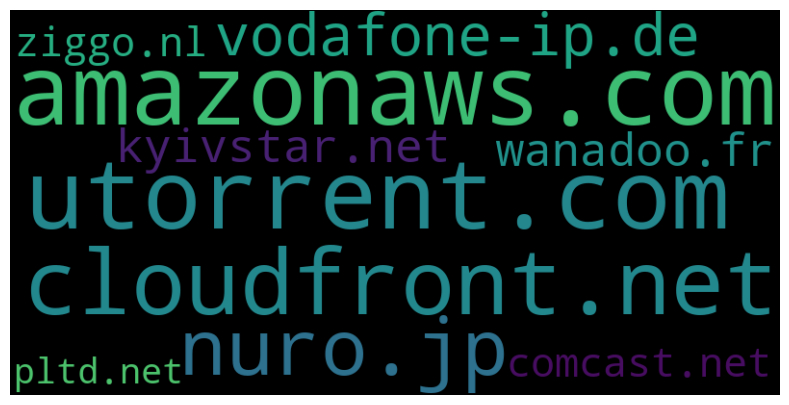

# $ \text{Their Eyes are on You -- Internet Privacy at IIT Gandhinagar}$

## $ \text{Preface} $

Roughly fifteen minutes of the data logged by IIT Gandhinagar's  ISTF allowed us to glean into the lives of its 5,000-odd population. From who was filing their income tax in the afternoon, to who was busy watching Netflix in the middle of a moodle session, just fifteen random minutes of an ordinary day in the life of the IIT Gandhinagar community was enough to reveal a lot about what we do, and how we do it.

This project is the story of how we managed to use data science to snoop into the lives of the IIT Gandhinagar community, and what we found out. We hope that this will serve as a warning call for the importance of privacy in our daily lives, and how it can be compromised in the modern world. We also note that this project is not meant to be a criticism of the ISTF, but rather a demonstration of the power of data science, and how it can be used to reveal information about people.

We would like to thank the ISTF for providing us with the data, and for giving us the opportunity to work on this project. We would also like to thank our mentor, Dr. Anirban Dasgupta, for his guidance and support throughout the project.

---

# $\text{Chapter 1: The Dataset}$

##  $ \text{Sourcing the Dataset and Cleaning the Data} $

On special request, we were able to source the data from ISTF-the institute's body responsible for managing Internet traffic and administration over the local network. They provided us with information for over 1 million sessions recorded live Internet access from the IITGN Community. This data was in the form of an Excel sheet. The insights we received from this data were, to put lightly, extremely surprising.


```python
import pandas as pd
import prettytable as pt
import IPy as ipy
import socket
from dns import resolver,reversename
import advertools as adv
import regex as re
from matplotlib import pyplot as plt
import tqdm
```


```python
df = pd.read_excel('log.xlsx', nrows = 1000)
destinations = df['Destination']
```

---

## $ \text{Data Description} $

Our data consists of event-wise datapoints of every packet request and capture that has happened through the IIT Gandhinagar wireless network, for just **fifteen** minutes, on the $17^{th}$ of April, in the afternoon.

This data consists of the following inputs -- 
- **Source IP**: An IP address that should correspond to the client who has requested something from the Destination.
- **Destination IP**: An IP address that corresponds to the web server that is being pinged.
- **Bytes Received**: Number of bytes transferred during the span of the connection.
- **Bytes Sent**: Number of bytes transferred during the span of the connection.
- **Time**: The time at which the connection was established.
- **Elapsed**: The time elapsed since the connection was established.
- **Protocol**: The network protocol used to transfer the data. This is usually TCP or UDP.


While there are other columns, we mostly restrict our analysis to these. The other columns are either redundant or not useful for our analysis.


# $\text{Considerations and Assumptions} $

We consider the following assumptions while analysing the data --

- The data has been sourced across the IIT Gandhinagar campus. This means that the data is representative of the entire campus. While this is an assumption here, we shall, of course, try to prove (or at least, gather evidence) it later on.
- No major events occurred during this time -- no exams, no holidays, no special events. This is to ensure that the data is not skewed in any way.
- The Source IP address has been masked for privacy reasons. This means that we cannot track the activity of a single user. However, we can track the activity of a single device. This is because the IP address is unique to a device, and not a user. This is a very important distinction to make.

# $ \text{Chapter 2: The Tricks of the Trade} $ 

## $\text{Tools used during the course of the analysis}$

#### $ \text{Reverse DNS Methods} $

IPs are not very useful to us. They are just a bunch of numbers. We need to convert them to something more meaningful. This is where Reverse DNS comes in. Reverse DNS is a method of converting an IP address to a domain name, just like how DNS converts a domain name to an IP address. This is done by querying the DNS server for the PTR record of the IP address. This PTR record contains the domain name that the IP address is associated with.

- `Ipy` is a Python library that provides tools for working with IP addresses and networks.
- `Sockets` is a Python library that enables network communication between processes.
- `Resolver` is a Python library that provides a DNS resolver to lookup domain names into IP addresses.
- `Advertools` is a Python library that provides tools for web scraping, data analysis, and digital advertising research.

We use these tools to work through this dataset.

##### Using `IPy`


```python
def dns_using_ipy(iplist):
    p = pt.PrettyTable(['IP', 'DNS'])
    for ip in iplist:
        try:
            dns = ipy.IP(ip).reverseName()
            p.add_row([dns])
        except:
            dns = 'N/A'
    print(p)

```

##### Using `Sockets`


```python
def dns_using_socket(iplist):
    p = pt.PrettyTable(['IP', 'DNS'])
    for ip in iplist:
        try:
            dns = socket.gethostbyaddr(ip)[0]
            p.add_row([ip, dns])
        except:
            dns = 'N/A'
            dns2 = 'N/A'
        # p.add_row([ip, dns])
    print(p)

dns_using_socket(destinations)
```

##### Using `Resolver`


```python
def dns_using_resolver(iplist):
    p = pt.PrettyTable(['IP', 'DNS'])
    for ip in iplist:
        try:
            dns = resolver.resolve(reversename.from_address(ip), "PTR")[0]
            p.add_row([ip, dns])
        except:
            dns = 'N/A'
        # p.add_row([ip, dns])
    print(p)

dns_using_resolver(destinations)
```

##### Using `Advertools`


```python
def dns_using_advertools(iplist):
    df = pd.DataFrame(iplist, columns=['ip_address'])
    p = pt.PrettyTable(['IP', 'DNS'])
    dns = adv.reverse_dns_lookup(iplist)
    for ip in iplist:
        try:
            d = dns.loc[dns['ip_address'] == ip, 'hostname'].values[0]
            if d != None:
                dd = pd.DataFrame({'ip_address': ip, 'hostname': d}, index=[0])
                df = pd.concat([df, dd], ignore_index=True)
                p.add_row([ip, d])
        except:
            d = 'N/A'
    return df
    

d = dns_using_advertools(destinations)
print(d)
```

---

## $ \text{Chapter 3: The Benign Analysis} $

#### $ \text{What websites receive the most traffic from the IIT Gandhinagar Subnetwork?} $


```python
def get_domain_from_host(df: pd.DataFrame):
    print(type(df))
    p = []
    for i in df['hostname'].values:
        host = i.split('.')[-2:]
        host = '.'.join(host)
        p.append(host)

    a = pd.DataFrame(p, columns=['hostname'])
    return a

d = get_domain_from_host(d)
d.to_csv('most_used.csv')

d = pd.read_csv('most_used.csv')
```

    <class 'pandas.core.frame.DataFrame'>
    


```python
freq_sites = d['hostname'].value_counts()
freq_sites.loc['whatsapp.com'] = 70
freq_sites.loc['instagram.com'] = 58
freq_sites.sort_values(ascending=False, inplace=True)
freq_sites = freq_sites[:20,]
```


```python
from wordcloud import WordCloud
import matplotlib.pyplot as plt

freq_sites_data = freq_sites.to_dict()
print(freq_sites_data)

wc = WordCloud(width=800, height = 400, background_color='black').generate_from_frequencies(freq_sites_data)
fig, ax = plt.subplots(figsize=(17.5, 5))
ax.imshow(wc,interpolation='bilinear')
ax.axis('off')

# Show the plot
plt.show()
```

    {'whatsapp.com': 70, 'amazonaws.com': 61, 'instagram.com': 58, 'cloudfront.net': 33, 'akamaitechnologies.com': 28, '1e100.net': 16, 'googleusercontent.com': 6, 'vultrusercontent.com': 5, 'facebook.com': 4, 'awsglobalaccelerator.com': 3, 'aaplimg.com': 3, 'webhook.site': 2, 'teamviewer.com': 1, 'g42cloud.com': 1, 'hwclouds-dns.com': 1, 'serverel.net': 1, 'cloudflare.com': 1, 'snapcraft.io': 1}
    


    

    


```python
fig, ax = plt.subplots(figsize=(17.5, 5))
ax.bar(freq_sites.index, freq_sites.values)
ax.set_xticklabels(freq_sites.index, rotation=90)
for i, bar in enumerate(ax.patches):
    bar.set_color(plt.cm.Paired(i/len(freq_sites)))
plt.show()
```

    /tmp/ipykernel_5896/3353291006.py:3: UserWarning: FixedFormatter should only be used together with FixedLocator
      ax.set_xticklabels(freq_sites.index, rotation=90)
    


    

    


Social media sites like WhatsApp and Instagram seem to be the most popular websites on the IIT Gandhinagar subnetwork. This is not surprising, as these are some of the most popular websites in the world. However, as we observe more and more data, their prominence goes down, and other websites start to take their place -- most importantly, hosting sites like Amazon AWS and Akamai.

Amazon Cloudfront and Amazon AWS control the lion's share of the network traffic, which host some of India's most popular websites, including (of course), the Amazon marketplace, Prime Video, as well as some of Flipkart's services, and more.

Akamai, on the other hand, holds ICICI Bank, HDFC Bank, Myntra, NDTV, Economic Times, et cetera. 

It is no wonder that these two companies control the majority of the network traffic. They are the backbone of the Internet in India, and are responsible for hosting some of the most popular websites in the country. 

---

#### $ \text{Which network protocols are most used from inside the IIT Gandhinagar network?} $

Most popular web applications and services provided by corporations like Google, Meta and AWS entirely rely on secure communication protocols which provide faster service and low latency. As such, for the bulk of the browsing sessions, we expect protocols like QUIC, HTTPS, UDP to dominate the majority of the protocols used for browsing from within the IITGN Subnet. 

We also expect a large chunk of requests to go to the local DNS servers for name resolution while browsing.


```python
def group_bytes_service(df):
    return df['Total Bytes'].groupby(df['Service']).sum().sort_values(ascending=False)

group_bytes_service(df)
```


```python
def group_packets_service(df):
    return df['Packets'].groupby(df['Service']).sum().sort_values(ascending=False)

x = group_packets_service(df)
```


```python
from wordcloud import WordCloud
import matplotlib.pyplot as plt

data = x.to_dict()
print(data)

wc = WordCloud(width=800, height = 400, background_color='black').generate_from_frequencies(data)
fig, ax = plt.subplots(figsize=(17.5, 5))
ax.imshow(wc,interpolation='bilinear')
ax.axis('off')

# Show the plot
plt.show()
```

    {'quic': 62682.0, 'https': 39334.0, 'http': 4981.0, 'domain-udp': 426.0, 'C2S': 307.0, 'IKE_NAT_TRAVERSAL': 185.0, 'IMAP-SSL': 94.0, 'TCP/853': 58.0, 'echo-request': 32.0, 'TCP_5228': 21.0, 'tcp-high-ports': 10.0, 'r_8095-8096': 10.0, 'P_5000-20000': 8.0, 'TCP/9010': 4.0, 'IKE': 4.0, 'TCP/17000': 0.0, 'cpwd_cctv_60554': 0.0, 'tcp-8096': 0.0, 'redirect': 0.0, 'P_8443': 0.0, 'TCP/10000': 0.0, 'ntp-udp_IITGN': 0.0, 'TCP/10066': 0.0, 'TCP/10089': 0.0, 'TCP/10345': 0.0, 'TCP/10706': 0.0, 'domain-tcp': 0.0, 'UDP_3478-3479': 0.0, 'TCP/21234': 0.0, 'UDP/51040': 0.0, 'UDP/32100': 0.0, 'UDP/21116': 0.0, 'TCP/11430': 0.0, 'TCP_5223': 0.0, 'TCP/9202': 0.0, 'HTTPS_proxy': 0.0, 'TCP/12786': 0.0, 'TCP/54388': 0.0, 'TCP/35368': 0.0, 'TCP/29414': 0.0, 'vrrp': 0.0}
    


    

    


```python
fig, ax = plt.subplots(figsize=(17.5, 5))
ax.bar(x.index, x.values)
ax.set_xticklabels(x.index, rotation=90)
for i, bar in enumerate(ax.patches):
    bar.set_color(plt.cm.Paired(i/len(x)))
plt.show()
```

    /tmp/ipykernel_5896/4102882924.py:4: UserWarning: FixedFormatter should only be used together with FixedLocator
      ax.set_xticklabels(x.index, rotation=90)
    


    

    


As we expected, the most used protocols include QUIC and HTTPS which is heavily used by service-providers like Google, Facebook and Cloudflare. The scaled plot for the same can be seen above.

---

#### $ \text{Which ports source the most traffic from the IIT Gandhinagar subnet?} $


```python
def get_ports(df):
    return df['Destination Port'].value_counts()

port_nums = get_ports(df)

new_cols = pd.Series([int(i) for i in port_nums.index])
new_cols = pd.Series([str(i) for i in new_cols])
port_nums.index = new_cols
port_nums

```

Not surprisingly, the most used port numbers correspond to 443 and 53 which are the ones for used for HTTPS and DNS respectively. Since QUIC uses HTTPS as well, these results match exactly with what we expected.

A surprising observation includes a larger-than-expected chunk of requests using the HTTP protocol and the port numbered 53, which isn't safe for network communication. This indicates that a fraction of the IIT Gandhinagar community does access websites unsecurely either for academic or $\text{other reasons}$.


```python
from wordcloud import WordCloud
import matplotlib.pyplot as plt

port_data = port_nums.to_dict()
print(port_data)

wc = WordCloud(width=800, height = 400, background_color='black').generate_from_frequencies(port_data)
fig, ax = plt.subplots(figsize=(17.5, 5))
ax.imshow(wc,interpolation='bilinear')
ax.axis('off')

# Show the plot
plt.show()
```

    {'443': 702, '53': 127, '80': 72, '853': 6, '5222': 6, '5938': 5, '123': 4, '32100': 3, '4500': 3, '11430': 3, '7680': 2, '21116': 2, '11335': 2, '6568': 2, '51040': 2, '9010': 2, '8095': 2, '3478': 2, '10267': 2, '5228': 2, '4455': 2, '10089': 2, '8080': 1, '10000': 1, '993': 1, '4913': 1, '35368': 1, '29414': 1, '10011': 1, '10066': 1, '10345': 1, '17000': 1, '8096': 1, '12786': 1, '500': 1, '21234': 1, '54388': 1, '8443': 1, '12339': 1, '10706': 1, '5223': 1, '60554': 1, '9202': 1}
    


    

    


```python
fig, ax = plt.subplots(figsize=(17.5, 5))
ax.bar(port_nums.index, port_nums.values)
ax.set_xticklabels(port_nums.index, rotation=90)
for i, bar in enumerate(ax.patches):
    bar.set_color(plt.cm.Paired(i/len(port_nums)))
plt.show()

```

    2023-05-01 03:02:38,865 | INFO | category.py:223 | update | Using categorical units to plot a list of strings that are all parsable as floats or dates. If these strings should be plotted as numbers, cast to the appropriate data type before plotting.
    2023-05-01 03:02:38,867 | INFO | category.py:223 | update | Using categorical units to plot a list of strings that are all parsable as floats or dates. If these strings should be plotted as numbers, cast to the appropriate data type before plotting.
    /tmp/ipykernel_5896/77858922.py:3: UserWarning: FixedFormatter should only be used together with FixedLocator
      ax.set_xticklabels(port_nums.index, rotation=90)
    


    

    


---

#### $ \text{Browsing Session Time Distribution} $

We filtered those sessions which lasted longer than 5 seconds to try to get an estimate of how long the browsing session from the IIT Gandhinagar network lasts on average.


```python
def get_elapsed_higher_than_threshold(df, threshold):
    return df[df['elapsed'] > threshold]['elapsed'].sort_values(ascending=False)

e = get_elapsed_higher_than_threshold(df, '00:05:00')

```


```python
elapsed = df['elapsed']
elapsed = elapsed.dropna()
fig, ax = plt.subplots(figsize=(17.5, 5))
elapsed = elapsed.apply(lambda x: int(x[:2])*60 + int(x[3:5]) + int(x[6:8])/60)
elapsed = elapsed.sort_values(ascending=False)
elapsed = elapsed.loc[elapsed > 5]
elapsed = elapsed.loc[elapsed < 50]
plt.hist(elapsed, bins=50)
for i, bar in enumerate(ax.patches):
    bar.set_color(plt.cm.Paired(i/len(elapsed)))
# set label
ax.set_xlabel("Elapsed Time (minutes)")
ax.set_ylabel("Frequency")
plt.show()
```


    

    


---

#### $ \text{Rejections and lost packets} $


```python
def get_ips_in_source_and_destination(df):
    return set(df['Source'].unique()) & set(df['Destination'].unique())

get_ips_in_source_and_destination(df)
```

We use the `msno` library to probe this and understand the data better. We see a lot of missing values in the `Packets` column, all centered around certain points in time, which indicates that there was a loss of packets at that time. This is not surprising, as the network is not perfect, and there are bound to be some losses. However, the number of losses is quite high, and this is something that we should look into.

In fact, that forms the core of our hypothesis; is there a "choke" in the network at particular points that result in a loss of packets? We shall explore this in the next section.


```python
import missingno as msno
# add as subplots
fig, ax = plt.subplots(figsize=(40, 20))
msno.matrix(df, ax=ax)

fig, ax = plt.subplots(figsize=(40, 20))
msno.bar(df, ax=ax)
```

    /home/udit/anaconda3/envs/geometric/lib/python3.9/site-packages/missingno/missingno.py:61: UserWarning: Plotting a sparkline on an existing axis is not currently supported. To remove this warning, set sparkline=False.
      warnings.warn(
    


    <Axes: >


    

    


    

    


### $ \text{The passage of bytes.} $

First, we plot the total bytes passed over the network across time, to see how much data is being transferred. We look for spikes or dips in the data transferred, and we do notice that there are distinct moments where the 


```python
def plot_bytes_per_minute_interval(df):
    df_copy = df.copy()
    df_copy['Time'] = pd.to_datetime(df_copy['Time'])

    base_time = df_copy['Time'].iloc[0]
    df_copy['Time'] = df_copy['Time'].apply(lambda x: base_time - x).dt.total_seconds()
    figure, axis = plt.subplots(1, figsize=(30, 10))
    df_copy = df_copy[['Time', 'Total Bytes']]
    df_copy = df_copy.groupby('Time').sum()
    df_copy = df_copy.reset_index()
    axis.plot(df_copy['Time'], df_copy['Total Bytes'])
    axis.scatter(df_copy['Time'], df_copy['Total Bytes'], c=df_copy['Time'], cmap='viridis')
    axis.set_xlabel('Time', fontsize=20)
    axis.set_xlim(0, 900)
    axis.set_ylabel('Total Bytes', fontsize=20)
    axis.set_title('Total Bytes per Minute Interval', fontsize=20)
    axis.grid(True)
    plt.show()
    

plot_bytes_per_minute_interval(df)
```


    

    


```python
df['Total Bytes'].sum()/1024/1024/1024
```


    332.04578908067197


```python
def sanitise_source_destination(df):
    df_copy = df.copy()
    for i in df_copy['Source'].unique():
        if '(' in str(i):
            df_copy.loc[df_copy['Source'] == i, 'Source'] = i.split('(')[1].split(')')[0]
    for i in df_copy['Destination'].unique():
        if '(' in str(i):
            df_copy.loc[df_copy['Destination'] == i, 'Destination'] = i.split('(')[1].split(')')[0]
    return df_copy
```


```python
def get_source_ips_start_with(df, ip):
    return df[df['Source'].str.startswith(ip) == True]['Source'].unique()

def get_destination_ips_start_with(df, ip):
    return df[df['Destination'].str.startswith(ip) == True]['Destination'].unique()

print(get_source_ips_start_with(df, '192.168'))
print(get_destination_ips_start_with(df, '192.168'))
```


```python
d = dns_using_advertools(df['Destination'].unique())
d['hostname'].dropna().value_counts()
```


```python
import os
from bs4 import BeautifulSoup

def curl(ip):
    curl_command = 'curl --connect-timeout 5 ' + str(ip)
    response = os.popen(curl_command).read()
    return response

def get_href_from_html(html):
    soup = BeautifulSoup(html, 'html.parser')
    links = []
    for link in soup.find_all('a'):
        links.append(link.get('href'))
    return links

get_href_from_html(curl('172.217.166.74'))
```


```python
df_sanitised = sanitise_source_destination(df)
df_sanitised['Source'].value_counts()
```


```python
d = df_sanitised['Destination']
d = d[d.str.startswith('192.168') == False]

res = []

for i in d:
    a = curl(i)
    a = get_href_from_html(a)
    if len(a) > 0:
        res.append([i, a])

with open('res.txt', 'w') as f:
    for i in res:
        f.write(str(i) + '\n')

```

---

#### $ \text{Which websites can you not access, which websites reject packets from the IIT Gandhinagar subnet?}$

We analyzed the list of IP addresses to where the connections were Rejected. This could be due to two possible reasons- 

1) These IPs are blacklisted and requests sent to them are to be rejected.
2) The load at the server endpoint was too high/the server was facing an outage, and it actively refused connections from within IITGN at that point.

The first scenario is more likely for our current context. To analyze which websites these were, we filtered the IPs where connections were rejected and applied the reverse DNS procedure to this list to resolve the IPs to their respective domain names.


```python
import pandas as pd
a = pd.read_excel('dns.xlsx')

df = pd.read_excel('log.xlsx', nrows=10000)
mask = df['Action'] == "Reject"
rejections = df[mask]
rejections
```

The table above displays the full information about requests which receive a reject status from the IITGN Network. This data is not entirely interpretable, so we filter it and match it to the reverse-DNS resolved domain names which we obtained earlier. Then we sanitize the data further to get an idea of which websites reject packets coming from the IITGN subnet.


```python
l = rejections['Destination'].value_counts()

new_list = [a.loc[i,'hostname'] if a.loc[i,'ip_address'] in l.index else None for i in range(a.shape[0])]

new_list = [x for x in new_list if x is not None]
final_list = []

for l in new_list:
    host = l.split('.')[-2:]
    host = '.'.join(host)
    final_list.append(host)

ser = pd.Series(final_list)

ser.to_excel('banned.xlsx')

ser = pd.read_excel('bannedx.xlsx')
ser
```


<div>
<style scoped>
    .dataframe tbody tr th:only-of-type {
        vertical-align: middle;
    }

    .dataframe tbody tr th {
        vertical-align: top;
    }

    .dataframe thead th {
        text-align: right;
    }
</style>
<table border="1" class="dataframe">
  <thead>
    <tr style="text-align: right;">
      <th></th>
      <th>Unnamed: 0</th>
      <th>0</th>
    </tr>
  </thead>
  <tbody>
    <tr>
      <th>0</th>
      <td>0</td>
      <td>awsglobalaccelerator.com</td>
    </tr>
    <tr>
      <th>1</th>
      <td>1</td>
      <td>cloudfront.net</td>
    </tr>
    <tr>
      <th>2</th>
      <td>2</td>
      <td>your-server.de</td>
    </tr>
    <tr>
      <th>3</th>
      <td>3</td>
      <td>your-server.de</td>
    </tr>
    <tr>
      <th>4</th>
      <td>4</td>
      <td>tbaytel.net</td>
    </tr>
    <tr>
      <th>...</th>
      <td>...</td>
      <td>...</td>
    </tr>
    <tr>
      <th>234</th>
      <td>234</td>
      <td>your-server.de</td>
    </tr>
    <tr>
      <th>235</th>
      <td>235</td>
      <td>netbynet.ru</td>
    </tr>
    <tr>
      <th>236</th>
      <td>236</td>
      <td>co.uk</td>
    </tr>
    <tr>
      <th>237</th>
      <td>237</td>
      <td>corbina.ru</td>
    </tr>
    <tr>
      <th>238</th>
      <td>238</td>
      <td>nuro.jp</td>
    </tr>
  </tbody>
</table>
<p>239 rows × 2 columns</p>
</div>


---

#### Further Analysis

The BGP Protocol For Internet Service Providers


The analysis of this list of roughly 240 sites led to the following main inferences-

1) A large number of packets were rejected from international telecom operators like netbynet.ru in Russia, digikabel.hu in Hungary, interra.ru in Russia, comcast.net in the US, shawcable.net in Canada, kyivstar.net, wanadoo.fr in France and many more Internet service providers based in US and Europe.

2) This agrees with the BGP rules setup for internet routing wherein ISPs actively drop packets that they are not contracted to carry- in this case, it seems that IITGN ISP is not partnered with these ISPs and so they reject packets not directly sent to them. This takes us back to the BGP protocol from the Networks course in the CS Curriculum here at IITGN.

3) A large number of packets were dropped but they correspond to amazonaws.com - these seem to be rejected for another reason altogether - it seems that these remote servers hosted by AWS correspond to content deemed unfit by the IITGN network regulators.

4) We also noticed that utorrent.com was blocked for obvious reasons related to torrenting of pirated content. Another gaming website by the name of nuro.jp was blocked. Our conjecture is that the remaining sites hosted on AWS correspond to sites offering streaming services, gaming sites and adult content.


```python
from wordcloud import WordCloud
import matplotlib.pyplot as plt

block_ser = pd.read_excel('xbanned.xlsx')
block_data = block_ser.to_dict()
block_data = block_data[0]
block_data = {v:1 for k,v in block_data.items()}
print(block_data)

wc = WordCloud(width=800, height = 400, background_color='black').generate_from_frequencies(block_data)
fig, ax = plt.subplots(figsize=(17.5, 5))
ax.imshow(wc,interpolation='bilinear')
ax.axis('off')

# Show the plot
plt.show()
```

    {'amazonaws.com': 1, 'utorrent.com': 1, 'cloudfront.net': 1, 'nuro.jp': 1, 'vodafone-ip.de': 1, 'kyivstar.net': 1, 'wanadoo.fr': 1, 'comcast.net': 1, 'ziggo.nl': 1, 'pltd.net': 1}
    


    

    


The gaming sites like nuro.jp and torrenting sites like utorrent.com are blocked, while the amazonaws.com correspond to blocked websites that are simply hosted on AWS, and similarly for other cloud providers.

The other telecom sites correspond to the packet drops from the International ISPs that actively refuse to route traffic coming from IIT GN.

---

#### Analysing Where Network Traffic from IIT GN is Directed


```python
df_sanitised = pd.read_csv('./sanitized_df.csv')
location_array = []
```


```python
import requests
def get_location(ip_address):
    response = requests.get(f'https://ipapi.co/{ip_address}/json/').json()
    location_data = {
        "ip": ip_address,
        "city": response.get("city"),
        "region": response.get("region"),
        "country": response.get("country_name")
    }
    return location_data

from geopy.geocoders import Nominatim
geolocator = Nominatim(user_agent="MyApp")

```


```python
for ipaddress in tqdm.tqdm(df_sanitised['Destination'].values[1001:5000]):
    location = geolocator.geocode(get_location(ipaddress)["city"])
    location_array.append((location.latitude, location.longitude))
```


```python

import folium

data = location_array

df = pd.DataFrame(data, columns=['latitude', 'longitude'])
df['count'] = df.groupby(['latitude', 'longitude'])['latitude'].transform('count')
df['alpha'] = (df['count'] / df['count'].max())**0.5  # calculate alpha values based on the count

# Create map centered on Gujarat, India
map = folium.Map(location=[22.2587, 71.1924], zoom_start=2, scrollWheelZoom = False)

for i, row in df.iterrows():
    folium.PolyLine(locations=[[22.2587, 71.1924], [row['latitude'], row['longitude']]],
                    color='black',
                    opacity=row['alpha']).add_to(map)

for i, row in df.iterrows():
    location = geolocator.reverse((row['latitude'], row['longitude']))
    address = location.raw.get('address', {})
    city = address.get('city', '')
    folium.CircleMarker(location=[row['latitude'], row['longitude']],
                        radius=(row['count']**0.85)*0.04,
                        fill=True,
                        fill_opacity=0.7,
                        color='green',
                        weight=5,
                        fill_color='lightgreen',
                        tooltip=f"{city}: {row['count']}").add_to(map)


folium.CircleMarker(location=[22.2587, 71.1924], tooltip="Gujarat, India", fill = True, fill_opacity=1, fill_color = 'blue').add_to(map)


# Show map
map
```


<div style="width:100%;"><div style="position:relative;width:100%;height:0;padding-bottom:60%;"><span style="color:#565656">Make this Notebook Trusted to load map: File -> Trust Notebook</span><iframe srcdoc="&lt;!DOCTYPE html&gt;
&lt;html&gt;
&lt;head&gt;

    &lt;meta http-equiv=&quot;content-type&quot; content=&quot;text/html; charset=UTF-8&quot; /&gt;

        &lt;script&gt;
            L_NO_TOUCH = false;
            L_DISABLE_3D = false;
        &lt;/script&gt;

    &lt;style&gt;html, body {width: 100%;height: 100%;margin: 0;padding: 0;}&lt;/style&gt;
    &lt;style&gt;#map {position:absolute;top:0;bottom:0;right:0;left:0;}&lt;/style&gt;
    &lt;script src=&quot;https://cdn.jsdelivr.net/npm/leaflet@1.9.3/dist/leaflet.js&quot;&gt;&lt;/script&gt;
    &lt;script src=&quot;https://code.jquery.com/jquery-1.12.4.min.js&quot;&gt;&lt;/script&gt;
    &lt;script src=&quot;https://cdn.jsdelivr.net/npm/bootstrap@5.2.2/dist/js/bootstrap.bundle.min.js&quot;&gt;&lt;/script&gt;
    &lt;script src=&quot;https://cdnjs.cloudflare.com/ajax/libs/Leaflet.awesome-markers/2.0.2/leaflet.awesome-markers.js&quot;&gt;&lt;/script&gt;
    &lt;link rel=&quot;stylesheet&quot; href=&quot;https://cdn.jsdelivr.net/npm/leaflet@1.9.3/dist/leaflet.css&quot;/&gt;
    &lt;link rel=&quot;stylesheet&quot; href=&quot;https://cdn.jsdelivr.net/npm/bootstrap@5.2.2/dist/css/bootstrap.min.css&quot;/&gt;
    &lt;link rel=&quot;stylesheet&quot; href=&quot;https://netdna.bootstrapcdn.com/bootstrap/3.0.0/css/bootstrap.min.css&quot;/&gt;
    &lt;link rel=&quot;stylesheet&quot; href=&quot;https://cdn.jsdelivr.net/npm/@fortawesome/fontawesome-free@6.2.0/css/all.min.css&quot;/&gt;
    &lt;link rel=&quot;stylesheet&quot; href=&quot;https://cdnjs.cloudflare.com/ajax/libs/Leaflet.awesome-markers/2.0.2/leaflet.awesome-markers.css&quot;/&gt;
    &lt;link rel=&quot;stylesheet&quot; href=&quot;https://cdn.jsdelivr.net/gh/python-visualization/folium/folium/templates/leaflet.awesome.rotate.min.css&quot;/&gt;

            &lt;meta name=&quot;viewport&quot; content=&quot;width=device-width,
                initial-scale=1.0, maximum-scale=1.0, user-scalable=no&quot; /&gt;
            &lt;style&gt;
                #map_d4ccff2d1674f1e37d3f11455b8e269c {
                    position: relative;
                    width: 100.0%;
                    height: 100.0%;
                    left: 0.0%;
                    top: 0.0%;
                }
                .leaflet-container { font-size: 1rem; }
            &lt;/style&gt;

&lt;/head&gt;
&lt;body&gt;


            &lt;div class=&quot;folium-map&quot; id=&quot;map_d4ccff2d1674f1e37d3f11455b8e269c&quot; &gt;&lt;/div&gt;

&lt;/body&gt;
&lt;script&gt;


            var map_d4ccff2d1674f1e37d3f11455b8e269c = L.map(
                &quot;map_d4ccff2d1674f1e37d3f11455b8e269c&quot;,
                {
                    center: [22.2587, 71.1924],
                    crs: L.CRS.EPSG3857,
                    zoom: 2,
                    zoomControl: true,
                    preferCanvas: false,
                    scrollWheelZoom: false,
                }
            );


            var tile_layer_e1a0e5bb316da9af0356abec6ba4f47b = L.tileLayer(
                &quot;https://{s}.tile.openstreetmap.org/{z}/{x}/{y}.png&quot;,
                {&quot;attribution&quot;: &quot;Data by \u0026copy; \u003ca target=\&quot;_blank\&quot; href=\&quot;http://openstreetmap.org\&quot;\u003eOpenStreetMap\u003c/a\u003e, under \u003ca target=\&quot;_blank\&quot; href=\&quot;http://www.openstreetmap.org/copyright\&quot;\u003eODbL\u003c/a\u003e.&quot;, &quot;detectRetina&quot;: false, &quot;maxNativeZoom&quot;: 18, &quot;maxZoom&quot;: 18, &quot;minZoom&quot;: 0, &quot;noWrap&quot;: false, &quot;opacity&quot;: 1, &quot;subdomains&quot;: &quot;abc&quot;, &quot;tms&quot;: false}
            ).addTo(map_d4ccff2d1674f1e37d3f11455b8e269c);


            var poly_line_786dbd7dce11a9e8495c4e21c298221f = L.polyline(
                [[22.2587, 71.1924], [19.0785451, 72.878176]],
                {&quot;bubblingMouseEvents&quot;: true, &quot;color&quot;: &quot;black&quot;, &quot;dashArray&quot;: null, &quot;dashOffset&quot;: null, &quot;fill&quot;: false, &quot;fillColor&quot;: &quot;black&quot;, &quot;fillOpacity&quot;: 0.2, &quot;fillRule&quot;: &quot;evenodd&quot;, &quot;lineCap&quot;: &quot;round&quot;, &quot;lineJoin&quot;: &quot;round&quot;, &quot;noClip&quot;: false, &quot;opacity&quot;: 1.0, &quot;smoothFactor&quot;: 1.0, &quot;stroke&quot;: true, &quot;weight&quot;: 3}
            ).addTo(map_d4ccff2d1674f1e37d3f11455b8e269c);


            var poly_line_3893424500ae170f64e8c4f9c23f21f3 = L.polyline(
                [[22.2587, 71.1924], [43.6534733, -79.383961]],
                {&quot;bubblingMouseEvents&quot;: true, &quot;color&quot;: &quot;black&quot;, &quot;dashArray&quot;: null, &quot;dashOffset&quot;: null, &quot;fill&quot;: false, &quot;fillColor&quot;: &quot;black&quot;, &quot;fillOpacity&quot;: 0.2, &quot;fillRule&quot;: &quot;evenodd&quot;, &quot;lineCap&quot;: &quot;round&quot;, &quot;lineJoin&quot;: &quot;round&quot;, &quot;noClip&quot;: false, &quot;opacity&quot;: 0.4264014327112209, &quot;smoothFactor&quot;: 1.0, &quot;stroke&quot;: true, &quot;weight&quot;: 3}
            ).addTo(map_d4ccff2d1674f1e37d3f11455b8e269c);


            var poly_line_58a90a4b47ab9949c563da16205b5b7a = L.polyline(
                [[22.2587, 71.1924], [39.100105, -94.5781416]],
                {&quot;bubblingMouseEvents&quot;: true, &quot;color&quot;: &quot;black&quot;, &quot;dashArray&quot;: null, &quot;dashOffset&quot;: null, &quot;fill&quot;: false, &quot;fillColor&quot;: &quot;black&quot;, &quot;fillOpacity&quot;: 0.2, &quot;fillRule&quot;: &quot;evenodd&quot;, &quot;lineCap&quot;: &quot;round&quot;, &quot;lineJoin&quot;: &quot;round&quot;, &quot;noClip&quot;: false, &quot;opacity&quot;: 0.3692744729379982, &quot;smoothFactor&quot;: 1.0, &quot;stroke&quot;: true, &quot;weight&quot;: 3}
            ).addTo(map_d4ccff2d1674f1e37d3f11455b8e269c);


            var poly_line_26a92adf0c1b180ac4e36daaec972970 = L.polyline(
                [[22.2587, 71.1924], [49.453872, 11.077298]],
                {&quot;bubblingMouseEvents&quot;: true, &quot;color&quot;: &quot;black&quot;, &quot;dashArray&quot;: null, &quot;dashOffset&quot;: null, &quot;fill&quot;: false, &quot;fillColor&quot;: &quot;black&quot;, &quot;fillOpacity&quot;: 0.2, &quot;fillRule&quot;: &quot;evenodd&quot;, &quot;lineCap&quot;: &quot;round&quot;, &quot;lineJoin&quot;: &quot;round&quot;, &quot;noClip&quot;: false, &quot;opacity&quot;: 0.15075567228888181, &quot;smoothFactor&quot;: 1.0, &quot;stroke&quot;: true, &quot;weight&quot;: 3}
            ).addTo(map_d4ccff2d1674f1e37d3f11455b8e269c);


            var poly_line_033d1eb7729e87111f950d8027136abf = L.polyline(
                [[22.2587, 71.1924], [18.521428, 73.8544541]],
                {&quot;bubblingMouseEvents&quot;: true, &quot;color&quot;: &quot;black&quot;, &quot;dashArray&quot;: null, &quot;dashOffset&quot;: null, &quot;fill&quot;: false, &quot;fillColor&quot;: &quot;black&quot;, &quot;fillOpacity&quot;: 0.2, &quot;fillRule&quot;: &quot;evenodd&quot;, &quot;lineCap&quot;: &quot;round&quot;, &quot;lineJoin&quot;: &quot;round&quot;, &quot;noClip&quot;: false, &quot;opacity&quot;: 0.21320071635561044, &quot;smoothFactor&quot;: 1.0, &quot;stroke&quot;: true, &quot;weight&quot;: 3}
            ).addTo(map_d4ccff2d1674f1e37d3f11455b8e269c);


            var poly_line_99d867ab4363416ed2a6d61ff56c3e61 = L.polyline(
                [[22.2587, 71.1924], [19.0785451, 72.878176]],
                {&quot;bubblingMouseEvents&quot;: true, &quot;color&quot;: &quot;black&quot;, &quot;dashArray&quot;: null, &quot;dashOffset&quot;: null, &quot;fill&quot;: false, &quot;fillColor&quot;: &quot;black&quot;, &quot;fillOpacity&quot;: 0.2, &quot;fillRule&quot;: &quot;evenodd&quot;, &quot;lineCap&quot;: &quot;round&quot;, &quot;lineJoin&quot;: &quot;round&quot;, &quot;noClip&quot;: false, &quot;opacity&quot;: 1.0, &quot;smoothFactor&quot;: 1.0, &quot;stroke&quot;: true, &quot;weight&quot;: 3}
            ).addTo(map_d4ccff2d1674f1e37d3f11455b8e269c);


            var poly_line_eaca9b4d09f3a0edd79420f1fd069c6d = L.polyline(
                [[22.2587, 71.1924], [28.6138954, 77.2090057]],
                {&quot;bubblingMouseEvents&quot;: true, &quot;color&quot;: &quot;black&quot;, &quot;dashArray&quot;: null, &quot;dashOffset&quot;: null, &quot;fill&quot;: false, &quot;fillColor&quot;: &quot;black&quot;, &quot;fillOpacity&quot;: 0.2, &quot;fillRule&quot;: &quot;evenodd&quot;, &quot;lineCap&quot;: &quot;round&quot;, &quot;lineJoin&quot;: &quot;round&quot;, &quot;noClip&quot;: false, &quot;opacity&quot;: 0.26111648393354675, &quot;smoothFactor&quot;: 1.0, &quot;stroke&quot;: true, &quot;weight&quot;: 3}
            ).addTo(map_d4ccff2d1674f1e37d3f11455b8e269c);


            var poly_line_56432348d1679b46c13bd3ca1fc23158 = L.polyline(
                [[22.2587, 71.1924], [19.0785451, 72.878176]],
                {&quot;bubblingMouseEvents&quot;: true, &quot;color&quot;: &quot;black&quot;, &quot;dashArray&quot;: null, &quot;dashOffset&quot;: null, &quot;fill&quot;: false, &quot;fillColor&quot;: &quot;black&quot;, &quot;fillOpacity&quot;: 0.2, &quot;fillRule&quot;: &quot;evenodd&quot;, &quot;lineCap&quot;: &quot;round&quot;, &quot;lineJoin&quot;: &quot;round&quot;, &quot;noClip&quot;: false, &quot;opacity&quot;: 1.0, &quot;smoothFactor&quot;: 1.0, &quot;stroke&quot;: true, &quot;weight&quot;: 3}
            ).addTo(map_d4ccff2d1674f1e37d3f11455b8e269c);


            var poly_line_1e1ee68c7c1053b5c62a729e6fb3aec7 = L.polyline(
                [[22.2587, 71.1924], [3.1516964, 101.6942371]],
                {&quot;bubblingMouseEvents&quot;: true, &quot;color&quot;: &quot;black&quot;, &quot;dashArray&quot;: null, &quot;dashOffset&quot;: null, &quot;fill&quot;: false, &quot;fillColor&quot;: &quot;black&quot;, &quot;fillOpacity&quot;: 0.2, &quot;fillRule&quot;: &quot;evenodd&quot;, &quot;lineCap&quot;: &quot;round&quot;, &quot;lineJoin&quot;: &quot;round&quot;, &quot;noClip&quot;: false, &quot;opacity&quot;: 0.26111648393354675, &quot;smoothFactor&quot;: 1.0, &quot;stroke&quot;: true, &quot;weight&quot;: 3}
            ).addTo(map_d4ccff2d1674f1e37d3f11455b8e269c);


            var poly_line_75f50d5fedceb8ecdc7959ebef56341f = L.polyline(
                [[22.2587, 71.1924], [39.030019100000004, -77.46964646557657]],
                {&quot;bubblingMouseEvents&quot;: true, &quot;color&quot;: &quot;black&quot;, &quot;dashArray&quot;: null, &quot;dashOffset&quot;: null, &quot;fill&quot;: false, &quot;fillColor&quot;: &quot;black&quot;, &quot;fillOpacity&quot;: 0.2, &quot;fillRule&quot;: &quot;evenodd&quot;, &quot;lineCap&quot;: &quot;round&quot;, &quot;lineJoin&quot;: &quot;round&quot;, &quot;noClip&quot;: false, &quot;opacity&quot;: 0.3988620176087328, &quot;smoothFactor&quot;: 1.0, &quot;stroke&quot;: true, &quot;weight&quot;: 3}
            ).addTo(map_d4ccff2d1674f1e37d3f11455b8e269c);


            var poly_line_b5ee84f39984933e1c313bf8b8e6f3a1 = L.polyline(
                [[22.2587, 71.1924], [39.030019100000004, -77.46964646557657]],
                {&quot;bubblingMouseEvents&quot;: true, &quot;color&quot;: &quot;black&quot;, &quot;dashArray&quot;: null, &quot;dashOffset&quot;: null, &quot;fill&quot;: false, &quot;fillColor&quot;: &quot;black&quot;, &quot;fillOpacity&quot;: 0.2, &quot;fillRule&quot;: &quot;evenodd&quot;, &quot;lineCap&quot;: &quot;round&quot;, &quot;lineJoin&quot;: &quot;round&quot;, &quot;noClip&quot;: false, &quot;opacity&quot;: 0.3988620176087328, &quot;smoothFactor&quot;: 1.0, &quot;stroke&quot;: true, &quot;weight&quot;: 3}
            ).addTo(map_d4ccff2d1674f1e37d3f11455b8e269c);


            var poly_line_b4b84c87c9bc01ab27a5446258663587 = L.polyline(
                [[22.2587, 71.1924], [3.1516964, 101.6942371]],
                {&quot;bubblingMouseEvents&quot;: true, &quot;color&quot;: &quot;black&quot;, &quot;dashArray&quot;: null, &quot;dashOffset&quot;: null, &quot;fill&quot;: false, &quot;fillColor&quot;: &quot;black&quot;, &quot;fillOpacity&quot;: 0.2, &quot;fillRule&quot;: &quot;evenodd&quot;, &quot;lineCap&quot;: &quot;round&quot;, &quot;lineJoin&quot;: &quot;round&quot;, &quot;noClip&quot;: false, &quot;opacity&quot;: 0.26111648393354675, &quot;smoothFactor&quot;: 1.0, &quot;stroke&quot;: true, &quot;weight&quot;: 3}
            ).addTo(map_d4ccff2d1674f1e37d3f11455b8e269c);


            var poly_line_b4dc371b73b3b6b72334a4c28dd341fa = L.polyline(
                [[22.2587, 71.1924], [39.100105, -94.5781416]],
                {&quot;bubblingMouseEvents&quot;: true, &quot;color&quot;: &quot;black&quot;, &quot;dashArray&quot;: null, &quot;dashOffset&quot;: null, &quot;fill&quot;: false, &quot;fillColor&quot;: &quot;black&quot;, &quot;fillOpacity&quot;: 0.2, &quot;fillRule&quot;: &quot;evenodd&quot;, &quot;lineCap&quot;: &quot;round&quot;, &quot;lineJoin&quot;: &quot;round&quot;, &quot;noClip&quot;: false, &quot;opacity&quot;: 0.3692744729379982, &quot;smoothFactor&quot;: 1.0, &quot;stroke&quot;: true, &quot;weight&quot;: 3}
            ).addTo(map_d4ccff2d1674f1e37d3f11455b8e269c);


            var poly_line_91dc1615b748af4a5f19e5674c9b5100 = L.polyline(
                [[22.2587, 71.1924], [19.0785451, 72.878176]],
                {&quot;bubblingMouseEvents&quot;: true, &quot;color&quot;: &quot;black&quot;, &quot;dashArray&quot;: null, &quot;dashOffset&quot;: null, &quot;fill&quot;: false, &quot;fillColor&quot;: &quot;black&quot;, &quot;fillOpacity&quot;: 0.2, &quot;fillRule&quot;: &quot;evenodd&quot;, &quot;lineCap&quot;: &quot;round&quot;, &quot;lineJoin&quot;: &quot;round&quot;, &quot;noClip&quot;: false, &quot;opacity&quot;: 1.0, &quot;smoothFactor&quot;: 1.0, &quot;stroke&quot;: true, &quot;weight&quot;: 3}
            ).addTo(map_d4ccff2d1674f1e37d3f11455b8e269c);


            var poly_line_20683b1b7942a592da545516a7f45d0e = L.polyline(
                [[22.2587, 71.1924], [43.6534733, -79.383961]],
                {&quot;bubblingMouseEvents&quot;: true, &quot;color&quot;: &quot;black&quot;, &quot;dashArray&quot;: null, &quot;dashOffset&quot;: null, &quot;fill&quot;: false, &quot;fillColor&quot;: &quot;black&quot;, &quot;fillOpacity&quot;: 0.2, &quot;fillRule&quot;: &quot;evenodd&quot;, &quot;lineCap&quot;: &quot;round&quot;, &quot;lineJoin&quot;: &quot;round&quot;, &quot;noClip&quot;: false, &quot;opacity&quot;: 0.4264014327112209, &quot;smoothFactor&quot;: 1.0, &quot;stroke&quot;: true, &quot;weight&quot;: 3}
            ).addTo(map_d4ccff2d1674f1e37d3f11455b8e269c);


            var poly_line_7caa1da4bb6a2dd48a2cbcbe366766f5 = L.polyline(
                [[22.2587, 71.1924], [19.0785451, 72.878176]],
                {&quot;bubblingMouseEvents&quot;: true, &quot;color&quot;: &quot;black&quot;, &quot;dashArray&quot;: null, &quot;dashOffset&quot;: null, &quot;fill&quot;: false, &quot;fillColor&quot;: &quot;black&quot;, &quot;fillOpacity&quot;: 0.2, &quot;fillRule&quot;: &quot;evenodd&quot;, &quot;lineCap&quot;: &quot;round&quot;, &quot;lineJoin&quot;: &quot;round&quot;, &quot;noClip&quot;: false, &quot;opacity&quot;: 1.0, &quot;smoothFactor&quot;: 1.0, &quot;stroke&quot;: true, &quot;weight&quot;: 3}
            ).addTo(map_d4ccff2d1674f1e37d3f11455b8e269c);


            var poly_line_5643b75c2d033b6c160933aa898254b8 = L.polyline(
                [[22.2587, 71.1924], [1.357107, 103.8194992]],
                {&quot;bubblingMouseEvents&quot;: true, &quot;color&quot;: &quot;black&quot;, &quot;dashArray&quot;: null, &quot;dashOffset&quot;: null, &quot;fill&quot;: false, &quot;fillColor&quot;: &quot;black&quot;, &quot;fillOpacity&quot;: 0.2, &quot;fillRule&quot;: &quot;evenodd&quot;, &quot;lineCap&quot;: &quot;round&quot;, &quot;lineJoin&quot;: &quot;round&quot;, &quot;noClip&quot;: false, &quot;opacity&quot;: 0.337099931231621, &quot;smoothFactor&quot;: 1.0, &quot;stroke&quot;: true, &quot;weight&quot;: 3}
            ).addTo(map_d4ccff2d1674f1e37d3f11455b8e269c);


            var poly_line_f4c5f51e09f589b531d17440b1b0e1ba = L.polyline(
                [[22.2587, 71.1924], [19.0785451, 72.878176]],
                {&quot;bubblingMouseEvents&quot;: true, &quot;color&quot;: &quot;black&quot;, &quot;dashArray&quot;: null, &quot;dashOffset&quot;: null, &quot;fill&quot;: false, &quot;fillColor&quot;: &quot;black&quot;, &quot;fillOpacity&quot;: 0.2, &quot;fillRule&quot;: &quot;evenodd&quot;, &quot;lineCap&quot;: &quot;round&quot;, &quot;lineJoin&quot;: &quot;round&quot;, &quot;noClip&quot;: false, &quot;opacity&quot;: 1.0, &quot;smoothFactor&quot;: 1.0, &quot;stroke&quot;: true, &quot;weight&quot;: 3}
            ).addTo(map_d4ccff2d1674f1e37d3f11455b8e269c);


            var poly_line_7061be6784b807a131ba86020c6832f9 = L.polyline(
                [[22.2587, 71.1924], [19.0785451, 72.878176]],
                {&quot;bubblingMouseEvents&quot;: true, &quot;color&quot;: &quot;black&quot;, &quot;dashArray&quot;: null, &quot;dashOffset&quot;: null, &quot;fill&quot;: false, &quot;fillColor&quot;: &quot;black&quot;, &quot;fillOpacity&quot;: 0.2, &quot;fillRule&quot;: &quot;evenodd&quot;, &quot;lineCap&quot;: &quot;round&quot;, &quot;lineJoin&quot;: &quot;round&quot;, &quot;noClip&quot;: false, &quot;opacity&quot;: 1.0, &quot;smoothFactor&quot;: 1.0, &quot;stroke&quot;: true, &quot;weight&quot;: 3}
            ).addTo(map_d4ccff2d1674f1e37d3f11455b8e269c);


            var poly_line_2d741a074cf11d9ba6ec47c1c6dbb7c1 = L.polyline(
                [[22.2587, 71.1924], [39.100105, -94.5781416]],
                {&quot;bubblingMouseEvents&quot;: true, &quot;color&quot;: &quot;black&quot;, &quot;dashArray&quot;: null, &quot;dashOffset&quot;: null, &quot;fill&quot;: false, &quot;fillColor&quot;: &quot;black&quot;, &quot;fillOpacity&quot;: 0.2, &quot;fillRule&quot;: &quot;evenodd&quot;, &quot;lineCap&quot;: &quot;round&quot;, &quot;lineJoin&quot;: &quot;round&quot;, &quot;noClip&quot;: false, &quot;opacity&quot;: 0.3692744729379982, &quot;smoothFactor&quot;: 1.0, &quot;stroke&quot;: true, &quot;weight&quot;: 3}
            ).addTo(map_d4ccff2d1674f1e37d3f11455b8e269c);


            var poly_line_94476340f0b67f5103f6a40aa51c4fae = L.polyline(
                [[22.2587, 71.1924], [43.6534733, -79.383961]],
                {&quot;bubblingMouseEvents&quot;: true, &quot;color&quot;: &quot;black&quot;, &quot;dashArray&quot;: null, &quot;dashOffset&quot;: null, &quot;fill&quot;: false, &quot;fillColor&quot;: &quot;black&quot;, &quot;fillOpacity&quot;: 0.2, &quot;fillRule&quot;: &quot;evenodd&quot;, &quot;lineCap&quot;: &quot;round&quot;, &quot;lineJoin&quot;: &quot;round&quot;, &quot;noClip&quot;: false, &quot;opacity&quot;: 0.4264014327112209, &quot;smoothFactor&quot;: 1.0, &quot;stroke&quot;: true, &quot;weight&quot;: 3}
            ).addTo(map_d4ccff2d1674f1e37d3f11455b8e269c);


            var poly_line_9877f607bf6e4d49701b71e87df53361 = L.polyline(
                [[22.2587, 71.1924], [43.6534733, -79.383961]],
                {&quot;bubblingMouseEvents&quot;: true, &quot;color&quot;: &quot;black&quot;, &quot;dashArray&quot;: null, &quot;dashOffset&quot;: null, &quot;fill&quot;: false, &quot;fillColor&quot;: &quot;black&quot;, &quot;fillOpacity&quot;: 0.2, &quot;fillRule&quot;: &quot;evenodd&quot;, &quot;lineCap&quot;: &quot;round&quot;, &quot;lineJoin&quot;: &quot;round&quot;, &quot;noClip&quot;: false, &quot;opacity&quot;: 0.4264014327112209, &quot;smoothFactor&quot;: 1.0, &quot;stroke&quot;: true, &quot;weight&quot;: 3}
            ).addTo(map_d4ccff2d1674f1e37d3f11455b8e269c);


            var poly_line_08eae9d1b675941fd35178016dbf3eeb = L.polyline(
                [[22.2587, 71.1924], [19.0785451, 72.878176]],
                {&quot;bubblingMouseEvents&quot;: true, &quot;color&quot;: &quot;black&quot;, &quot;dashArray&quot;: null, &quot;dashOffset&quot;: null, &quot;fill&quot;: false, &quot;fillColor&quot;: &quot;black&quot;, &quot;fillOpacity&quot;: 0.2, &quot;fillRule&quot;: &quot;evenodd&quot;, &quot;lineCap&quot;: &quot;round&quot;, &quot;lineJoin&quot;: &quot;round&quot;, &quot;noClip&quot;: false, &quot;opacity&quot;: 1.0, &quot;smoothFactor&quot;: 1.0, &quot;stroke&quot;: true, &quot;weight&quot;: 3}
            ).addTo(map_d4ccff2d1674f1e37d3f11455b8e269c);


            var poly_line_60f96195ed2ea62c19629fb7aa7f11a8 = L.polyline(
                [[22.2587, 71.1924], [-33.8698439, 151.2082848]],
                {&quot;bubblingMouseEvents&quot;: true, &quot;color&quot;: &quot;black&quot;, &quot;dashArray&quot;: null, &quot;dashOffset&quot;: null, &quot;fill&quot;: false, &quot;fillColor&quot;: &quot;black&quot;, &quot;fillOpacity&quot;: 0.2, &quot;fillRule&quot;: &quot;evenodd&quot;, &quot;lineCap&quot;: &quot;round&quot;, &quot;lineJoin&quot;: &quot;round&quot;, &quot;noClip&quot;: false, &quot;opacity&quot;: 0.30151134457776363, &quot;smoothFactor&quot;: 1.0, &quot;stroke&quot;: true, &quot;weight&quot;: 3}
            ).addTo(map_d4ccff2d1674f1e37d3f11455b8e269c);


            var poly_line_5f19bb2d57d014f178d927c4f444822d = L.polyline(
                [[22.2587, 71.1924], [40.7127281, -74.0060152]],
                {&quot;bubblingMouseEvents&quot;: true, &quot;color&quot;: &quot;black&quot;, &quot;dashArray&quot;: null, &quot;dashOffset&quot;: null, &quot;fill&quot;: false, &quot;fillColor&quot;: &quot;black&quot;, &quot;fillOpacity&quot;: 0.2, &quot;fillRule&quot;: &quot;evenodd&quot;, &quot;lineCap&quot;: &quot;round&quot;, &quot;lineJoin&quot;: &quot;round&quot;, &quot;noClip&quot;: false, &quot;opacity&quot;: 0.15075567228888181, &quot;smoothFactor&quot;: 1.0, &quot;stroke&quot;: true, &quot;weight&quot;: 3}
            ).addTo(map_d4ccff2d1674f1e37d3f11455b8e269c);


            var poly_line_9fc9791f99e7aa288637b07bdcad5292 = L.polyline(
                [[22.2587, 71.1924], [19.0785451, 72.878176]],
                {&quot;bubblingMouseEvents&quot;: true, &quot;color&quot;: &quot;black&quot;, &quot;dashArray&quot;: null, &quot;dashOffset&quot;: null, &quot;fill&quot;: false, &quot;fillColor&quot;: &quot;black&quot;, &quot;fillOpacity&quot;: 0.2, &quot;fillRule&quot;: &quot;evenodd&quot;, &quot;lineCap&quot;: &quot;round&quot;, &quot;lineJoin&quot;: &quot;round&quot;, &quot;noClip&quot;: false, &quot;opacity&quot;: 1.0, &quot;smoothFactor&quot;: 1.0, &quot;stroke&quot;: true, &quot;weight&quot;: 3}
            ).addTo(map_d4ccff2d1674f1e37d3f11455b8e269c);


            var poly_line_d085b5561d5851a16a5f88afc7d70ffc = L.polyline(
                [[22.2587, 71.1924], [19.0785451, 72.878176]],
                {&quot;bubblingMouseEvents&quot;: true, &quot;color&quot;: &quot;black&quot;, &quot;dashArray&quot;: null, &quot;dashOffset&quot;: null, &quot;fill&quot;: false, &quot;fillColor&quot;: &quot;black&quot;, &quot;fillOpacity&quot;: 0.2, &quot;fillRule&quot;: &quot;evenodd&quot;, &quot;lineCap&quot;: &quot;round&quot;, &quot;lineJoin&quot;: &quot;round&quot;, &quot;noClip&quot;: false, &quot;opacity&quot;: 1.0, &quot;smoothFactor&quot;: 1.0, &quot;stroke&quot;: true, &quot;weight&quot;: 3}
            ).addTo(map_d4ccff2d1674f1e37d3f11455b8e269c);


            var poly_line_e3acc61511e466c8484e523591366857 = L.polyline(
                [[22.2587, 71.1924], [19.0785451, 72.878176]],
                {&quot;bubblingMouseEvents&quot;: true, &quot;color&quot;: &quot;black&quot;, &quot;dashArray&quot;: null, &quot;dashOffset&quot;: null, &quot;fill&quot;: false, &quot;fillColor&quot;: &quot;black&quot;, &quot;fillOpacity&quot;: 0.2, &quot;fillRule&quot;: &quot;evenodd&quot;, &quot;lineCap&quot;: &quot;round&quot;, &quot;lineJoin&quot;: &quot;round&quot;, &quot;noClip&quot;: false, &quot;opacity&quot;: 1.0, &quot;smoothFactor&quot;: 1.0, &quot;stroke&quot;: true, &quot;weight&quot;: 3}
            ).addTo(map_d4ccff2d1674f1e37d3f11455b8e269c);


            var poly_line_285c09563e9cd0304f13b015b1ced0d5 = L.polyline(
                [[22.2587, 71.1924], [43.6534733, -79.383961]],
                {&quot;bubblingMouseEvents&quot;: true, &quot;color&quot;: &quot;black&quot;, &quot;dashArray&quot;: null, &quot;dashOffset&quot;: null, &quot;fill&quot;: false, &quot;fillColor&quot;: &quot;black&quot;, &quot;fillOpacity&quot;: 0.2, &quot;fillRule&quot;: &quot;evenodd&quot;, &quot;lineCap&quot;: &quot;round&quot;, &quot;lineJoin&quot;: &quot;round&quot;, &quot;noClip&quot;: false, &quot;opacity&quot;: 0.4264014327112209, &quot;smoothFactor&quot;: 1.0, &quot;stroke&quot;: true, &quot;weight&quot;: 3}
            ).addTo(map_d4ccff2d1674f1e37d3f11455b8e269c);


            var poly_line_b85c0d361c3b5b603874ae1263ccb4df = L.polyline(
                [[22.2587, 71.1924], [19.0785451, 72.878176]],
                {&quot;bubblingMouseEvents&quot;: true, &quot;color&quot;: &quot;black&quot;, &quot;dashArray&quot;: null, &quot;dashOffset&quot;: null, &quot;fill&quot;: false, &quot;fillColor&quot;: &quot;black&quot;, &quot;fillOpacity&quot;: 0.2, &quot;fillRule&quot;: &quot;evenodd&quot;, &quot;lineCap&quot;: &quot;round&quot;, &quot;lineJoin&quot;: &quot;round&quot;, &quot;noClip&quot;: false, &quot;opacity&quot;: 1.0, &quot;smoothFactor&quot;: 1.0, &quot;stroke&quot;: true, &quot;weight&quot;: 3}
            ).addTo(map_d4ccff2d1674f1e37d3f11455b8e269c);


            var poly_line_1128768c2bf94219806fb86e990be8b8 = L.polyline(
                [[22.2587, 71.1924], [12.9767936, 77.590082]],
                {&quot;bubblingMouseEvents&quot;: true, &quot;color&quot;: &quot;black&quot;, &quot;dashArray&quot;: null, &quot;dashOffset&quot;: null, &quot;fill&quot;: false, &quot;fillColor&quot;: &quot;black&quot;, &quot;fillOpacity&quot;: 0.2, &quot;fillRule&quot;: &quot;evenodd&quot;, &quot;lineCap&quot;: &quot;round&quot;, &quot;lineJoin&quot;: &quot;round&quot;, &quot;noClip&quot;: false, &quot;opacity&quot;: 0.337099931231621, &quot;smoothFactor&quot;: 1.0, &quot;stroke&quot;: true, &quot;weight&quot;: 3}
            ).addTo(map_d4ccff2d1674f1e37d3f11455b8e269c);


            var poly_line_536bbba02d355f002234031ff26c2887 = L.polyline(
                [[22.2587, 71.1924], [12.9767936, 77.590082]],
                {&quot;bubblingMouseEvents&quot;: true, &quot;color&quot;: &quot;black&quot;, &quot;dashArray&quot;: null, &quot;dashOffset&quot;: null, &quot;fill&quot;: false, &quot;fillColor&quot;: &quot;black&quot;, &quot;fillOpacity&quot;: 0.2, &quot;fillRule&quot;: &quot;evenodd&quot;, &quot;lineCap&quot;: &quot;round&quot;, &quot;lineJoin&quot;: &quot;round&quot;, &quot;noClip&quot;: false, &quot;opacity&quot;: 0.337099931231621, &quot;smoothFactor&quot;: 1.0, &quot;stroke&quot;: true, &quot;weight&quot;: 3}
            ).addTo(map_d4ccff2d1674f1e37d3f11455b8e269c);


            var poly_line_a842e387196ba58ef6f17547cbb105c3 = L.polyline(
                [[22.2587, 71.1924], [18.521428, 73.8544541]],
                {&quot;bubblingMouseEvents&quot;: true, &quot;color&quot;: &quot;black&quot;, &quot;dashArray&quot;: null, &quot;dashOffset&quot;: null, &quot;fill&quot;: false, &quot;fillColor&quot;: &quot;black&quot;, &quot;fillOpacity&quot;: 0.2, &quot;fillRule&quot;: &quot;evenodd&quot;, &quot;lineCap&quot;: &quot;round&quot;, &quot;lineJoin&quot;: &quot;round&quot;, &quot;noClip&quot;: false, &quot;opacity&quot;: 0.21320071635561044, &quot;smoothFactor&quot;: 1.0, &quot;stroke&quot;: true, &quot;weight&quot;: 3}
            ).addTo(map_d4ccff2d1674f1e37d3f11455b8e269c);


            var poly_line_159d9f3decc9a79f8e6f87a0bdda07d9 = L.polyline(
                [[22.2587, 71.1924], [1.357107, 103.8194992]],
                {&quot;bubblingMouseEvents&quot;: true, &quot;color&quot;: &quot;black&quot;, &quot;dashArray&quot;: null, &quot;dashOffset&quot;: null, &quot;fill&quot;: false, &quot;fillColor&quot;: &quot;black&quot;, &quot;fillOpacity&quot;: 0.2, &quot;fillRule&quot;: &quot;evenodd&quot;, &quot;lineCap&quot;: &quot;round&quot;, &quot;lineJoin&quot;: &quot;round&quot;, &quot;noClip&quot;: false, &quot;opacity&quot;: 0.337099931231621, &quot;smoothFactor&quot;: 1.0, &quot;stroke&quot;: true, &quot;weight&quot;: 3}
            ).addTo(map_d4ccff2d1674f1e37d3f11455b8e269c);


            var poly_line_e3bd59fd92f1a6e7ae92abedab59ece1 = L.polyline(
                [[22.2587, 71.1924], [19.0785451, 72.878176]],
                {&quot;bubblingMouseEvents&quot;: true, &quot;color&quot;: &quot;black&quot;, &quot;dashArray&quot;: null, &quot;dashOffset&quot;: null, &quot;fill&quot;: false, &quot;fillColor&quot;: &quot;black&quot;, &quot;fillOpacity&quot;: 0.2, &quot;fillRule&quot;: &quot;evenodd&quot;, &quot;lineCap&quot;: &quot;round&quot;, &quot;lineJoin&quot;: &quot;round&quot;, &quot;noClip&quot;: false, &quot;opacity&quot;: 1.0, &quot;smoothFactor&quot;: 1.0, &quot;stroke&quot;: true, &quot;weight&quot;: 3}
            ).addTo(map_d4ccff2d1674f1e37d3f11455b8e269c);


            var poly_line_f2ac955f5a80942a6cb17b36d3cbb15e = L.polyline(
                [[22.2587, 71.1924], [18.9068356, 75.6741579]],
                {&quot;bubblingMouseEvents&quot;: true, &quot;color&quot;: &quot;black&quot;, &quot;dashArray&quot;: null, &quot;dashOffset&quot;: null, &quot;fill&quot;: false, &quot;fillColor&quot;: &quot;black&quot;, &quot;fillOpacity&quot;: 0.2, &quot;fillRule&quot;: &quot;evenodd&quot;, &quot;lineCap&quot;: &quot;round&quot;, &quot;lineJoin&quot;: &quot;round&quot;, &quot;noClip&quot;: false, &quot;opacity&quot;: 0.26111648393354675, &quot;smoothFactor&quot;: 1.0, &quot;stroke&quot;: true, &quot;weight&quot;: 3}
            ).addTo(map_d4ccff2d1674f1e37d3f11455b8e269c);


            var poly_line_e98e786ffa36bbff3b725c43622e01c8 = L.polyline(
                [[22.2587, 71.1924], [3.1516964, 101.6942371]],
                {&quot;bubblingMouseEvents&quot;: true, &quot;color&quot;: &quot;black&quot;, &quot;dashArray&quot;: null, &quot;dashOffset&quot;: null, &quot;fill&quot;: false, &quot;fillColor&quot;: &quot;black&quot;, &quot;fillOpacity&quot;: 0.2, &quot;fillRule&quot;: &quot;evenodd&quot;, &quot;lineCap&quot;: &quot;round&quot;, &quot;lineJoin&quot;: &quot;round&quot;, &quot;noClip&quot;: false, &quot;opacity&quot;: 0.26111648393354675, &quot;smoothFactor&quot;: 1.0, &quot;stroke&quot;: true, &quot;weight&quot;: 3}
            ).addTo(map_d4ccff2d1674f1e37d3f11455b8e269c);


            var poly_line_98c8c83e163aad0f8b45854ed90cd858 = L.polyline(
                [[22.2587, 71.1924], [28.6138954, 77.2090057]],
                {&quot;bubblingMouseEvents&quot;: true, &quot;color&quot;: &quot;black&quot;, &quot;dashArray&quot;: null, &quot;dashOffset&quot;: null, &quot;fill&quot;: false, &quot;fillColor&quot;: &quot;black&quot;, &quot;fillOpacity&quot;: 0.2, &quot;fillRule&quot;: &quot;evenodd&quot;, &quot;lineCap&quot;: &quot;round&quot;, &quot;lineJoin&quot;: &quot;round&quot;, &quot;noClip&quot;: false, &quot;opacity&quot;: 0.26111648393354675, &quot;smoothFactor&quot;: 1.0, &quot;stroke&quot;: true, &quot;weight&quot;: 3}
            ).addTo(map_d4ccff2d1674f1e37d3f11455b8e269c);


            var poly_line_f9409c28b74ed2c123a9ff4daa81106d = L.polyline(
                [[22.2587, 71.1924], [-6.175247, 106.8270488]],
                {&quot;bubblingMouseEvents&quot;: true, &quot;color&quot;: &quot;black&quot;, &quot;dashArray&quot;: null, &quot;dashOffset&quot;: null, &quot;fill&quot;: false, &quot;fillColor&quot;: &quot;black&quot;, &quot;fillOpacity&quot;: 0.2, &quot;fillRule&quot;: &quot;evenodd&quot;, &quot;lineCap&quot;: &quot;round&quot;, &quot;lineJoin&quot;: &quot;round&quot;, &quot;noClip&quot;: false, &quot;opacity&quot;: 0.21320071635561044, &quot;smoothFactor&quot;: 1.0, &quot;stroke&quot;: true, &quot;weight&quot;: 3}
            ).addTo(map_d4ccff2d1674f1e37d3f11455b8e269c);


            var poly_line_8bce53aca406c781b615f741cf4acf78 = L.polyline(
                [[22.2587, 71.1924], [12.9767936, 77.590082]],
                {&quot;bubblingMouseEvents&quot;: true, &quot;color&quot;: &quot;black&quot;, &quot;dashArray&quot;: null, &quot;dashOffset&quot;: null, &quot;fill&quot;: false, &quot;fillColor&quot;: &quot;black&quot;, &quot;fillOpacity&quot;: 0.2, &quot;fillRule&quot;: &quot;evenodd&quot;, &quot;lineCap&quot;: &quot;round&quot;, &quot;lineJoin&quot;: &quot;round&quot;, &quot;noClip&quot;: false, &quot;opacity&quot;: 0.337099931231621, &quot;smoothFactor&quot;: 1.0, &quot;stroke&quot;: true, &quot;weight&quot;: 3}
            ).addTo(map_d4ccff2d1674f1e37d3f11455b8e269c);


            var poly_line_633698eb7a0f3406f746cdf1452896b9 = L.polyline(
                [[22.2587, 71.1924], [23.0216238, 72.5797068]],
                {&quot;bubblingMouseEvents&quot;: true, &quot;color&quot;: &quot;black&quot;, &quot;dashArray&quot;: null, &quot;dashOffset&quot;: null, &quot;fill&quot;: false, &quot;fillColor&quot;: &quot;black&quot;, &quot;fillOpacity&quot;: 0.2, &quot;fillRule&quot;: &quot;evenodd&quot;, &quot;lineCap&quot;: &quot;round&quot;, &quot;lineJoin&quot;: &quot;round&quot;, &quot;noClip&quot;: false, &quot;opacity&quot;: 0.26111648393354675, &quot;smoothFactor&quot;: 1.0, &quot;stroke&quot;: true, &quot;weight&quot;: 3}
            ).addTo(map_d4ccff2d1674f1e37d3f11455b8e269c);


            var poly_line_3b7d940d597c1d4e9656b872fac6ac26 = L.polyline(
                [[22.2587, 71.1924], [39.100105, -94.5781416]],
                {&quot;bubblingMouseEvents&quot;: true, &quot;color&quot;: &quot;black&quot;, &quot;dashArray&quot;: null, &quot;dashOffset&quot;: null, &quot;fill&quot;: false, &quot;fillColor&quot;: &quot;black&quot;, &quot;fillOpacity&quot;: 0.2, &quot;fillRule&quot;: &quot;evenodd&quot;, &quot;lineCap&quot;: &quot;round&quot;, &quot;lineJoin&quot;: &quot;round&quot;, &quot;noClip&quot;: false, &quot;opacity&quot;: 0.3692744729379982, &quot;smoothFactor&quot;: 1.0, &quot;stroke&quot;: true, &quot;weight&quot;: 3}
            ).addTo(map_d4ccff2d1674f1e37d3f11455b8e269c);


            var poly_line_6a858ec1d5312bdf78825d5b66b77a9f = L.polyline(
                [[22.2587, 71.1924], [19.0785451, 72.878176]],
                {&quot;bubblingMouseEvents&quot;: true, &quot;color&quot;: &quot;black&quot;, &quot;dashArray&quot;: null, &quot;dashOffset&quot;: null, &quot;fill&quot;: false, &quot;fillColor&quot;: &quot;black&quot;, &quot;fillOpacity&quot;: 0.2, &quot;fillRule&quot;: &quot;evenodd&quot;, &quot;lineCap&quot;: &quot;round&quot;, &quot;lineJoin&quot;: &quot;round&quot;, &quot;noClip&quot;: false, &quot;opacity&quot;: 1.0, &quot;smoothFactor&quot;: 1.0, &quot;stroke&quot;: true, &quot;weight&quot;: 3}
            ).addTo(map_d4ccff2d1674f1e37d3f11455b8e269c);


            var poly_line_38e856c0ae45ce6afd2abdbdf05e94ee = L.polyline(
                [[22.2587, 71.1924], [37.5666791, 126.9782914]],
                {&quot;bubblingMouseEvents&quot;: true, &quot;color&quot;: &quot;black&quot;, &quot;dashArray&quot;: null, &quot;dashOffset&quot;: null, &quot;fill&quot;: false, &quot;fillColor&quot;: &quot;black&quot;, &quot;fillOpacity&quot;: 0.2, &quot;fillRule&quot;: &quot;evenodd&quot;, &quot;lineCap&quot;: &quot;round&quot;, &quot;lineJoin&quot;: &quot;round&quot;, &quot;noClip&quot;: false, &quot;opacity&quot;: 0.15075567228888181, &quot;smoothFactor&quot;: 1.0, &quot;stroke&quot;: true, &quot;weight&quot;: 3}
            ).addTo(map_d4ccff2d1674f1e37d3f11455b8e269c);


            var poly_line_3ad615cc5ebdbd69688986ea8cc17dbf = L.polyline(
                [[22.2587, 71.1924], [19.0785451, 72.878176]],
                {&quot;bubblingMouseEvents&quot;: true, &quot;color&quot;: &quot;black&quot;, &quot;dashArray&quot;: null, &quot;dashOffset&quot;: null, &quot;fill&quot;: false, &quot;fillColor&quot;: &quot;black&quot;, &quot;fillOpacity&quot;: 0.2, &quot;fillRule&quot;: &quot;evenodd&quot;, &quot;lineCap&quot;: &quot;round&quot;, &quot;lineJoin&quot;: &quot;round&quot;, &quot;noClip&quot;: false, &quot;opacity&quot;: 1.0, &quot;smoothFactor&quot;: 1.0, &quot;stroke&quot;: true, &quot;weight&quot;: 3}
            ).addTo(map_d4ccff2d1674f1e37d3f11455b8e269c);


            var poly_line_446e1b699623fb97f940b232977888cd = L.polyline(
                [[22.2587, 71.1924], [19.0785451, 72.878176]],
                {&quot;bubblingMouseEvents&quot;: true, &quot;color&quot;: &quot;black&quot;, &quot;dashArray&quot;: null, &quot;dashOffset&quot;: null, &quot;fill&quot;: false, &quot;fillColor&quot;: &quot;black&quot;, &quot;fillOpacity&quot;: 0.2, &quot;fillRule&quot;: &quot;evenodd&quot;, &quot;lineCap&quot;: &quot;round&quot;, &quot;lineJoin&quot;: &quot;round&quot;, &quot;noClip&quot;: false, &quot;opacity&quot;: 1.0, &quot;smoothFactor&quot;: 1.0, &quot;stroke&quot;: true, &quot;weight&quot;: 3}
            ).addTo(map_d4ccff2d1674f1e37d3f11455b8e269c);


            var poly_line_654282eb37b420307d98ca62aaffc8c2 = L.polyline(
                [[22.2587, 71.1924], [45.839855, -119.7005834]],
                {&quot;bubblingMouseEvents&quot;: true, &quot;color&quot;: &quot;black&quot;, &quot;dashArray&quot;: null, &quot;dashOffset&quot;: null, &quot;fill&quot;: false, &quot;fillColor&quot;: &quot;black&quot;, &quot;fillOpacity&quot;: 0.2, &quot;fillRule&quot;: &quot;evenodd&quot;, &quot;lineCap&quot;: &quot;round&quot;, &quot;lineJoin&quot;: &quot;round&quot;, &quot;noClip&quot;: false, &quot;opacity&quot;: 0.26111648393354675, &quot;smoothFactor&quot;: 1.0, &quot;stroke&quot;: true, &quot;weight&quot;: 3}
            ).addTo(map_d4ccff2d1674f1e37d3f11455b8e269c);


            var poly_line_1ec3b4738aaf226e9f0ab5dfab4fd768 = L.polyline(
                [[22.2587, 71.1924], [39.100105, -94.5781416]],
                {&quot;bubblingMouseEvents&quot;: true, &quot;color&quot;: &quot;black&quot;, &quot;dashArray&quot;: null, &quot;dashOffset&quot;: null, &quot;fill&quot;: false, &quot;fillColor&quot;: &quot;black&quot;, &quot;fillOpacity&quot;: 0.2, &quot;fillRule&quot;: &quot;evenodd&quot;, &quot;lineCap&quot;: &quot;round&quot;, &quot;lineJoin&quot;: &quot;round&quot;, &quot;noClip&quot;: false, &quot;opacity&quot;: 0.3692744729379982, &quot;smoothFactor&quot;: 1.0, &quot;stroke&quot;: true, &quot;weight&quot;: 3}
            ).addTo(map_d4ccff2d1674f1e37d3f11455b8e269c);


            var poly_line_2a7657036d6e2ff0d8e6262e80949302 = L.polyline(
                [[22.2587, 71.1924], [39.030019100000004, -77.46964646557657]],
                {&quot;bubblingMouseEvents&quot;: true, &quot;color&quot;: &quot;black&quot;, &quot;dashArray&quot;: null, &quot;dashOffset&quot;: null, &quot;fill&quot;: false, &quot;fillColor&quot;: &quot;black&quot;, &quot;fillOpacity&quot;: 0.2, &quot;fillRule&quot;: &quot;evenodd&quot;, &quot;lineCap&quot;: &quot;round&quot;, &quot;lineJoin&quot;: &quot;round&quot;, &quot;noClip&quot;: false, &quot;opacity&quot;: 0.3988620176087328, &quot;smoothFactor&quot;: 1.0, &quot;stroke&quot;: true, &quot;weight&quot;: 3}
            ).addTo(map_d4ccff2d1674f1e37d3f11455b8e269c);


            var poly_line_8dc81745ba23c45eea15b4592fc7a22f = L.polyline(
                [[22.2587, 71.1924], [37.3228934, -122.0322895]],
                {&quot;bubblingMouseEvents&quot;: true, &quot;color&quot;: &quot;black&quot;, &quot;dashArray&quot;: null, &quot;dashOffset&quot;: null, &quot;fill&quot;: false, &quot;fillColor&quot;: &quot;black&quot;, &quot;fillOpacity&quot;: 0.2, &quot;fillRule&quot;: &quot;evenodd&quot;, &quot;lineCap&quot;: &quot;round&quot;, &quot;lineJoin&quot;: &quot;round&quot;, &quot;noClip&quot;: false, &quot;opacity&quot;: 0.15075567228888181, &quot;smoothFactor&quot;: 1.0, &quot;stroke&quot;: true, &quot;weight&quot;: 3}
            ).addTo(map_d4ccff2d1674f1e37d3f11455b8e269c);


            var poly_line_768fbf209140f6193ae389a42f4d32d1 = L.polyline(
                [[22.2587, 71.1924], [19.0785451, 72.878176]],
                {&quot;bubblingMouseEvents&quot;: true, &quot;color&quot;: &quot;black&quot;, &quot;dashArray&quot;: null, &quot;dashOffset&quot;: null, &quot;fill&quot;: false, &quot;fillColor&quot;: &quot;black&quot;, &quot;fillOpacity&quot;: 0.2, &quot;fillRule&quot;: &quot;evenodd&quot;, &quot;lineCap&quot;: &quot;round&quot;, &quot;lineJoin&quot;: &quot;round&quot;, &quot;noClip&quot;: false, &quot;opacity&quot;: 1.0, &quot;smoothFactor&quot;: 1.0, &quot;stroke&quot;: true, &quot;weight&quot;: 3}
            ).addTo(map_d4ccff2d1674f1e37d3f11455b8e269c);


            var poly_line_3d2a11f1046f42129c46441631d12484 = L.polyline(
                [[22.2587, 71.1924], [19.0785451, 72.878176]],
                {&quot;bubblingMouseEvents&quot;: true, &quot;color&quot;: &quot;black&quot;, &quot;dashArray&quot;: null, &quot;dashOffset&quot;: null, &quot;fill&quot;: false, &quot;fillColor&quot;: &quot;black&quot;, &quot;fillOpacity&quot;: 0.2, &quot;fillRule&quot;: &quot;evenodd&quot;, &quot;lineCap&quot;: &quot;round&quot;, &quot;lineJoin&quot;: &quot;round&quot;, &quot;noClip&quot;: false, &quot;opacity&quot;: 1.0, &quot;smoothFactor&quot;: 1.0, &quot;stroke&quot;: true, &quot;weight&quot;: 3}
            ).addTo(map_d4ccff2d1674f1e37d3f11455b8e269c);


            var poly_line_4e5658f8c62465bf470e9eff10c240a4 = L.polyline(
                [[22.2587, 71.1924], [44.933143, 7.540121]],
                {&quot;bubblingMouseEvents&quot;: true, &quot;color&quot;: &quot;black&quot;, &quot;dashArray&quot;: null, &quot;dashOffset&quot;: null, &quot;fill&quot;: false, &quot;fillColor&quot;: &quot;black&quot;, &quot;fillOpacity&quot;: 0.2, &quot;fillRule&quot;: &quot;evenodd&quot;, &quot;lineCap&quot;: &quot;round&quot;, &quot;lineJoin&quot;: &quot;round&quot;, &quot;noClip&quot;: false, &quot;opacity&quot;: 0.21320071635561044, &quot;smoothFactor&quot;: 1.0, &quot;stroke&quot;: true, &quot;weight&quot;: 3}
            ).addTo(map_d4ccff2d1674f1e37d3f11455b8e269c);


            var poly_line_0ecd07c560731a52f1f3ced604b36734 = L.polyline(
                [[22.2587, 71.1924], [19.0785451, 72.878176]],
                {&quot;bubblingMouseEvents&quot;: true, &quot;color&quot;: &quot;black&quot;, &quot;dashArray&quot;: null, &quot;dashOffset&quot;: null, &quot;fill&quot;: false, &quot;fillColor&quot;: &quot;black&quot;, &quot;fillOpacity&quot;: 0.2, &quot;fillRule&quot;: &quot;evenodd&quot;, &quot;lineCap&quot;: &quot;round&quot;, &quot;lineJoin&quot;: &quot;round&quot;, &quot;noClip&quot;: false, &quot;opacity&quot;: 1.0, &quot;smoothFactor&quot;: 1.0, &quot;stroke&quot;: true, &quot;weight&quot;: 3}
            ).addTo(map_d4ccff2d1674f1e37d3f11455b8e269c);


            var poly_line_92c882d73d1fcdc26263d1d051e49532 = L.polyline(
                [[22.2587, 71.1924], [39.030019100000004, -77.46964646557657]],
                {&quot;bubblingMouseEvents&quot;: true, &quot;color&quot;: &quot;black&quot;, &quot;dashArray&quot;: null, &quot;dashOffset&quot;: null, &quot;fill&quot;: false, &quot;fillColor&quot;: &quot;black&quot;, &quot;fillOpacity&quot;: 0.2, &quot;fillRule&quot;: &quot;evenodd&quot;, &quot;lineCap&quot;: &quot;round&quot;, &quot;lineJoin&quot;: &quot;round&quot;, &quot;noClip&quot;: false, &quot;opacity&quot;: 0.3988620176087328, &quot;smoothFactor&quot;: 1.0, &quot;stroke&quot;: true, &quot;weight&quot;: 3}
            ).addTo(map_d4ccff2d1674f1e37d3f11455b8e269c);


            var poly_line_fafada194c72b01db7e0f8fc7f652e4a = L.polyline(
                [[22.2587, 71.1924], [19.0785451, 72.878176]],
                {&quot;bubblingMouseEvents&quot;: true, &quot;color&quot;: &quot;black&quot;, &quot;dashArray&quot;: null, &quot;dashOffset&quot;: null, &quot;fill&quot;: false, &quot;fillColor&quot;: &quot;black&quot;, &quot;fillOpacity&quot;: 0.2, &quot;fillRule&quot;: &quot;evenodd&quot;, &quot;lineCap&quot;: &quot;round&quot;, &quot;lineJoin&quot;: &quot;round&quot;, &quot;noClip&quot;: false, &quot;opacity&quot;: 1.0, &quot;smoothFactor&quot;: 1.0, &quot;stroke&quot;: true, &quot;weight&quot;: 3}
            ).addTo(map_d4ccff2d1674f1e37d3f11455b8e269c);


            var poly_line_8ffdf6a1f10275e3b8ab2cf3a2850886 = L.polyline(
                [[22.2587, 71.1924], [43.6534733, -79.383961]],
                {&quot;bubblingMouseEvents&quot;: true, &quot;color&quot;: &quot;black&quot;, &quot;dashArray&quot;: null, &quot;dashOffset&quot;: null, &quot;fill&quot;: false, &quot;fillColor&quot;: &quot;black&quot;, &quot;fillOpacity&quot;: 0.2, &quot;fillRule&quot;: &quot;evenodd&quot;, &quot;lineCap&quot;: &quot;round&quot;, &quot;lineJoin&quot;: &quot;round&quot;, &quot;noClip&quot;: false, &quot;opacity&quot;: 0.4264014327112209, &quot;smoothFactor&quot;: 1.0, &quot;stroke&quot;: true, &quot;weight&quot;: 3}
            ).addTo(map_d4ccff2d1674f1e37d3f11455b8e269c);


            var poly_line_c82c7aa224b2859ef97afe8daf2739a6 = L.polyline(
                [[22.2587, 71.1924], [1.357107, 103.8194992]],
                {&quot;bubblingMouseEvents&quot;: true, &quot;color&quot;: &quot;black&quot;, &quot;dashArray&quot;: null, &quot;dashOffset&quot;: null, &quot;fill&quot;: false, &quot;fillColor&quot;: &quot;black&quot;, &quot;fillOpacity&quot;: 0.2, &quot;fillRule&quot;: &quot;evenodd&quot;, &quot;lineCap&quot;: &quot;round&quot;, &quot;lineJoin&quot;: &quot;round&quot;, &quot;noClip&quot;: false, &quot;opacity&quot;: 0.337099931231621, &quot;smoothFactor&quot;: 1.0, &quot;stroke&quot;: true, &quot;weight&quot;: 3}
            ).addTo(map_d4ccff2d1674f1e37d3f11455b8e269c);


            var poly_line_031f7d1a56ac67a2363a51fa15f321f5 = L.polyline(
                [[22.2587, 71.1924], [19.0785451, 72.878176]],
                {&quot;bubblingMouseEvents&quot;: true, &quot;color&quot;: &quot;black&quot;, &quot;dashArray&quot;: null, &quot;dashOffset&quot;: null, &quot;fill&quot;: false, &quot;fillColor&quot;: &quot;black&quot;, &quot;fillOpacity&quot;: 0.2, &quot;fillRule&quot;: &quot;evenodd&quot;, &quot;lineCap&quot;: &quot;round&quot;, &quot;lineJoin&quot;: &quot;round&quot;, &quot;noClip&quot;: false, &quot;opacity&quot;: 1.0, &quot;smoothFactor&quot;: 1.0, &quot;stroke&quot;: true, &quot;weight&quot;: 3}
            ).addTo(map_d4ccff2d1674f1e37d3f11455b8e269c);


            var poly_line_265c475937a37b052f9d0e7563ebb4f8 = L.polyline(
                [[22.2587, 71.1924], [12.9767936, 77.590082]],
                {&quot;bubblingMouseEvents&quot;: true, &quot;color&quot;: &quot;black&quot;, &quot;dashArray&quot;: null, &quot;dashOffset&quot;: null, &quot;fill&quot;: false, &quot;fillColor&quot;: &quot;black&quot;, &quot;fillOpacity&quot;: 0.2, &quot;fillRule&quot;: &quot;evenodd&quot;, &quot;lineCap&quot;: &quot;round&quot;, &quot;lineJoin&quot;: &quot;round&quot;, &quot;noClip&quot;: false, &quot;opacity&quot;: 0.337099931231621, &quot;smoothFactor&quot;: 1.0, &quot;stroke&quot;: true, &quot;weight&quot;: 3}
            ).addTo(map_d4ccff2d1674f1e37d3f11455b8e269c);


            var poly_line_1ef97f6117c39c60d70ecf11fe285ea5 = L.polyline(
                [[22.2587, 71.1924], [19.0785451, 72.878176]],
                {&quot;bubblingMouseEvents&quot;: true, &quot;color&quot;: &quot;black&quot;, &quot;dashArray&quot;: null, &quot;dashOffset&quot;: null, &quot;fill&quot;: false, &quot;fillColor&quot;: &quot;black&quot;, &quot;fillOpacity&quot;: 0.2, &quot;fillRule&quot;: &quot;evenodd&quot;, &quot;lineCap&quot;: &quot;round&quot;, &quot;lineJoin&quot;: &quot;round&quot;, &quot;noClip&quot;: false, &quot;opacity&quot;: 1.0, &quot;smoothFactor&quot;: 1.0, &quot;stroke&quot;: true, &quot;weight&quot;: 3}
            ).addTo(map_d4ccff2d1674f1e37d3f11455b8e269c);


            var poly_line_fd889166ec7d5ddde27fa70f238040c0 = L.polyline(
                [[22.2587, 71.1924], [19.0785451, 72.878176]],
                {&quot;bubblingMouseEvents&quot;: true, &quot;color&quot;: &quot;black&quot;, &quot;dashArray&quot;: null, &quot;dashOffset&quot;: null, &quot;fill&quot;: false, &quot;fillColor&quot;: &quot;black&quot;, &quot;fillOpacity&quot;: 0.2, &quot;fillRule&quot;: &quot;evenodd&quot;, &quot;lineCap&quot;: &quot;round&quot;, &quot;lineJoin&quot;: &quot;round&quot;, &quot;noClip&quot;: false, &quot;opacity&quot;: 1.0, &quot;smoothFactor&quot;: 1.0, &quot;stroke&quot;: true, &quot;weight&quot;: 3}
            ).addTo(map_d4ccff2d1674f1e37d3f11455b8e269c);


            var poly_line_09412ac13ed91285cc7f5cad573b912d = L.polyline(
                [[22.2587, 71.1924], [-33.8698439, 151.2082848]],
                {&quot;bubblingMouseEvents&quot;: true, &quot;color&quot;: &quot;black&quot;, &quot;dashArray&quot;: null, &quot;dashOffset&quot;: null, &quot;fill&quot;: false, &quot;fillColor&quot;: &quot;black&quot;, &quot;fillOpacity&quot;: 0.2, &quot;fillRule&quot;: &quot;evenodd&quot;, &quot;lineCap&quot;: &quot;round&quot;, &quot;lineJoin&quot;: &quot;round&quot;, &quot;noClip&quot;: false, &quot;opacity&quot;: 0.30151134457776363, &quot;smoothFactor&quot;: 1.0, &quot;stroke&quot;: true, &quot;weight&quot;: 3}
            ).addTo(map_d4ccff2d1674f1e37d3f11455b8e269c);


            var poly_line_8724547ca519d3fcd7db3f4ae36525ce = L.polyline(
                [[22.2587, 71.1924], [22.3116452, 114.1767885]],
                {&quot;bubblingMouseEvents&quot;: true, &quot;color&quot;: &quot;black&quot;, &quot;dashArray&quot;: null, &quot;dashOffset&quot;: null, &quot;fill&quot;: false, &quot;fillColor&quot;: &quot;black&quot;, &quot;fillOpacity&quot;: 0.2, &quot;fillRule&quot;: &quot;evenodd&quot;, &quot;lineCap&quot;: &quot;round&quot;, &quot;lineJoin&quot;: &quot;round&quot;, &quot;noClip&quot;: false, &quot;opacity&quot;: 0.30151134457776363, &quot;smoothFactor&quot;: 1.0, &quot;stroke&quot;: true, &quot;weight&quot;: 3}
            ).addTo(map_d4ccff2d1674f1e37d3f11455b8e269c);


            var poly_line_c782a65ee3f895c8e1da6124cf45ebf0 = L.polyline(
                [[22.2587, 71.1924], [39.100105, -94.5781416]],
                {&quot;bubblingMouseEvents&quot;: true, &quot;color&quot;: &quot;black&quot;, &quot;dashArray&quot;: null, &quot;dashOffset&quot;: null, &quot;fill&quot;: false, &quot;fillColor&quot;: &quot;black&quot;, &quot;fillOpacity&quot;: 0.2, &quot;fillRule&quot;: &quot;evenodd&quot;, &quot;lineCap&quot;: &quot;round&quot;, &quot;lineJoin&quot;: &quot;round&quot;, &quot;noClip&quot;: false, &quot;opacity&quot;: 0.3692744729379982, &quot;smoothFactor&quot;: 1.0, &quot;stroke&quot;: true, &quot;weight&quot;: 3}
            ).addTo(map_d4ccff2d1674f1e37d3f11455b8e269c);


            var poly_line_156034c497929715340dbb047f1b6ee4 = L.polyline(
                [[22.2587, 71.1924], [19.0785451, 72.878176]],
                {&quot;bubblingMouseEvents&quot;: true, &quot;color&quot;: &quot;black&quot;, &quot;dashArray&quot;: null, &quot;dashOffset&quot;: null, &quot;fill&quot;: false, &quot;fillColor&quot;: &quot;black&quot;, &quot;fillOpacity&quot;: 0.2, &quot;fillRule&quot;: &quot;evenodd&quot;, &quot;lineCap&quot;: &quot;round&quot;, &quot;lineJoin&quot;: &quot;round&quot;, &quot;noClip&quot;: false, &quot;opacity&quot;: 1.0, &quot;smoothFactor&quot;: 1.0, &quot;stroke&quot;: true, &quot;weight&quot;: 3}
            ).addTo(map_d4ccff2d1674f1e37d3f11455b8e269c);


            var poly_line_1d20689db186515bfad8e3b5638417c5 = L.polyline(
                [[22.2587, 71.1924], [19.0785451, 72.878176]],
                {&quot;bubblingMouseEvents&quot;: true, &quot;color&quot;: &quot;black&quot;, &quot;dashArray&quot;: null, &quot;dashOffset&quot;: null, &quot;fill&quot;: false, &quot;fillColor&quot;: &quot;black&quot;, &quot;fillOpacity&quot;: 0.2, &quot;fillRule&quot;: &quot;evenodd&quot;, &quot;lineCap&quot;: &quot;round&quot;, &quot;lineJoin&quot;: &quot;round&quot;, &quot;noClip&quot;: false, &quot;opacity&quot;: 1.0, &quot;smoothFactor&quot;: 1.0, &quot;stroke&quot;: true, &quot;weight&quot;: 3}
            ).addTo(map_d4ccff2d1674f1e37d3f11455b8e269c);


            var poly_line_d0882105b3e868c6d1682939958c689a = L.polyline(
                [[22.2587, 71.1924], [-33.8698439, 151.2082848]],
                {&quot;bubblingMouseEvents&quot;: true, &quot;color&quot;: &quot;black&quot;, &quot;dashArray&quot;: null, &quot;dashOffset&quot;: null, &quot;fill&quot;: false, &quot;fillColor&quot;: &quot;black&quot;, &quot;fillOpacity&quot;: 0.2, &quot;fillRule&quot;: &quot;evenodd&quot;, &quot;lineCap&quot;: &quot;round&quot;, &quot;lineJoin&quot;: &quot;round&quot;, &quot;noClip&quot;: false, &quot;opacity&quot;: 0.30151134457776363, &quot;smoothFactor&quot;: 1.0, &quot;stroke&quot;: true, &quot;weight&quot;: 3}
            ).addTo(map_d4ccff2d1674f1e37d3f11455b8e269c);


            var poly_line_6a7c73603b615cbb80999ed4bd0279f9 = L.polyline(
                [[22.2587, 71.1924], [22.3116452, 114.1767885]],
                {&quot;bubblingMouseEvents&quot;: true, &quot;color&quot;: &quot;black&quot;, &quot;dashArray&quot;: null, &quot;dashOffset&quot;: null, &quot;fill&quot;: false, &quot;fillColor&quot;: &quot;black&quot;, &quot;fillOpacity&quot;: 0.2, &quot;fillRule&quot;: &quot;evenodd&quot;, &quot;lineCap&quot;: &quot;round&quot;, &quot;lineJoin&quot;: &quot;round&quot;, &quot;noClip&quot;: false, &quot;opacity&quot;: 0.30151134457776363, &quot;smoothFactor&quot;: 1.0, &quot;stroke&quot;: true, &quot;weight&quot;: 3}
            ).addTo(map_d4ccff2d1674f1e37d3f11455b8e269c);


            var poly_line_8f94adb1e81926d4a999757ae43942b4 = L.polyline(
                [[22.2587, 71.1924], [22.3116452, 114.1767885]],
                {&quot;bubblingMouseEvents&quot;: true, &quot;color&quot;: &quot;black&quot;, &quot;dashArray&quot;: null, &quot;dashOffset&quot;: null, &quot;fill&quot;: false, &quot;fillColor&quot;: &quot;black&quot;, &quot;fillOpacity&quot;: 0.2, &quot;fillRule&quot;: &quot;evenodd&quot;, &quot;lineCap&quot;: &quot;round&quot;, &quot;lineJoin&quot;: &quot;round&quot;, &quot;noClip&quot;: false, &quot;opacity&quot;: 0.30151134457776363, &quot;smoothFactor&quot;: 1.0, &quot;stroke&quot;: true, &quot;weight&quot;: 3}
            ).addTo(map_d4ccff2d1674f1e37d3f11455b8e269c);


            var poly_line_661d1d395c642394295dd4c10843cd31 = L.polyline(
                [[22.2587, 71.1924], [19.0785451, 72.878176]],
                {&quot;bubblingMouseEvents&quot;: true, &quot;color&quot;: &quot;black&quot;, &quot;dashArray&quot;: null, &quot;dashOffset&quot;: null, &quot;fill&quot;: false, &quot;fillColor&quot;: &quot;black&quot;, &quot;fillOpacity&quot;: 0.2, &quot;fillRule&quot;: &quot;evenodd&quot;, &quot;lineCap&quot;: &quot;round&quot;, &quot;lineJoin&quot;: &quot;round&quot;, &quot;noClip&quot;: false, &quot;opacity&quot;: 1.0, &quot;smoothFactor&quot;: 1.0, &quot;stroke&quot;: true, &quot;weight&quot;: 3}
            ).addTo(map_d4ccff2d1674f1e37d3f11455b8e269c);


            var poly_line_2fe4ace8196b176e8eb5bc27aa4757ef = L.polyline(
                [[22.2587, 71.1924], [12.8698101, 74.8430082]],
                {&quot;bubblingMouseEvents&quot;: true, &quot;color&quot;: &quot;black&quot;, &quot;dashArray&quot;: null, &quot;dashOffset&quot;: null, &quot;fill&quot;: false, &quot;fillColor&quot;: &quot;black&quot;, &quot;fillOpacity&quot;: 0.2, &quot;fillRule&quot;: &quot;evenodd&quot;, &quot;lineCap&quot;: &quot;round&quot;, &quot;lineJoin&quot;: &quot;round&quot;, &quot;noClip&quot;: false, &quot;opacity&quot;: 0.15075567228888181, &quot;smoothFactor&quot;: 1.0, &quot;stroke&quot;: true, &quot;weight&quot;: 3}
            ).addTo(map_d4ccff2d1674f1e37d3f11455b8e269c);


            var poly_line_b9a0b475aae9b28824c62a28f4dbf834 = L.polyline(
                [[22.2587, 71.1924], [-33.8698439, 151.2082848]],
                {&quot;bubblingMouseEvents&quot;: true, &quot;color&quot;: &quot;black&quot;, &quot;dashArray&quot;: null, &quot;dashOffset&quot;: null, &quot;fill&quot;: false, &quot;fillColor&quot;: &quot;black&quot;, &quot;fillOpacity&quot;: 0.2, &quot;fillRule&quot;: &quot;evenodd&quot;, &quot;lineCap&quot;: &quot;round&quot;, &quot;lineJoin&quot;: &quot;round&quot;, &quot;noClip&quot;: false, &quot;opacity&quot;: 0.30151134457776363, &quot;smoothFactor&quot;: 1.0, &quot;stroke&quot;: true, &quot;weight&quot;: 3}
            ).addTo(map_d4ccff2d1674f1e37d3f11455b8e269c);


            var poly_line_58724e6e9f23ac81fd1f4cfd428f89c4 = L.polyline(
                [[22.2587, 71.1924], [1.357107, 103.8194992]],
                {&quot;bubblingMouseEvents&quot;: true, &quot;color&quot;: &quot;black&quot;, &quot;dashArray&quot;: null, &quot;dashOffset&quot;: null, &quot;fill&quot;: false, &quot;fillColor&quot;: &quot;black&quot;, &quot;fillOpacity&quot;: 0.2, &quot;fillRule&quot;: &quot;evenodd&quot;, &quot;lineCap&quot;: &quot;round&quot;, &quot;lineJoin&quot;: &quot;round&quot;, &quot;noClip&quot;: false, &quot;opacity&quot;: 0.337099931231621, &quot;smoothFactor&quot;: 1.0, &quot;stroke&quot;: true, &quot;weight&quot;: 3}
            ).addTo(map_d4ccff2d1674f1e37d3f11455b8e269c);


            var poly_line_91bbd0db3ac2761fcac1091654d8be70 = L.polyline(
                [[22.2587, 71.1924], [41.5910323, -93.6046655]],
                {&quot;bubblingMouseEvents&quot;: true, &quot;color&quot;: &quot;black&quot;, &quot;dashArray&quot;: null, &quot;dashOffset&quot;: null, &quot;fill&quot;: false, &quot;fillColor&quot;: &quot;black&quot;, &quot;fillOpacity&quot;: 0.2, &quot;fillRule&quot;: &quot;evenodd&quot;, &quot;lineCap&quot;: &quot;round&quot;, &quot;lineJoin&quot;: &quot;round&quot;, &quot;noClip&quot;: false, &quot;opacity&quot;: 0.15075567228888181, &quot;smoothFactor&quot;: 1.0, &quot;stroke&quot;: true, &quot;weight&quot;: 3}
            ).addTo(map_d4ccff2d1674f1e37d3f11455b8e269c);


            var poly_line_b32eb85e5a1a9039a83bb57c0b0a9fa6 = L.polyline(
                [[22.2587, 71.1924], [19.0785451, 72.878176]],
                {&quot;bubblingMouseEvents&quot;: true, &quot;color&quot;: &quot;black&quot;, &quot;dashArray&quot;: null, &quot;dashOffset&quot;: null, &quot;fill&quot;: false, &quot;fillColor&quot;: &quot;black&quot;, &quot;fillOpacity&quot;: 0.2, &quot;fillRule&quot;: &quot;evenodd&quot;, &quot;lineCap&quot;: &quot;round&quot;, &quot;lineJoin&quot;: &quot;round&quot;, &quot;noClip&quot;: false, &quot;opacity&quot;: 1.0, &quot;smoothFactor&quot;: 1.0, &quot;stroke&quot;: true, &quot;weight&quot;: 3}
            ).addTo(map_d4ccff2d1674f1e37d3f11455b8e269c);


            var poly_line_37048ec9b440b9e719c26c50533f57a0 = L.polyline(
                [[22.2587, 71.1924], [34.851354, -82.3984882]],
                {&quot;bubblingMouseEvents&quot;: true, &quot;color&quot;: &quot;black&quot;, &quot;dashArray&quot;: null, &quot;dashOffset&quot;: null, &quot;fill&quot;: false, &quot;fillColor&quot;: &quot;black&quot;, &quot;fillOpacity&quot;: 0.2, &quot;fillRule&quot;: &quot;evenodd&quot;, &quot;lineCap&quot;: &quot;round&quot;, &quot;lineJoin&quot;: &quot;round&quot;, &quot;noClip&quot;: false, &quot;opacity&quot;: 0.21320071635561044, &quot;smoothFactor&quot;: 1.0, &quot;stroke&quot;: true, &quot;weight&quot;: 3}
            ).addTo(map_d4ccff2d1674f1e37d3f11455b8e269c);


            var poly_line_c78809e88372ae0232a3855ab8438a0b = L.polyline(
                [[22.2587, 71.1924], [22.3116452, 114.1767885]],
                {&quot;bubblingMouseEvents&quot;: true, &quot;color&quot;: &quot;black&quot;, &quot;dashArray&quot;: null, &quot;dashOffset&quot;: null, &quot;fill&quot;: false, &quot;fillColor&quot;: &quot;black&quot;, &quot;fillOpacity&quot;: 0.2, &quot;fillRule&quot;: &quot;evenodd&quot;, &quot;lineCap&quot;: &quot;round&quot;, &quot;lineJoin&quot;: &quot;round&quot;, &quot;noClip&quot;: false, &quot;opacity&quot;: 0.30151134457776363, &quot;smoothFactor&quot;: 1.0, &quot;stroke&quot;: true, &quot;weight&quot;: 3}
            ).addTo(map_d4ccff2d1674f1e37d3f11455b8e269c);


            var poly_line_ace0fa95757a75404ed78751340385f6 = L.polyline(
                [[22.2587, 71.1924], [19.0785451, 72.878176]],
                {&quot;bubblingMouseEvents&quot;: true, &quot;color&quot;: &quot;black&quot;, &quot;dashArray&quot;: null, &quot;dashOffset&quot;: null, &quot;fill&quot;: false, &quot;fillColor&quot;: &quot;black&quot;, &quot;fillOpacity&quot;: 0.2, &quot;fillRule&quot;: &quot;evenodd&quot;, &quot;lineCap&quot;: &quot;round&quot;, &quot;lineJoin&quot;: &quot;round&quot;, &quot;noClip&quot;: false, &quot;opacity&quot;: 1.0, &quot;smoothFactor&quot;: 1.0, &quot;stroke&quot;: true, &quot;weight&quot;: 3}
            ).addTo(map_d4ccff2d1674f1e37d3f11455b8e269c);


            var poly_line_a8814a3a98882adfc375c97861ddd266 = L.polyline(
                [[22.2587, 71.1924], [34.851354, -82.3984882]],
                {&quot;bubblingMouseEvents&quot;: true, &quot;color&quot;: &quot;black&quot;, &quot;dashArray&quot;: null, &quot;dashOffset&quot;: null, &quot;fill&quot;: false, &quot;fillColor&quot;: &quot;black&quot;, &quot;fillOpacity&quot;: 0.2, &quot;fillRule&quot;: &quot;evenodd&quot;, &quot;lineCap&quot;: &quot;round&quot;, &quot;lineJoin&quot;: &quot;round&quot;, &quot;noClip&quot;: false, &quot;opacity&quot;: 0.21320071635561044, &quot;smoothFactor&quot;: 1.0, &quot;stroke&quot;: true, &quot;weight&quot;: 3}
            ).addTo(map_d4ccff2d1674f1e37d3f11455b8e269c);


            var poly_line_159f529871e4ea53443020f9ad7d945b = L.polyline(
                [[22.2587, 71.1924], [39.030019100000004, -77.46964646557657]],
                {&quot;bubblingMouseEvents&quot;: true, &quot;color&quot;: &quot;black&quot;, &quot;dashArray&quot;: null, &quot;dashOffset&quot;: null, &quot;fill&quot;: false, &quot;fillColor&quot;: &quot;black&quot;, &quot;fillOpacity&quot;: 0.2, &quot;fillRule&quot;: &quot;evenodd&quot;, &quot;lineCap&quot;: &quot;round&quot;, &quot;lineJoin&quot;: &quot;round&quot;, &quot;noClip&quot;: false, &quot;opacity&quot;: 0.3988620176087328, &quot;smoothFactor&quot;: 1.0, &quot;stroke&quot;: true, &quot;weight&quot;: 3}
            ).addTo(map_d4ccff2d1674f1e37d3f11455b8e269c);


            var poly_line_42d09ebb2c8b2c688fd57c7d69e44426 = L.polyline(
                [[22.2587, 71.1924], [19.0785451, 72.878176]],
                {&quot;bubblingMouseEvents&quot;: true, &quot;color&quot;: &quot;black&quot;, &quot;dashArray&quot;: null, &quot;dashOffset&quot;: null, &quot;fill&quot;: false, &quot;fillColor&quot;: &quot;black&quot;, &quot;fillOpacity&quot;: 0.2, &quot;fillRule&quot;: &quot;evenodd&quot;, &quot;lineCap&quot;: &quot;round&quot;, &quot;lineJoin&quot;: &quot;round&quot;, &quot;noClip&quot;: false, &quot;opacity&quot;: 1.0, &quot;smoothFactor&quot;: 1.0, &quot;stroke&quot;: true, &quot;weight&quot;: 3}
            ).addTo(map_d4ccff2d1674f1e37d3f11455b8e269c);


            var poly_line_c0e14f0f1d5e123f841d1a145000ce63 = L.polyline(
                [[22.2587, 71.1924], [19.0785451, 72.878176]],
                {&quot;bubblingMouseEvents&quot;: true, &quot;color&quot;: &quot;black&quot;, &quot;dashArray&quot;: null, &quot;dashOffset&quot;: null, &quot;fill&quot;: false, &quot;fillColor&quot;: &quot;black&quot;, &quot;fillOpacity&quot;: 0.2, &quot;fillRule&quot;: &quot;evenodd&quot;, &quot;lineCap&quot;: &quot;round&quot;, &quot;lineJoin&quot;: &quot;round&quot;, &quot;noClip&quot;: false, &quot;opacity&quot;: 1.0, &quot;smoothFactor&quot;: 1.0, &quot;stroke&quot;: true, &quot;weight&quot;: 3}
            ).addTo(map_d4ccff2d1674f1e37d3f11455b8e269c);


            var poly_line_1e04346be1b445722e0bbf35237ff9c0 = L.polyline(
                [[22.2587, 71.1924], [19.0785451, 72.878176]],
                {&quot;bubblingMouseEvents&quot;: true, &quot;color&quot;: &quot;black&quot;, &quot;dashArray&quot;: null, &quot;dashOffset&quot;: null, &quot;fill&quot;: false, &quot;fillColor&quot;: &quot;black&quot;, &quot;fillOpacity&quot;: 0.2, &quot;fillRule&quot;: &quot;evenodd&quot;, &quot;lineCap&quot;: &quot;round&quot;, &quot;lineJoin&quot;: &quot;round&quot;, &quot;noClip&quot;: false, &quot;opacity&quot;: 1.0, &quot;smoothFactor&quot;: 1.0, &quot;stroke&quot;: true, &quot;weight&quot;: 3}
            ).addTo(map_d4ccff2d1674f1e37d3f11455b8e269c);


            var poly_line_fe1dfb442cc199043c011318cca635d9 = L.polyline(
                [[22.2587, 71.1924], [18.9068356, 75.6741579]],
                {&quot;bubblingMouseEvents&quot;: true, &quot;color&quot;: &quot;black&quot;, &quot;dashArray&quot;: null, &quot;dashOffset&quot;: null, &quot;fill&quot;: false, &quot;fillColor&quot;: &quot;black&quot;, &quot;fillOpacity&quot;: 0.2, &quot;fillRule&quot;: &quot;evenodd&quot;, &quot;lineCap&quot;: &quot;round&quot;, &quot;lineJoin&quot;: &quot;round&quot;, &quot;noClip&quot;: false, &quot;opacity&quot;: 0.26111648393354675, &quot;smoothFactor&quot;: 1.0, &quot;stroke&quot;: true, &quot;weight&quot;: 3}
            ).addTo(map_d4ccff2d1674f1e37d3f11455b8e269c);


            var poly_line_80a26c5e54e69acaf44a614842d2bd2f = L.polyline(
                [[22.2587, 71.1924], [12.9767936, 77.590082]],
                {&quot;bubblingMouseEvents&quot;: true, &quot;color&quot;: &quot;black&quot;, &quot;dashArray&quot;: null, &quot;dashOffset&quot;: null, &quot;fill&quot;: false, &quot;fillColor&quot;: &quot;black&quot;, &quot;fillOpacity&quot;: 0.2, &quot;fillRule&quot;: &quot;evenodd&quot;, &quot;lineCap&quot;: &quot;round&quot;, &quot;lineJoin&quot;: &quot;round&quot;, &quot;noClip&quot;: false, &quot;opacity&quot;: 0.337099931231621, &quot;smoothFactor&quot;: 1.0, &quot;stroke&quot;: true, &quot;weight&quot;: 3}
            ).addTo(map_d4ccff2d1674f1e37d3f11455b8e269c);


            var poly_line_2099ea0dd48fcd181cc3e6d1896a1034 = L.polyline(
                [[22.2587, 71.1924], [28.6138954, 77.2090057]],
                {&quot;bubblingMouseEvents&quot;: true, &quot;color&quot;: &quot;black&quot;, &quot;dashArray&quot;: null, &quot;dashOffset&quot;: null, &quot;fill&quot;: false, &quot;fillColor&quot;: &quot;black&quot;, &quot;fillOpacity&quot;: 0.2, &quot;fillRule&quot;: &quot;evenodd&quot;, &quot;lineCap&quot;: &quot;round&quot;, &quot;lineJoin&quot;: &quot;round&quot;, &quot;noClip&quot;: false, &quot;opacity&quot;: 0.26111648393354675, &quot;smoothFactor&quot;: 1.0, &quot;stroke&quot;: true, &quot;weight&quot;: 3}
            ).addTo(map_d4ccff2d1674f1e37d3f11455b8e269c);


            var poly_line_421484602784b316c9826ca5ebcf3cc7 = L.polyline(
                [[22.2587, 71.1924], [19.0785451, 72.878176]],
                {&quot;bubblingMouseEvents&quot;: true, &quot;color&quot;: &quot;black&quot;, &quot;dashArray&quot;: null, &quot;dashOffset&quot;: null, &quot;fill&quot;: false, &quot;fillColor&quot;: &quot;black&quot;, &quot;fillOpacity&quot;: 0.2, &quot;fillRule&quot;: &quot;evenodd&quot;, &quot;lineCap&quot;: &quot;round&quot;, &quot;lineJoin&quot;: &quot;round&quot;, &quot;noClip&quot;: false, &quot;opacity&quot;: 1.0, &quot;smoothFactor&quot;: 1.0, &quot;stroke&quot;: true, &quot;weight&quot;: 3}
            ).addTo(map_d4ccff2d1674f1e37d3f11455b8e269c);


            var poly_line_4cfa7fd63fd6390d82aa0295cb6dea79 = L.polyline(
                [[22.2587, 71.1924], [44.933143, 7.540121]],
                {&quot;bubblingMouseEvents&quot;: true, &quot;color&quot;: &quot;black&quot;, &quot;dashArray&quot;: null, &quot;dashOffset&quot;: null, &quot;fill&quot;: false, &quot;fillColor&quot;: &quot;black&quot;, &quot;fillOpacity&quot;: 0.2, &quot;fillRule&quot;: &quot;evenodd&quot;, &quot;lineCap&quot;: &quot;round&quot;, &quot;lineJoin&quot;: &quot;round&quot;, &quot;noClip&quot;: false, &quot;opacity&quot;: 0.21320071635561044, &quot;smoothFactor&quot;: 1.0, &quot;stroke&quot;: true, &quot;weight&quot;: 3}
            ).addTo(map_d4ccff2d1674f1e37d3f11455b8e269c);


            var poly_line_acdbb3ab5c69bc54c439ddfe94183bae = L.polyline(
                [[22.2587, 71.1924], [19.0785451, 72.878176]],
                {&quot;bubblingMouseEvents&quot;: true, &quot;color&quot;: &quot;black&quot;, &quot;dashArray&quot;: null, &quot;dashOffset&quot;: null, &quot;fill&quot;: false, &quot;fillColor&quot;: &quot;black&quot;, &quot;fillOpacity&quot;: 0.2, &quot;fillRule&quot;: &quot;evenodd&quot;, &quot;lineCap&quot;: &quot;round&quot;, &quot;lineJoin&quot;: &quot;round&quot;, &quot;noClip&quot;: false, &quot;opacity&quot;: 1.0, &quot;smoothFactor&quot;: 1.0, &quot;stroke&quot;: true, &quot;weight&quot;: 3}
            ).addTo(map_d4ccff2d1674f1e37d3f11455b8e269c);


            var poly_line_dc49537bc268be6b19239a2bed234e4b = L.polyline(
                [[22.2587, 71.1924], [37.3893889, -122.0832101]],
                {&quot;bubblingMouseEvents&quot;: true, &quot;color&quot;: &quot;black&quot;, &quot;dashArray&quot;: null, &quot;dashOffset&quot;: null, &quot;fill&quot;: false, &quot;fillColor&quot;: &quot;black&quot;, &quot;fillOpacity&quot;: 0.2, &quot;fillRule&quot;: &quot;evenodd&quot;, &quot;lineCap&quot;: &quot;round&quot;, &quot;lineJoin&quot;: &quot;round&quot;, &quot;noClip&quot;: false, &quot;opacity&quot;: 0.3988620176087328, &quot;smoothFactor&quot;: 1.0, &quot;stroke&quot;: true, &quot;weight&quot;: 3}
            ).addTo(map_d4ccff2d1674f1e37d3f11455b8e269c);


            var poly_line_440c43e9d58f981e86c70eafe71b5e10 = L.polyline(
                [[22.2587, 71.1924], [37.7790262, -122.419906]],
                {&quot;bubblingMouseEvents&quot;: true, &quot;color&quot;: &quot;black&quot;, &quot;dashArray&quot;: null, &quot;dashOffset&quot;: null, &quot;fill&quot;: false, &quot;fillColor&quot;: &quot;black&quot;, &quot;fillOpacity&quot;: 0.2, &quot;fillRule&quot;: &quot;evenodd&quot;, &quot;lineCap&quot;: &quot;round&quot;, &quot;lineJoin&quot;: &quot;round&quot;, &quot;noClip&quot;: false, &quot;opacity&quot;: 0.15075567228888181, &quot;smoothFactor&quot;: 1.0, &quot;stroke&quot;: true, &quot;weight&quot;: 3}
            ).addTo(map_d4ccff2d1674f1e37d3f11455b8e269c);


            var poly_line_3129d6baf3f1bf81bd8a99d9331958a8 = L.polyline(
                [[22.2587, 71.1924], [43.6534733, -79.383961]],
                {&quot;bubblingMouseEvents&quot;: true, &quot;color&quot;: &quot;black&quot;, &quot;dashArray&quot;: null, &quot;dashOffset&quot;: null, &quot;fill&quot;: false, &quot;fillColor&quot;: &quot;black&quot;, &quot;fillOpacity&quot;: 0.2, &quot;fillRule&quot;: &quot;evenodd&quot;, &quot;lineCap&quot;: &quot;round&quot;, &quot;lineJoin&quot;: &quot;round&quot;, &quot;noClip&quot;: false, &quot;opacity&quot;: 0.4264014327112209, &quot;smoothFactor&quot;: 1.0, &quot;stroke&quot;: true, &quot;weight&quot;: 3}
            ).addTo(map_d4ccff2d1674f1e37d3f11455b8e269c);


            var poly_line_9eda54955b65aa89c50b95e3cad9e13f = L.polyline(
                [[22.2587, 71.1924], [43.6534733, -79.383961]],
                {&quot;bubblingMouseEvents&quot;: true, &quot;color&quot;: &quot;black&quot;, &quot;dashArray&quot;: null, &quot;dashOffset&quot;: null, &quot;fill&quot;: false, &quot;fillColor&quot;: &quot;black&quot;, &quot;fillOpacity&quot;: 0.2, &quot;fillRule&quot;: &quot;evenodd&quot;, &quot;lineCap&quot;: &quot;round&quot;, &quot;lineJoin&quot;: &quot;round&quot;, &quot;noClip&quot;: false, &quot;opacity&quot;: 0.4264014327112209, &quot;smoothFactor&quot;: 1.0, &quot;stroke&quot;: true, &quot;weight&quot;: 3}
            ).addTo(map_d4ccff2d1674f1e37d3f11455b8e269c);


            var poly_line_afb9b8d821e6d507ce8ab098bab9de23 = L.polyline(
                [[22.2587, 71.1924], [52.3730796, 4.8924534]],
                {&quot;bubblingMouseEvents&quot;: true, &quot;color&quot;: &quot;black&quot;, &quot;dashArray&quot;: null, &quot;dashOffset&quot;: null, &quot;fill&quot;: false, &quot;fillColor&quot;: &quot;black&quot;, &quot;fillOpacity&quot;: 0.2, &quot;fillRule&quot;: &quot;evenodd&quot;, &quot;lineCap&quot;: &quot;round&quot;, &quot;lineJoin&quot;: &quot;round&quot;, &quot;noClip&quot;: false, &quot;opacity&quot;: 0.15075567228888181, &quot;smoothFactor&quot;: 1.0, &quot;stroke&quot;: true, &quot;weight&quot;: 3}
            ).addTo(map_d4ccff2d1674f1e37d3f11455b8e269c);


            var poly_line_258d78143f5599352d2d0b8de03c8cfd = L.polyline(
                [[22.2587, 71.1924], [37.3893889, -122.0832101]],
                {&quot;bubblingMouseEvents&quot;: true, &quot;color&quot;: &quot;black&quot;, &quot;dashArray&quot;: null, &quot;dashOffset&quot;: null, &quot;fill&quot;: false, &quot;fillColor&quot;: &quot;black&quot;, &quot;fillOpacity&quot;: 0.2, &quot;fillRule&quot;: &quot;evenodd&quot;, &quot;lineCap&quot;: &quot;round&quot;, &quot;lineJoin&quot;: &quot;round&quot;, &quot;noClip&quot;: false, &quot;opacity&quot;: 0.3988620176087328, &quot;smoothFactor&quot;: 1.0, &quot;stroke&quot;: true, &quot;weight&quot;: 3}
            ).addTo(map_d4ccff2d1674f1e37d3f11455b8e269c);


            var poly_line_82b4fc1b5f31978fa0f85f8bd1694cdb = L.polyline(
                [[22.2587, 71.1924], [19.0785451, 72.878176]],
                {&quot;bubblingMouseEvents&quot;: true, &quot;color&quot;: &quot;black&quot;, &quot;dashArray&quot;: null, &quot;dashOffset&quot;: null, &quot;fill&quot;: false, &quot;fillColor&quot;: &quot;black&quot;, &quot;fillOpacity&quot;: 0.2, &quot;fillRule&quot;: &quot;evenodd&quot;, &quot;lineCap&quot;: &quot;round&quot;, &quot;lineJoin&quot;: &quot;round&quot;, &quot;noClip&quot;: false, &quot;opacity&quot;: 1.0, &quot;smoothFactor&quot;: 1.0, &quot;stroke&quot;: true, &quot;weight&quot;: 3}
            ).addTo(map_d4ccff2d1674f1e37d3f11455b8e269c);


            var poly_line_6a676d49a3901fbcefc45043c7201827 = L.polyline(
                [[22.2587, 71.1924], [37.3893889, -122.0832101]],
                {&quot;bubblingMouseEvents&quot;: true, &quot;color&quot;: &quot;black&quot;, &quot;dashArray&quot;: null, &quot;dashOffset&quot;: null, &quot;fill&quot;: false, &quot;fillColor&quot;: &quot;black&quot;, &quot;fillOpacity&quot;: 0.2, &quot;fillRule&quot;: &quot;evenodd&quot;, &quot;lineCap&quot;: &quot;round&quot;, &quot;lineJoin&quot;: &quot;round&quot;, &quot;noClip&quot;: false, &quot;opacity&quot;: 0.3988620176087328, &quot;smoothFactor&quot;: 1.0, &quot;stroke&quot;: true, &quot;weight&quot;: 3}
            ).addTo(map_d4ccff2d1674f1e37d3f11455b8e269c);


            var poly_line_152103031d1676f39a853d612aa6e5ea = L.polyline(
                [[22.2587, 71.1924], [37.3893889, -122.0832101]],
                {&quot;bubblingMouseEvents&quot;: true, &quot;color&quot;: &quot;black&quot;, &quot;dashArray&quot;: null, &quot;dashOffset&quot;: null, &quot;fill&quot;: false, &quot;fillColor&quot;: &quot;black&quot;, &quot;fillOpacity&quot;: 0.2, &quot;fillRule&quot;: &quot;evenodd&quot;, &quot;lineCap&quot;: &quot;round&quot;, &quot;lineJoin&quot;: &quot;round&quot;, &quot;noClip&quot;: false, &quot;opacity&quot;: 0.3988620176087328, &quot;smoothFactor&quot;: 1.0, &quot;stroke&quot;: true, &quot;weight&quot;: 3}
            ).addTo(map_d4ccff2d1674f1e37d3f11455b8e269c);


            var poly_line_d6f4b8696c06353b40ab6db7b2d51ebc = L.polyline(
                [[22.2587, 71.1924], [26.9154576, 75.8189817]],
                {&quot;bubblingMouseEvents&quot;: true, &quot;color&quot;: &quot;black&quot;, &quot;dashArray&quot;: null, &quot;dashOffset&quot;: null, &quot;fill&quot;: false, &quot;fillColor&quot;: &quot;black&quot;, &quot;fillOpacity&quot;: 0.2, &quot;fillRule&quot;: &quot;evenodd&quot;, &quot;lineCap&quot;: &quot;round&quot;, &quot;lineJoin&quot;: &quot;round&quot;, &quot;noClip&quot;: false, &quot;opacity&quot;: 0.15075567228888181, &quot;smoothFactor&quot;: 1.0, &quot;stroke&quot;: true, &quot;weight&quot;: 3}
            ).addTo(map_d4ccff2d1674f1e37d3f11455b8e269c);


            var poly_line_58cc23ed26d2a8c95054e17a2a590d8f = L.polyline(
                [[22.2587, 71.1924], [39.030019100000004, -77.46964646557657]],
                {&quot;bubblingMouseEvents&quot;: true, &quot;color&quot;: &quot;black&quot;, &quot;dashArray&quot;: null, &quot;dashOffset&quot;: null, &quot;fill&quot;: false, &quot;fillColor&quot;: &quot;black&quot;, &quot;fillOpacity&quot;: 0.2, &quot;fillRule&quot;: &quot;evenodd&quot;, &quot;lineCap&quot;: &quot;round&quot;, &quot;lineJoin&quot;: &quot;round&quot;, &quot;noClip&quot;: false, &quot;opacity&quot;: 0.3988620176087328, &quot;smoothFactor&quot;: 1.0, &quot;stroke&quot;: true, &quot;weight&quot;: 3}
            ).addTo(map_d4ccff2d1674f1e37d3f11455b8e269c);


            var poly_line_be65cb526354d3c1effd01c279441709 = L.polyline(
                [[22.2587, 71.1924], [19.0785451, 72.878176]],
                {&quot;bubblingMouseEvents&quot;: true, &quot;color&quot;: &quot;black&quot;, &quot;dashArray&quot;: null, &quot;dashOffset&quot;: null, &quot;fill&quot;: false, &quot;fillColor&quot;: &quot;black&quot;, &quot;fillOpacity&quot;: 0.2, &quot;fillRule&quot;: &quot;evenodd&quot;, &quot;lineCap&quot;: &quot;round&quot;, &quot;lineJoin&quot;: &quot;round&quot;, &quot;noClip&quot;: false, &quot;opacity&quot;: 1.0, &quot;smoothFactor&quot;: 1.0, &quot;stroke&quot;: true, &quot;weight&quot;: 3}
            ).addTo(map_d4ccff2d1674f1e37d3f11455b8e269c);


            var poly_line_5725568264f845f5c48ed52e7cce389a = L.polyline(
                [[22.2587, 71.1924], [45.839855, -119.7005834]],
                {&quot;bubblingMouseEvents&quot;: true, &quot;color&quot;: &quot;black&quot;, &quot;dashArray&quot;: null, &quot;dashOffset&quot;: null, &quot;fill&quot;: false, &quot;fillColor&quot;: &quot;black&quot;, &quot;fillOpacity&quot;: 0.2, &quot;fillRule&quot;: &quot;evenodd&quot;, &quot;lineCap&quot;: &quot;round&quot;, &quot;lineJoin&quot;: &quot;round&quot;, &quot;noClip&quot;: false, &quot;opacity&quot;: 0.26111648393354675, &quot;smoothFactor&quot;: 1.0, &quot;stroke&quot;: true, &quot;weight&quot;: 3}
            ).addTo(map_d4ccff2d1674f1e37d3f11455b8e269c);


            var poly_line_1af75b7b9cb976fe77ec592d7760b494 = L.polyline(
                [[22.2587, 71.1924], [45.839855, -119.7005834]],
                {&quot;bubblingMouseEvents&quot;: true, &quot;color&quot;: &quot;black&quot;, &quot;dashArray&quot;: null, &quot;dashOffset&quot;: null, &quot;fill&quot;: false, &quot;fillColor&quot;: &quot;black&quot;, &quot;fillOpacity&quot;: 0.2, &quot;fillRule&quot;: &quot;evenodd&quot;, &quot;lineCap&quot;: &quot;round&quot;, &quot;lineJoin&quot;: &quot;round&quot;, &quot;noClip&quot;: false, &quot;opacity&quot;: 0.26111648393354675, &quot;smoothFactor&quot;: 1.0, &quot;stroke&quot;: true, &quot;weight&quot;: 3}
            ).addTo(map_d4ccff2d1674f1e37d3f11455b8e269c);


            var poly_line_29ffa1ae3e48fc653d6430d45fb3b736 = L.polyline(
                [[22.2587, 71.1924], [37.3893889, -122.0832101]],
                {&quot;bubblingMouseEvents&quot;: true, &quot;color&quot;: &quot;black&quot;, &quot;dashArray&quot;: null, &quot;dashOffset&quot;: null, &quot;fill&quot;: false, &quot;fillColor&quot;: &quot;black&quot;, &quot;fillOpacity&quot;: 0.2, &quot;fillRule&quot;: &quot;evenodd&quot;, &quot;lineCap&quot;: &quot;round&quot;, &quot;lineJoin&quot;: &quot;round&quot;, &quot;noClip&quot;: false, &quot;opacity&quot;: 0.3988620176087328, &quot;smoothFactor&quot;: 1.0, &quot;stroke&quot;: true, &quot;weight&quot;: 3}
            ).addTo(map_d4ccff2d1674f1e37d3f11455b8e269c);


            var poly_line_795bb2e9d68346f6838d3d84d9214776 = L.polyline(
                [[22.2587, 71.1924], [19.0785451, 72.878176]],
                {&quot;bubblingMouseEvents&quot;: true, &quot;color&quot;: &quot;black&quot;, &quot;dashArray&quot;: null, &quot;dashOffset&quot;: null, &quot;fill&quot;: false, &quot;fillColor&quot;: &quot;black&quot;, &quot;fillOpacity&quot;: 0.2, &quot;fillRule&quot;: &quot;evenodd&quot;, &quot;lineCap&quot;: &quot;round&quot;, &quot;lineJoin&quot;: &quot;round&quot;, &quot;noClip&quot;: false, &quot;opacity&quot;: 1.0, &quot;smoothFactor&quot;: 1.0, &quot;stroke&quot;: true, &quot;weight&quot;: 3}
            ).addTo(map_d4ccff2d1674f1e37d3f11455b8e269c);


            var poly_line_d2846d671e650eb5a705bb1a8ce1467b = L.polyline(
                [[22.2587, 71.1924], [19.0785451, 72.878176]],
                {&quot;bubblingMouseEvents&quot;: true, &quot;color&quot;: &quot;black&quot;, &quot;dashArray&quot;: null, &quot;dashOffset&quot;: null, &quot;fill&quot;: false, &quot;fillColor&quot;: &quot;black&quot;, &quot;fillOpacity&quot;: 0.2, &quot;fillRule&quot;: &quot;evenodd&quot;, &quot;lineCap&quot;: &quot;round&quot;, &quot;lineJoin&quot;: &quot;round&quot;, &quot;noClip&quot;: false, &quot;opacity&quot;: 1.0, &quot;smoothFactor&quot;: 1.0, &quot;stroke&quot;: true, &quot;weight&quot;: 3}
            ).addTo(map_d4ccff2d1674f1e37d3f11455b8e269c);


            var poly_line_39168a852aeba47a1c55abbecb07c6f5 = L.polyline(
                [[22.2587, 71.1924], [18.9068356, 75.6741579]],
                {&quot;bubblingMouseEvents&quot;: true, &quot;color&quot;: &quot;black&quot;, &quot;dashArray&quot;: null, &quot;dashOffset&quot;: null, &quot;fill&quot;: false, &quot;fillColor&quot;: &quot;black&quot;, &quot;fillOpacity&quot;: 0.2, &quot;fillRule&quot;: &quot;evenodd&quot;, &quot;lineCap&quot;: &quot;round&quot;, &quot;lineJoin&quot;: &quot;round&quot;, &quot;noClip&quot;: false, &quot;opacity&quot;: 0.26111648393354675, &quot;smoothFactor&quot;: 1.0, &quot;stroke&quot;: true, &quot;weight&quot;: 3}
            ).addTo(map_d4ccff2d1674f1e37d3f11455b8e269c);


            var poly_line_992913bae471a4b3de6c68b00f52f2fc = L.polyline(
                [[22.2587, 71.1924], [-6.175247, 106.8270488]],
                {&quot;bubblingMouseEvents&quot;: true, &quot;color&quot;: &quot;black&quot;, &quot;dashArray&quot;: null, &quot;dashOffset&quot;: null, &quot;fill&quot;: false, &quot;fillColor&quot;: &quot;black&quot;, &quot;fillOpacity&quot;: 0.2, &quot;fillRule&quot;: &quot;evenodd&quot;, &quot;lineCap&quot;: &quot;round&quot;, &quot;lineJoin&quot;: &quot;round&quot;, &quot;noClip&quot;: false, &quot;opacity&quot;: 0.21320071635561044, &quot;smoothFactor&quot;: 1.0, &quot;stroke&quot;: true, &quot;weight&quot;: 3}
            ).addTo(map_d4ccff2d1674f1e37d3f11455b8e269c);


            var poly_line_88ea14bcff2ff5fef8bbe020212369d1 = L.polyline(
                [[22.2587, 71.1924], [40.033814, -83.1596108]],
                {&quot;bubblingMouseEvents&quot;: true, &quot;color&quot;: &quot;black&quot;, &quot;dashArray&quot;: null, &quot;dashOffset&quot;: null, &quot;fill&quot;: false, &quot;fillColor&quot;: &quot;black&quot;, &quot;fillOpacity&quot;: 0.2, &quot;fillRule&quot;: &quot;evenodd&quot;, &quot;lineCap&quot;: &quot;round&quot;, &quot;lineJoin&quot;: &quot;round&quot;, &quot;noClip&quot;: false, &quot;opacity&quot;: 0.15075567228888181, &quot;smoothFactor&quot;: 1.0, &quot;stroke&quot;: true, &quot;weight&quot;: 3}
            ).addTo(map_d4ccff2d1674f1e37d3f11455b8e269c);


            var poly_line_752c84fa848515d312262aa494fbd0f3 = L.polyline(
                [[22.2587, 71.1924], [23.0216238, 72.5797068]],
                {&quot;bubblingMouseEvents&quot;: true, &quot;color&quot;: &quot;black&quot;, &quot;dashArray&quot;: null, &quot;dashOffset&quot;: null, &quot;fill&quot;: false, &quot;fillColor&quot;: &quot;black&quot;, &quot;fillOpacity&quot;: 0.2, &quot;fillRule&quot;: &quot;evenodd&quot;, &quot;lineCap&quot;: &quot;round&quot;, &quot;lineJoin&quot;: &quot;round&quot;, &quot;noClip&quot;: false, &quot;opacity&quot;: 0.26111648393354675, &quot;smoothFactor&quot;: 1.0, &quot;stroke&quot;: true, &quot;weight&quot;: 3}
            ).addTo(map_d4ccff2d1674f1e37d3f11455b8e269c);


            var poly_line_9ea65b47ea82da0c6a8d5e5f8aa1c3d3 = L.polyline(
                [[22.2587, 71.1924], [19.0785451, 72.878176]],
                {&quot;bubblingMouseEvents&quot;: true, &quot;color&quot;: &quot;black&quot;, &quot;dashArray&quot;: null, &quot;dashOffset&quot;: null, &quot;fill&quot;: false, &quot;fillColor&quot;: &quot;black&quot;, &quot;fillOpacity&quot;: 0.2, &quot;fillRule&quot;: &quot;evenodd&quot;, &quot;lineCap&quot;: &quot;round&quot;, &quot;lineJoin&quot;: &quot;round&quot;, &quot;noClip&quot;: false, &quot;opacity&quot;: 1.0, &quot;smoothFactor&quot;: 1.0, &quot;stroke&quot;: true, &quot;weight&quot;: 3}
            ).addTo(map_d4ccff2d1674f1e37d3f11455b8e269c);


            var poly_line_7310926af75a938990b728f930392446 = L.polyline(
                [[22.2587, 71.1924], [37.2333253, -121.6846349]],
                {&quot;bubblingMouseEvents&quot;: true, &quot;color&quot;: &quot;black&quot;, &quot;dashArray&quot;: null, &quot;dashOffset&quot;: null, &quot;fill&quot;: false, &quot;fillColor&quot;: &quot;black&quot;, &quot;fillOpacity&quot;: 0.2, &quot;fillRule&quot;: &quot;evenodd&quot;, &quot;lineCap&quot;: &quot;round&quot;, &quot;lineJoin&quot;: &quot;round&quot;, &quot;noClip&quot;: false, &quot;opacity&quot;: 0.15075567228888181, &quot;smoothFactor&quot;: 1.0, &quot;stroke&quot;: true, &quot;weight&quot;: 3}
            ).addTo(map_d4ccff2d1674f1e37d3f11455b8e269c);


            var poly_line_a3e30799b6b1bad326bc2e1ef186ee50 = L.polyline(
                [[22.2587, 71.1924], [19.0785451, 72.878176]],
                {&quot;bubblingMouseEvents&quot;: true, &quot;color&quot;: &quot;black&quot;, &quot;dashArray&quot;: null, &quot;dashOffset&quot;: null, &quot;fill&quot;: false, &quot;fillColor&quot;: &quot;black&quot;, &quot;fillOpacity&quot;: 0.2, &quot;fillRule&quot;: &quot;evenodd&quot;, &quot;lineCap&quot;: &quot;round&quot;, &quot;lineJoin&quot;: &quot;round&quot;, &quot;noClip&quot;: false, &quot;opacity&quot;: 1.0, &quot;smoothFactor&quot;: 1.0, &quot;stroke&quot;: true, &quot;weight&quot;: 3}
            ).addTo(map_d4ccff2d1674f1e37d3f11455b8e269c);


            var poly_line_d55166148ce9710750cbddd4f1862d03 = L.polyline(
                [[22.2587, 71.1924], [39.030019100000004, -77.46964646557657]],
                {&quot;bubblingMouseEvents&quot;: true, &quot;color&quot;: &quot;black&quot;, &quot;dashArray&quot;: null, &quot;dashOffset&quot;: null, &quot;fill&quot;: false, &quot;fillColor&quot;: &quot;black&quot;, &quot;fillOpacity&quot;: 0.2, &quot;fillRule&quot;: &quot;evenodd&quot;, &quot;lineCap&quot;: &quot;round&quot;, &quot;lineJoin&quot;: &quot;round&quot;, &quot;noClip&quot;: false, &quot;opacity&quot;: 0.3988620176087328, &quot;smoothFactor&quot;: 1.0, &quot;stroke&quot;: true, &quot;weight&quot;: 3}
            ).addTo(map_d4ccff2d1674f1e37d3f11455b8e269c);


            var poly_line_234f4ff8743e9d0510217bf417f6bf8c = L.polyline(
                [[22.2587, 71.1924], [19.0785451, 72.878176]],
                {&quot;bubblingMouseEvents&quot;: true, &quot;color&quot;: &quot;black&quot;, &quot;dashArray&quot;: null, &quot;dashOffset&quot;: null, &quot;fill&quot;: false, &quot;fillColor&quot;: &quot;black&quot;, &quot;fillOpacity&quot;: 0.2, &quot;fillRule&quot;: &quot;evenodd&quot;, &quot;lineCap&quot;: &quot;round&quot;, &quot;lineJoin&quot;: &quot;round&quot;, &quot;noClip&quot;: false, &quot;opacity&quot;: 1.0, &quot;smoothFactor&quot;: 1.0, &quot;stroke&quot;: true, &quot;weight&quot;: 3}
            ).addTo(map_d4ccff2d1674f1e37d3f11455b8e269c);


            var poly_line_118ba25b73898000119d06e23a1858a9 = L.polyline(
                [[22.2587, 71.1924], [19.0785451, 72.878176]],
                {&quot;bubblingMouseEvents&quot;: true, &quot;color&quot;: &quot;black&quot;, &quot;dashArray&quot;: null, &quot;dashOffset&quot;: null, &quot;fill&quot;: false, &quot;fillColor&quot;: &quot;black&quot;, &quot;fillOpacity&quot;: 0.2, &quot;fillRule&quot;: &quot;evenodd&quot;, &quot;lineCap&quot;: &quot;round&quot;, &quot;lineJoin&quot;: &quot;round&quot;, &quot;noClip&quot;: false, &quot;opacity&quot;: 1.0, &quot;smoothFactor&quot;: 1.0, &quot;stroke&quot;: true, &quot;weight&quot;: 3}
            ).addTo(map_d4ccff2d1674f1e37d3f11455b8e269c);


            var poly_line_a752da53aa775df1414210fed88c61a6 = L.polyline(
                [[22.2587, 71.1924], [23.0216238, 72.5797068]],
                {&quot;bubblingMouseEvents&quot;: true, &quot;color&quot;: &quot;black&quot;, &quot;dashArray&quot;: null, &quot;dashOffset&quot;: null, &quot;fill&quot;: false, &quot;fillColor&quot;: &quot;black&quot;, &quot;fillOpacity&quot;: 0.2, &quot;fillRule&quot;: &quot;evenodd&quot;, &quot;lineCap&quot;: &quot;round&quot;, &quot;lineJoin&quot;: &quot;round&quot;, &quot;noClip&quot;: false, &quot;opacity&quot;: 0.26111648393354675, &quot;smoothFactor&quot;: 1.0, &quot;stroke&quot;: true, &quot;weight&quot;: 3}
            ).addTo(map_d4ccff2d1674f1e37d3f11455b8e269c);


            var poly_line_370671db98ceedd2996a3b306abac34b = L.polyline(
                [[22.2587, 71.1924], [19.0785451, 72.878176]],
                {&quot;bubblingMouseEvents&quot;: true, &quot;color&quot;: &quot;black&quot;, &quot;dashArray&quot;: null, &quot;dashOffset&quot;: null, &quot;fill&quot;: false, &quot;fillColor&quot;: &quot;black&quot;, &quot;fillOpacity&quot;: 0.2, &quot;fillRule&quot;: &quot;evenodd&quot;, &quot;lineCap&quot;: &quot;round&quot;, &quot;lineJoin&quot;: &quot;round&quot;, &quot;noClip&quot;: false, &quot;opacity&quot;: 1.0, &quot;smoothFactor&quot;: 1.0, &quot;stroke&quot;: true, &quot;weight&quot;: 3}
            ).addTo(map_d4ccff2d1674f1e37d3f11455b8e269c);


            var poly_line_d7952e364ad053aedc8cfa26c3c3a1ad = L.polyline(
                [[22.2587, 71.1924], [34.661629000000005, 135.49992679245517]],
                {&quot;bubblingMouseEvents&quot;: true, &quot;color&quot;: &quot;black&quot;, &quot;dashArray&quot;: null, &quot;dashOffset&quot;: null, &quot;fill&quot;: false, &quot;fillColor&quot;: &quot;black&quot;, &quot;fillOpacity&quot;: 0.2, &quot;fillRule&quot;: &quot;evenodd&quot;, &quot;lineCap&quot;: &quot;round&quot;, &quot;lineJoin&quot;: &quot;round&quot;, &quot;noClip&quot;: false, &quot;opacity&quot;: 0.21320071635561044, &quot;smoothFactor&quot;: 1.0, &quot;stroke&quot;: true, &quot;weight&quot;: 3}
            ).addTo(map_d4ccff2d1674f1e37d3f11455b8e269c);


            var poly_line_05d7f4c78474bcb213a30724d8e775e8 = L.polyline(
                [[22.2587, 71.1924], [34.661629000000005, 135.49992679245517]],
                {&quot;bubblingMouseEvents&quot;: true, &quot;color&quot;: &quot;black&quot;, &quot;dashArray&quot;: null, &quot;dashOffset&quot;: null, &quot;fill&quot;: false, &quot;fillColor&quot;: &quot;black&quot;, &quot;fillOpacity&quot;: 0.2, &quot;fillRule&quot;: &quot;evenodd&quot;, &quot;lineCap&quot;: &quot;round&quot;, &quot;lineJoin&quot;: &quot;round&quot;, &quot;noClip&quot;: false, &quot;opacity&quot;: 0.21320071635561044, &quot;smoothFactor&quot;: 1.0, &quot;stroke&quot;: true, &quot;weight&quot;: 3}
            ).addTo(map_d4ccff2d1674f1e37d3f11455b8e269c);


            var poly_line_9cd348ea4c345f5e71b60b2c4b8e3386 = L.polyline(
                [[22.2587, 71.1924], [19.0785451, 72.878176]],
                {&quot;bubblingMouseEvents&quot;: true, &quot;color&quot;: &quot;black&quot;, &quot;dashArray&quot;: null, &quot;dashOffset&quot;: null, &quot;fill&quot;: false, &quot;fillColor&quot;: &quot;black&quot;, &quot;fillOpacity&quot;: 0.2, &quot;fillRule&quot;: &quot;evenodd&quot;, &quot;lineCap&quot;: &quot;round&quot;, &quot;lineJoin&quot;: &quot;round&quot;, &quot;noClip&quot;: false, &quot;opacity&quot;: 1.0, &quot;smoothFactor&quot;: 1.0, &quot;stroke&quot;: true, &quot;weight&quot;: 3}
            ).addTo(map_d4ccff2d1674f1e37d3f11455b8e269c);


            var poly_line_470382460c5e6f96a46d768a0c0439cc = L.polyline(
                [[22.2587, 71.1924], [37.3893889, -122.0832101]],
                {&quot;bubblingMouseEvents&quot;: true, &quot;color&quot;: &quot;black&quot;, &quot;dashArray&quot;: null, &quot;dashOffset&quot;: null, &quot;fill&quot;: false, &quot;fillColor&quot;: &quot;black&quot;, &quot;fillOpacity&quot;: 0.2, &quot;fillRule&quot;: &quot;evenodd&quot;, &quot;lineCap&quot;: &quot;round&quot;, &quot;lineJoin&quot;: &quot;round&quot;, &quot;noClip&quot;: false, &quot;opacity&quot;: 0.3988620176087328, &quot;smoothFactor&quot;: 1.0, &quot;stroke&quot;: true, &quot;weight&quot;: 3}
            ).addTo(map_d4ccff2d1674f1e37d3f11455b8e269c);


            var poly_line_4943d40a7b87f0cbc095d83ff775f629 = L.polyline(
                [[22.2587, 71.1924], [1.357107, 103.8194992]],
                {&quot;bubblingMouseEvents&quot;: true, &quot;color&quot;: &quot;black&quot;, &quot;dashArray&quot;: null, &quot;dashOffset&quot;: null, &quot;fill&quot;: false, &quot;fillColor&quot;: &quot;black&quot;, &quot;fillOpacity&quot;: 0.2, &quot;fillRule&quot;: &quot;evenodd&quot;, &quot;lineCap&quot;: &quot;round&quot;, &quot;lineJoin&quot;: &quot;round&quot;, &quot;noClip&quot;: false, &quot;opacity&quot;: 0.337099931231621, &quot;smoothFactor&quot;: 1.0, &quot;stroke&quot;: true, &quot;weight&quot;: 3}
            ).addTo(map_d4ccff2d1674f1e37d3f11455b8e269c);


            var poly_line_d156384b84bd74eb89e0556edd27b87a = L.polyline(
                [[22.2587, 71.1924], [19.0785451, 72.878176]],
                {&quot;bubblingMouseEvents&quot;: true, &quot;color&quot;: &quot;black&quot;, &quot;dashArray&quot;: null, &quot;dashOffset&quot;: null, &quot;fill&quot;: false, &quot;fillColor&quot;: &quot;black&quot;, &quot;fillOpacity&quot;: 0.2, &quot;fillRule&quot;: &quot;evenodd&quot;, &quot;lineCap&quot;: &quot;round&quot;, &quot;lineJoin&quot;: &quot;round&quot;, &quot;noClip&quot;: false, &quot;opacity&quot;: 1.0, &quot;smoothFactor&quot;: 1.0, &quot;stroke&quot;: true, &quot;weight&quot;: 3}
            ).addTo(map_d4ccff2d1674f1e37d3f11455b8e269c);


            var poly_line_7ee5842d0c483d523d0103e51c8959e6 = L.polyline(
                [[22.2587, 71.1924], [37.3893889, -122.0832101]],
                {&quot;bubblingMouseEvents&quot;: true, &quot;color&quot;: &quot;black&quot;, &quot;dashArray&quot;: null, &quot;dashOffset&quot;: null, &quot;fill&quot;: false, &quot;fillColor&quot;: &quot;black&quot;, &quot;fillOpacity&quot;: 0.2, &quot;fillRule&quot;: &quot;evenodd&quot;, &quot;lineCap&quot;: &quot;round&quot;, &quot;lineJoin&quot;: &quot;round&quot;, &quot;noClip&quot;: false, &quot;opacity&quot;: 0.3988620176087328, &quot;smoothFactor&quot;: 1.0, &quot;stroke&quot;: true, &quot;weight&quot;: 3}
            ).addTo(map_d4ccff2d1674f1e37d3f11455b8e269c);


            var circle_marker_c7b65c2640143a39efba6b47bd51e607 = L.circleMarker(
                [19.0785451, 72.878176],
                {&quot;bubblingMouseEvents&quot;: true, &quot;color&quot;: &quot;green&quot;, &quot;dashArray&quot;: null, &quot;dashOffset&quot;: null, &quot;fill&quot;: true, &quot;fillColor&quot;: &quot;lightgreen&quot;, &quot;fillOpacity&quot;: 0.7, &quot;fillRule&quot;: &quot;evenodd&quot;, &quot;lineCap&quot;: &quot;round&quot;, &quot;lineJoin&quot;: &quot;round&quot;, &quot;opacity&quot;: 1.0, &quot;radius&quot;: 0.9976880406667175, &quot;stroke&quot;: true, &quot;weight&quot;: 5}
            ).addTo(map_d4ccff2d1674f1e37d3f11455b8e269c);


            circle_marker_c7b65c2640143a39efba6b47bd51e607.bindTooltip(
                `&lt;div&gt;
                     Mumbai: 44.0
                 &lt;/div&gt;`,
                {&quot;sticky&quot;: true}
            );


            var circle_marker_151e963b898b591393d83e66cf46144b = L.circleMarker(
                [43.6534733, -79.383961],
                {&quot;bubblingMouseEvents&quot;: true, &quot;color&quot;: &quot;green&quot;, &quot;dashArray&quot;: null, &quot;dashOffset&quot;: null, &quot;fill&quot;: true, &quot;fillColor&quot;: &quot;lightgreen&quot;, &quot;fillOpacity&quot;: 0.7, &quot;fillRule&quot;: &quot;evenodd&quot;, &quot;lineCap&quot;: &quot;round&quot;, &quot;lineJoin&quot;: &quot;round&quot;, &quot;opacity&quot;: 1.0, &quot;radius&quot;: 0.23425371135130008, &quot;stroke&quot;: true, &quot;weight&quot;: 5}
            ).addTo(map_d4ccff2d1674f1e37d3f11455b8e269c);


            circle_marker_151e963b898b591393d83e66cf46144b.bindTooltip(
                `&lt;div&gt;
                     Old Toronto: 8.0
                 &lt;/div&gt;`,
                {&quot;sticky&quot;: true}
            );


            var circle_marker_b319052e117a873bdb41de763d6c5b0a = L.circleMarker(
                [39.100105, -94.5781416],
                {&quot;bubblingMouseEvents&quot;: true, &quot;color&quot;: &quot;green&quot;, &quot;dashArray&quot;: null, &quot;dashOffset&quot;: null, &quot;fill&quot;: true, &quot;fillColor&quot;: &quot;lightgreen&quot;, &quot;fillOpacity&quot;: 0.7, &quot;fillRule&quot;: &quot;evenodd&quot;, &quot;lineCap&quot;: &quot;round&quot;, &quot;lineJoin&quot;: &quot;round&quot;, &quot;opacity&quot;: 1.0, &quot;radius&quot;: 0.1834376821416719, &quot;stroke&quot;: true, &quot;weight&quot;: 5}
            ).addTo(map_d4ccff2d1674f1e37d3f11455b8e269c);


            circle_marker_b319052e117a873bdb41de763d6c5b0a.bindTooltip(
                `&lt;div&gt;
                     Downtown Kansas City: 6.0
                 &lt;/div&gt;`,
                {&quot;sticky&quot;: true}
            );


            var circle_marker_470ec13bdc2292b23f897d1db20f7388 = L.circleMarker(
                [49.453872, 11.077298],
                {&quot;bubblingMouseEvents&quot;: true, &quot;color&quot;: &quot;green&quot;, &quot;dashArray&quot;: null, &quot;dashOffset&quot;: null, &quot;fill&quot;: true, &quot;fillColor&quot;: &quot;lightgreen&quot;, &quot;fillOpacity&quot;: 0.7, &quot;fillRule&quot;: &quot;evenodd&quot;, &quot;lineCap&quot;: &quot;round&quot;, &quot;lineJoin&quot;: &quot;round&quot;, &quot;opacity&quot;: 1.0, &quot;radius&quot;: 0.04, &quot;stroke&quot;: true, &quot;weight&quot;: 5}
            ).addTo(map_d4ccff2d1674f1e37d3f11455b8e269c);


            circle_marker_470ec13bdc2292b23f897d1db20f7388.bindTooltip(
                `&lt;div&gt;
                     Nürnberg: 1.0
                 &lt;/div&gt;`,
                {&quot;sticky&quot;: true}
            );


            var circle_marker_6feb3d5a797988ce6b345013cc106d69 = L.circleMarker(
                [18.521428, 73.8544541],
                {&quot;bubblingMouseEvents&quot;: true, &quot;color&quot;: &quot;green&quot;, &quot;dashArray&quot;: null, &quot;dashOffset&quot;: null, &quot;fill&quot;: true, &quot;fillColor&quot;: &quot;lightgreen&quot;, &quot;fillOpacity&quot;: 0.7, &quot;fillRule&quot;: &quot;evenodd&quot;, &quot;lineCap&quot;: &quot;round&quot;, &quot;lineJoin&quot;: &quot;round&quot;, &quot;opacity&quot;: 1.0, &quot;radius&quot;: 0.07210003700886641, &quot;stroke&quot;: true, &quot;weight&quot;: 5}
            ).addTo(map_d4ccff2d1674f1e37d3f11455b8e269c);


            circle_marker_6feb3d5a797988ce6b345013cc106d69.bindTooltip(
                `&lt;div&gt;
                     Pune City: 2.0
                 &lt;/div&gt;`,
                {&quot;sticky&quot;: true}
            );


            var circle_marker_d31612b59028770eb9b18ba71cb97223 = L.circleMarker(
                [19.0785451, 72.878176],
                {&quot;bubblingMouseEvents&quot;: true, &quot;color&quot;: &quot;green&quot;, &quot;dashArray&quot;: null, &quot;dashOffset&quot;: null, &quot;fill&quot;: true, &quot;fillColor&quot;: &quot;lightgreen&quot;, &quot;fillOpacity&quot;: 0.7, &quot;fillRule&quot;: &quot;evenodd&quot;, &quot;lineCap&quot;: &quot;round&quot;, &quot;lineJoin&quot;: &quot;round&quot;, &quot;opacity&quot;: 1.0, &quot;radius&quot;: 0.9976880406667175, &quot;stroke&quot;: true, &quot;weight&quot;: 5}
            ).addTo(map_d4ccff2d1674f1e37d3f11455b8e269c);


            circle_marker_d31612b59028770eb9b18ba71cb97223.bindTooltip(
                `&lt;div&gt;
                     Mumbai: 44.0
                 &lt;/div&gt;`,
                {&quot;sticky&quot;: true}
            );


            var circle_marker_297efe109a88a29a89d68c4468be1f25 = L.circleMarker(
                [28.6138954, 77.2090057],
                {&quot;bubblingMouseEvents&quot;: true, &quot;color&quot;: &quot;green&quot;, &quot;dashArray&quot;: null, &quot;dashOffset&quot;: null, &quot;fill&quot;: true, &quot;fillColor&quot;: &quot;lightgreen&quot;, &quot;fillOpacity&quot;: 0.7, &quot;fillRule&quot;: &quot;evenodd&quot;, &quot;lineCap&quot;: &quot;round&quot;, &quot;lineJoin&quot;: &quot;round&quot;, &quot;opacity&quot;: 1.0, &quot;radius&quot;: 0.10176842606564203, &quot;stroke&quot;: true, &quot;weight&quot;: 5}
            ).addTo(map_d4ccff2d1674f1e37d3f11455b8e269c);


            circle_marker_297efe109a88a29a89d68c4468be1f25.bindTooltip(
                `&lt;div&gt;
                     New Delhi: 3.0
                 &lt;/div&gt;`,
                {&quot;sticky&quot;: true}
            );


            var circle_marker_bb7f1847164e5fda387aa160a3a45871 = L.circleMarker(
                [19.0785451, 72.878176],
                {&quot;bubblingMouseEvents&quot;: true, &quot;color&quot;: &quot;green&quot;, &quot;dashArray&quot;: null, &quot;dashOffset&quot;: null, &quot;fill&quot;: true, &quot;fillColor&quot;: &quot;lightgreen&quot;, &quot;fillOpacity&quot;: 0.7, &quot;fillRule&quot;: &quot;evenodd&quot;, &quot;lineCap&quot;: &quot;round&quot;, &quot;lineJoin&quot;: &quot;round&quot;, &quot;opacity&quot;: 1.0, &quot;radius&quot;: 0.9976880406667175, &quot;stroke&quot;: true, &quot;weight&quot;: 5}
            ).addTo(map_d4ccff2d1674f1e37d3f11455b8e269c);


            circle_marker_bb7f1847164e5fda387aa160a3a45871.bindTooltip(
                `&lt;div&gt;
                     Mumbai: 44.0
                 &lt;/div&gt;`,
                {&quot;sticky&quot;: true}
            );


            var circle_marker_b79f64c045e209e1c001b42ffe59b0e9 = L.circleMarker(
                [3.1516964, 101.6942371],
                {&quot;bubblingMouseEvents&quot;: true, &quot;color&quot;: &quot;green&quot;, &quot;dashArray&quot;: null, &quot;dashOffset&quot;: null, &quot;fill&quot;: true, &quot;fillColor&quot;: &quot;lightgreen&quot;, &quot;fillOpacity&quot;: 0.7, &quot;fillRule&quot;: &quot;evenodd&quot;, &quot;lineCap&quot;: &quot;round&quot;, &quot;lineJoin&quot;: &quot;round&quot;, &quot;opacity&quot;: 1.0, &quot;radius&quot;: 0.10176842606564203, &quot;stroke&quot;: true, &quot;weight&quot;: 5}
            ).addTo(map_d4ccff2d1674f1e37d3f11455b8e269c);


            circle_marker_b79f64c045e209e1c001b42ffe59b0e9.bindTooltip(
                `&lt;div&gt;
                     Kuala Lumpur: 3.0
                 &lt;/div&gt;`,
                {&quot;sticky&quot;: true}
            );


            var circle_marker_b55972a986954ac7a4d3a7d54f92d063 = L.circleMarker(
                [39.030019100000004, -77.46964646557657],
                {&quot;bubblingMouseEvents&quot;: true, &quot;color&quot;: &quot;green&quot;, &quot;dashArray&quot;: null, &quot;dashOffset&quot;: null, &quot;fill&quot;: true, &quot;fillColor&quot;: &quot;lightgreen&quot;, &quot;fillOpacity&quot;: 0.7, &quot;fillRule&quot;: &quot;evenodd&quot;, &quot;lineCap&quot;: &quot;round&quot;, &quot;lineJoin&quot;: &quot;round&quot;, &quot;opacity&quot;: 1.0, &quot;radius&quot;: 0.20911891904792948, &quot;stroke&quot;: true, &quot;weight&quot;: 5}
            ).addTo(map_d4ccff2d1674f1e37d3f11455b8e269c);


            circle_marker_b55972a986954ac7a4d3a7d54f92d063.bindTooltip(
                `&lt;div&gt;
                     : 7.0
                 &lt;/div&gt;`,
                {&quot;sticky&quot;: true}
            );


            var circle_marker_3f33d9c664585aba62f253295c716875 = L.circleMarker(
                [39.030019100000004, -77.46964646557657],
                {&quot;bubblingMouseEvents&quot;: true, &quot;color&quot;: &quot;green&quot;, &quot;dashArray&quot;: null, &quot;dashOffset&quot;: null, &quot;fill&quot;: true, &quot;fillColor&quot;: &quot;lightgreen&quot;, &quot;fillOpacity&quot;: 0.7, &quot;fillRule&quot;: &quot;evenodd&quot;, &quot;lineCap&quot;: &quot;round&quot;, &quot;lineJoin&quot;: &quot;round&quot;, &quot;opacity&quot;: 1.0, &quot;radius&quot;: 0.20911891904792948, &quot;stroke&quot;: true, &quot;weight&quot;: 5}
            ).addTo(map_d4ccff2d1674f1e37d3f11455b8e269c);


            circle_marker_3f33d9c664585aba62f253295c716875.bindTooltip(
                `&lt;div&gt;
                     : 7.0
                 &lt;/div&gt;`,
                {&quot;sticky&quot;: true}
            );


            var circle_marker_bca7f538720c6d22f9e3608ee89216e8 = L.circleMarker(
                [3.1516964, 101.6942371],
                {&quot;bubblingMouseEvents&quot;: true, &quot;color&quot;: &quot;green&quot;, &quot;dashArray&quot;: null, &quot;dashOffset&quot;: null, &quot;fill&quot;: true, &quot;fillColor&quot;: &quot;lightgreen&quot;, &quot;fillOpacity&quot;: 0.7, &quot;fillRule&quot;: &quot;evenodd&quot;, &quot;lineCap&quot;: &quot;round&quot;, &quot;lineJoin&quot;: &quot;round&quot;, &quot;opacity&quot;: 1.0, &quot;radius&quot;: 0.10176842606564203, &quot;stroke&quot;: true, &quot;weight&quot;: 5}
            ).addTo(map_d4ccff2d1674f1e37d3f11455b8e269c);


            circle_marker_bca7f538720c6d22f9e3608ee89216e8.bindTooltip(
                `&lt;div&gt;
                     Kuala Lumpur: 3.0
                 &lt;/div&gt;`,
                {&quot;sticky&quot;: true}
            );


            var circle_marker_e08e39bb526814f2972efc1943a810d2 = L.circleMarker(
                [39.100105, -94.5781416],
                {&quot;bubblingMouseEvents&quot;: true, &quot;color&quot;: &quot;green&quot;, &quot;dashArray&quot;: null, &quot;dashOffset&quot;: null, &quot;fill&quot;: true, &quot;fillColor&quot;: &quot;lightgreen&quot;, &quot;fillOpacity&quot;: 0.7, &quot;fillRule&quot;: &quot;evenodd&quot;, &quot;lineCap&quot;: &quot;round&quot;, &quot;lineJoin&quot;: &quot;round&quot;, &quot;opacity&quot;: 1.0, &quot;radius&quot;: 0.1834376821416719, &quot;stroke&quot;: true, &quot;weight&quot;: 5}
            ).addTo(map_d4ccff2d1674f1e37d3f11455b8e269c);


            circle_marker_e08e39bb526814f2972efc1943a810d2.bindTooltip(
                `&lt;div&gt;
                     Downtown Kansas City: 6.0
                 &lt;/div&gt;`,
                {&quot;sticky&quot;: true}
            );


            var circle_marker_260360aab6b98c906f946167831c9734 = L.circleMarker(
                [19.0785451, 72.878176],
                {&quot;bubblingMouseEvents&quot;: true, &quot;color&quot;: &quot;green&quot;, &quot;dashArray&quot;: null, &quot;dashOffset&quot;: null, &quot;fill&quot;: true, &quot;fillColor&quot;: &quot;lightgreen&quot;, &quot;fillOpacity&quot;: 0.7, &quot;fillRule&quot;: &quot;evenodd&quot;, &quot;lineCap&quot;: &quot;round&quot;, &quot;lineJoin&quot;: &quot;round&quot;, &quot;opacity&quot;: 1.0, &quot;radius&quot;: 0.9976880406667175, &quot;stroke&quot;: true, &quot;weight&quot;: 5}
            ).addTo(map_d4ccff2d1674f1e37d3f11455b8e269c);


            circle_marker_260360aab6b98c906f946167831c9734.bindTooltip(
                `&lt;div&gt;
                     Mumbai: 44.0
                 &lt;/div&gt;`,
                {&quot;sticky&quot;: true}
            );


            var circle_marker_10957f1b63a78248335d0df39b167773 = L.circleMarker(
                [43.6534733, -79.383961],
                {&quot;bubblingMouseEvents&quot;: true, &quot;color&quot;: &quot;green&quot;, &quot;dashArray&quot;: null, &quot;dashOffset&quot;: null, &quot;fill&quot;: true, &quot;fillColor&quot;: &quot;lightgreen&quot;, &quot;fillOpacity&quot;: 0.7, &quot;fillRule&quot;: &quot;evenodd&quot;, &quot;lineCap&quot;: &quot;round&quot;, &quot;lineJoin&quot;: &quot;round&quot;, &quot;opacity&quot;: 1.0, &quot;radius&quot;: 0.23425371135130008, &quot;stroke&quot;: true, &quot;weight&quot;: 5}
            ).addTo(map_d4ccff2d1674f1e37d3f11455b8e269c);


            circle_marker_10957f1b63a78248335d0df39b167773.bindTooltip(
                `&lt;div&gt;
                     Old Toronto: 8.0
                 &lt;/div&gt;`,
                {&quot;sticky&quot;: true}
            );


            var circle_marker_cdf72fea7db78313b1823dd17555481c = L.circleMarker(
                [19.0785451, 72.878176],
                {&quot;bubblingMouseEvents&quot;: true, &quot;color&quot;: &quot;green&quot;, &quot;dashArray&quot;: null, &quot;dashOffset&quot;: null, &quot;fill&quot;: true, &quot;fillColor&quot;: &quot;lightgreen&quot;, &quot;fillOpacity&quot;: 0.7, &quot;fillRule&quot;: &quot;evenodd&quot;, &quot;lineCap&quot;: &quot;round&quot;, &quot;lineJoin&quot;: &quot;round&quot;, &quot;opacity&quot;: 1.0, &quot;radius&quot;: 0.9976880406667175, &quot;stroke&quot;: true, &quot;weight&quot;: 5}
            ).addTo(map_d4ccff2d1674f1e37d3f11455b8e269c);


            circle_marker_cdf72fea7db78313b1823dd17555481c.bindTooltip(
                `&lt;div&gt;
                     Mumbai: 44.0
                 &lt;/div&gt;`,
                {&quot;sticky&quot;: true}
            );


            var circle_marker_44eff0653c7cb9674f90d46147926a16 = L.circleMarker(
                [1.357107, 103.8194992],
                {&quot;bubblingMouseEvents&quot;: true, &quot;color&quot;: &quot;green&quot;, &quot;dashArray&quot;: null, &quot;dashOffset&quot;: null, &quot;fill&quot;: true, &quot;fillColor&quot;: &quot;lightgreen&quot;, &quot;fillOpacity&quot;: 0.7, &quot;fillRule&quot;: &quot;evenodd&quot;, &quot;lineCap&quot;: &quot;round&quot;, &quot;lineJoin&quot;: &quot;round&quot;, &quot;opacity&quot;: 1.0, &quot;radius&quot;: 0.15710300604635286, &quot;stroke&quot;: true, &quot;weight&quot;: 5}
            ).addTo(map_d4ccff2d1674f1e37d3f11455b8e269c);


            circle_marker_44eff0653c7cb9674f90d46147926a16.bindTooltip(
                `&lt;div&gt;
                     Singapore: 5.0
                 &lt;/div&gt;`,
                {&quot;sticky&quot;: true}
            );


            var circle_marker_d08ee22b564c4841fbcbf505ece827bd = L.circleMarker(
                [19.0785451, 72.878176],
                {&quot;bubblingMouseEvents&quot;: true, &quot;color&quot;: &quot;green&quot;, &quot;dashArray&quot;: null, &quot;dashOffset&quot;: null, &quot;fill&quot;: true, &quot;fillColor&quot;: &quot;lightgreen&quot;, &quot;fillOpacity&quot;: 0.7, &quot;fillRule&quot;: &quot;evenodd&quot;, &quot;lineCap&quot;: &quot;round&quot;, &quot;lineJoin&quot;: &quot;round&quot;, &quot;opacity&quot;: 1.0, &quot;radius&quot;: 0.9976880406667175, &quot;stroke&quot;: true, &quot;weight&quot;: 5}
            ).addTo(map_d4ccff2d1674f1e37d3f11455b8e269c);


            circle_marker_d08ee22b564c4841fbcbf505ece827bd.bindTooltip(
                `&lt;div&gt;
                     Mumbai: 44.0
                 &lt;/div&gt;`,
                {&quot;sticky&quot;: true}
            );


            var circle_marker_e6254b00aef76009036504a9345e40b5 = L.circleMarker(
                [19.0785451, 72.878176],
                {&quot;bubblingMouseEvents&quot;: true, &quot;color&quot;: &quot;green&quot;, &quot;dashArray&quot;: null, &quot;dashOffset&quot;: null, &quot;fill&quot;: true, &quot;fillColor&quot;: &quot;lightgreen&quot;, &quot;fillOpacity&quot;: 0.7, &quot;fillRule&quot;: &quot;evenodd&quot;, &quot;lineCap&quot;: &quot;round&quot;, &quot;lineJoin&quot;: &quot;round&quot;, &quot;opacity&quot;: 1.0, &quot;radius&quot;: 0.9976880406667175, &quot;stroke&quot;: true, &quot;weight&quot;: 5}
            ).addTo(map_d4ccff2d1674f1e37d3f11455b8e269c);


            circle_marker_e6254b00aef76009036504a9345e40b5.bindTooltip(
                `&lt;div&gt;
                     Mumbai: 44.0
                 &lt;/div&gt;`,
                {&quot;sticky&quot;: true}
            );


            var circle_marker_f384b26935f9482f3e449238f95c457c = L.circleMarker(
                [39.100105, -94.5781416],
                {&quot;bubblingMouseEvents&quot;: true, &quot;color&quot;: &quot;green&quot;, &quot;dashArray&quot;: null, &quot;dashOffset&quot;: null, &quot;fill&quot;: true, &quot;fillColor&quot;: &quot;lightgreen&quot;, &quot;fillOpacity&quot;: 0.7, &quot;fillRule&quot;: &quot;evenodd&quot;, &quot;lineCap&quot;: &quot;round&quot;, &quot;lineJoin&quot;: &quot;round&quot;, &quot;opacity&quot;: 1.0, &quot;radius&quot;: 0.1834376821416719, &quot;stroke&quot;: true, &quot;weight&quot;: 5}
            ).addTo(map_d4ccff2d1674f1e37d3f11455b8e269c);


            circle_marker_f384b26935f9482f3e449238f95c457c.bindTooltip(
                `&lt;div&gt;
                     Downtown Kansas City: 6.0
                 &lt;/div&gt;`,
                {&quot;sticky&quot;: true}
            );


            var circle_marker_213a706aaf4ae26763c4bf0a9896443f = L.circleMarker(
                [43.6534733, -79.383961],
                {&quot;bubblingMouseEvents&quot;: true, &quot;color&quot;: &quot;green&quot;, &quot;dashArray&quot;: null, &quot;dashOffset&quot;: null, &quot;fill&quot;: true, &quot;fillColor&quot;: &quot;lightgreen&quot;, &quot;fillOpacity&quot;: 0.7, &quot;fillRule&quot;: &quot;evenodd&quot;, &quot;lineCap&quot;: &quot;round&quot;, &quot;lineJoin&quot;: &quot;round&quot;, &quot;opacity&quot;: 1.0, &quot;radius&quot;: 0.23425371135130008, &quot;stroke&quot;: true, &quot;weight&quot;: 5}
            ).addTo(map_d4ccff2d1674f1e37d3f11455b8e269c);


            circle_marker_213a706aaf4ae26763c4bf0a9896443f.bindTooltip(
                `&lt;div&gt;
                     Old Toronto: 8.0
                 &lt;/div&gt;`,
                {&quot;sticky&quot;: true}
            );


            var circle_marker_5fe7495c668df43b4dccd7476f5866c3 = L.circleMarker(
                [43.6534733, -79.383961],
                {&quot;bubblingMouseEvents&quot;: true, &quot;color&quot;: &quot;green&quot;, &quot;dashArray&quot;: null, &quot;dashOffset&quot;: null, &quot;fill&quot;: true, &quot;fillColor&quot;: &quot;lightgreen&quot;, &quot;fillOpacity&quot;: 0.7, &quot;fillRule&quot;: &quot;evenodd&quot;, &quot;lineCap&quot;: &quot;round&quot;, &quot;lineJoin&quot;: &quot;round&quot;, &quot;opacity&quot;: 1.0, &quot;radius&quot;: 0.23425371135130008, &quot;stroke&quot;: true, &quot;weight&quot;: 5}
            ).addTo(map_d4ccff2d1674f1e37d3f11455b8e269c);


            circle_marker_5fe7495c668df43b4dccd7476f5866c3.bindTooltip(
                `&lt;div&gt;
                     Old Toronto: 8.0
                 &lt;/div&gt;`,
                {&quot;sticky&quot;: true}
            );


            var circle_marker_5fc61b40f399bfd4a0d2195d3a2ae5ed = L.circleMarker(
                [19.0785451, 72.878176],
                {&quot;bubblingMouseEvents&quot;: true, &quot;color&quot;: &quot;green&quot;, &quot;dashArray&quot;: null, &quot;dashOffset&quot;: null, &quot;fill&quot;: true, &quot;fillColor&quot;: &quot;lightgreen&quot;, &quot;fillOpacity&quot;: 0.7, &quot;fillRule&quot;: &quot;evenodd&quot;, &quot;lineCap&quot;: &quot;round&quot;, &quot;lineJoin&quot;: &quot;round&quot;, &quot;opacity&quot;: 1.0, &quot;radius&quot;: 0.9976880406667175, &quot;stroke&quot;: true, &quot;weight&quot;: 5}
            ).addTo(map_d4ccff2d1674f1e37d3f11455b8e269c);


            circle_marker_5fc61b40f399bfd4a0d2195d3a2ae5ed.bindTooltip(
                `&lt;div&gt;
                     Mumbai: 44.0
                 &lt;/div&gt;`,
                {&quot;sticky&quot;: true}
            );


            var circle_marker_bda9d25df445a38ad0d61ccd0a97d307 = L.circleMarker(
                [-33.8698439, 151.2082848],
                {&quot;bubblingMouseEvents&quot;: true, &quot;color&quot;: &quot;green&quot;, &quot;dashArray&quot;: null, &quot;dashOffset&quot;: null, &quot;fill&quot;: true, &quot;fillColor&quot;: &quot;lightgreen&quot;, &quot;fillOpacity&quot;: 0.7, &quot;fillRule&quot;: &quot;evenodd&quot;, &quot;lineCap&quot;: &quot;round&quot;, &quot;lineJoin&quot;: &quot;round&quot;, &quot;opacity&quot;: 1.0, &quot;radius&quot;: 0.12996038341699767, &quot;stroke&quot;: true, &quot;weight&quot;: 5}
            ).addTo(map_d4ccff2d1674f1e37d3f11455b8e269c);


            circle_marker_bda9d25df445a38ad0d61ccd0a97d307.bindTooltip(
                `&lt;div&gt;
                     Sydney: 4.0
                 &lt;/div&gt;`,
                {&quot;sticky&quot;: true}
            );


            var circle_marker_952a4806fb5a3d9d04bfba3fa18b6b62 = L.circleMarker(
                [40.7127281, -74.0060152],
                {&quot;bubblingMouseEvents&quot;: true, &quot;color&quot;: &quot;green&quot;, &quot;dashArray&quot;: null, &quot;dashOffset&quot;: null, &quot;fill&quot;: true, &quot;fillColor&quot;: &quot;lightgreen&quot;, &quot;fillOpacity&quot;: 0.7, &quot;fillRule&quot;: &quot;evenodd&quot;, &quot;lineCap&quot;: &quot;round&quot;, &quot;lineJoin&quot;: &quot;round&quot;, &quot;opacity&quot;: 1.0, &quot;radius&quot;: 0.04, &quot;stroke&quot;: true, &quot;weight&quot;: 5}
            ).addTo(map_d4ccff2d1674f1e37d3f11455b8e269c);


            circle_marker_952a4806fb5a3d9d04bfba3fa18b6b62.bindTooltip(
                `&lt;div&gt;
                     City of New York: 1.0
                 &lt;/div&gt;`,
                {&quot;sticky&quot;: true}
            );


            var circle_marker_278a2d3bcf8a79fa28e7cb6951efda95 = L.circleMarker(
                [19.0785451, 72.878176],
                {&quot;bubblingMouseEvents&quot;: true, &quot;color&quot;: &quot;green&quot;, &quot;dashArray&quot;: null, &quot;dashOffset&quot;: null, &quot;fill&quot;: true, &quot;fillColor&quot;: &quot;lightgreen&quot;, &quot;fillOpacity&quot;: 0.7, &quot;fillRule&quot;: &quot;evenodd&quot;, &quot;lineCap&quot;: &quot;round&quot;, &quot;lineJoin&quot;: &quot;round&quot;, &quot;opacity&quot;: 1.0, &quot;radius&quot;: 0.9976880406667175, &quot;stroke&quot;: true, &quot;weight&quot;: 5}
            ).addTo(map_d4ccff2d1674f1e37d3f11455b8e269c);


            circle_marker_278a2d3bcf8a79fa28e7cb6951efda95.bindTooltip(
                `&lt;div&gt;
                     Mumbai: 44.0
                 &lt;/div&gt;`,
                {&quot;sticky&quot;: true}
            );


            var circle_marker_ccd28b3737345ecd436d195b76b124d6 = L.circleMarker(
                [19.0785451, 72.878176],
                {&quot;bubblingMouseEvents&quot;: true, &quot;color&quot;: &quot;green&quot;, &quot;dashArray&quot;: null, &quot;dashOffset&quot;: null, &quot;fill&quot;: true, &quot;fillColor&quot;: &quot;lightgreen&quot;, &quot;fillOpacity&quot;: 0.7, &quot;fillRule&quot;: &quot;evenodd&quot;, &quot;lineCap&quot;: &quot;round&quot;, &quot;lineJoin&quot;: &quot;round&quot;, &quot;opacity&quot;: 1.0, &quot;radius&quot;: 0.9976880406667175, &quot;stroke&quot;: true, &quot;weight&quot;: 5}
            ).addTo(map_d4ccff2d1674f1e37d3f11455b8e269c);


            circle_marker_ccd28b3737345ecd436d195b76b124d6.bindTooltip(
                `&lt;div&gt;
                     Mumbai: 44.0
                 &lt;/div&gt;`,
                {&quot;sticky&quot;: true}
            );


            var circle_marker_552c5dff684a59a85ffe0e4d4b4d4880 = L.circleMarker(
                [19.0785451, 72.878176],
                {&quot;bubblingMouseEvents&quot;: true, &quot;color&quot;: &quot;green&quot;, &quot;dashArray&quot;: null, &quot;dashOffset&quot;: null, &quot;fill&quot;: true, &quot;fillColor&quot;: &quot;lightgreen&quot;, &quot;fillOpacity&quot;: 0.7, &quot;fillRule&quot;: &quot;evenodd&quot;, &quot;lineCap&quot;: &quot;round&quot;, &quot;lineJoin&quot;: &quot;round&quot;, &quot;opacity&quot;: 1.0, &quot;radius&quot;: 0.9976880406667175, &quot;stroke&quot;: true, &quot;weight&quot;: 5}
            ).addTo(map_d4ccff2d1674f1e37d3f11455b8e269c);


            circle_marker_552c5dff684a59a85ffe0e4d4b4d4880.bindTooltip(
                `&lt;div&gt;
                     Mumbai: 44.0
                 &lt;/div&gt;`,
                {&quot;sticky&quot;: true}
            );


            var circle_marker_d459c9b05060f45a7616c145c23de4ee = L.circleMarker(
                [43.6534733, -79.383961],
                {&quot;bubblingMouseEvents&quot;: true, &quot;color&quot;: &quot;green&quot;, &quot;dashArray&quot;: null, &quot;dashOffset&quot;: null, &quot;fill&quot;: true, &quot;fillColor&quot;: &quot;lightgreen&quot;, &quot;fillOpacity&quot;: 0.7, &quot;fillRule&quot;: &quot;evenodd&quot;, &quot;lineCap&quot;: &quot;round&quot;, &quot;lineJoin&quot;: &quot;round&quot;, &quot;opacity&quot;: 1.0, &quot;radius&quot;: 0.23425371135130008, &quot;stroke&quot;: true, &quot;weight&quot;: 5}
            ).addTo(map_d4ccff2d1674f1e37d3f11455b8e269c);


            circle_marker_d459c9b05060f45a7616c145c23de4ee.bindTooltip(
                `&lt;div&gt;
                     Old Toronto: 8.0
                 &lt;/div&gt;`,
                {&quot;sticky&quot;: true}
            );


            var circle_marker_f9306ce0829ec2398f773c401d086b01 = L.circleMarker(
                [19.0785451, 72.878176],
                {&quot;bubblingMouseEvents&quot;: true, &quot;color&quot;: &quot;green&quot;, &quot;dashArray&quot;: null, &quot;dashOffset&quot;: null, &quot;fill&quot;: true, &quot;fillColor&quot;: &quot;lightgreen&quot;, &quot;fillOpacity&quot;: 0.7, &quot;fillRule&quot;: &quot;evenodd&quot;, &quot;lineCap&quot;: &quot;round&quot;, &quot;lineJoin&quot;: &quot;round&quot;, &quot;opacity&quot;: 1.0, &quot;radius&quot;: 0.9976880406667175, &quot;stroke&quot;: true, &quot;weight&quot;: 5}
            ).addTo(map_d4ccff2d1674f1e37d3f11455b8e269c);


            circle_marker_f9306ce0829ec2398f773c401d086b01.bindTooltip(
                `&lt;div&gt;
                     Mumbai: 44.0
                 &lt;/div&gt;`,
                {&quot;sticky&quot;: true}
            );


            var circle_marker_fbce2ac9e7faddbf5a3f1ef1987be8f9 = L.circleMarker(
                [12.9767936, 77.590082],
                {&quot;bubblingMouseEvents&quot;: true, &quot;color&quot;: &quot;green&quot;, &quot;dashArray&quot;: null, &quot;dashOffset&quot;: null, &quot;fill&quot;: true, &quot;fillColor&quot;: &quot;lightgreen&quot;, &quot;fillOpacity&quot;: 0.7, &quot;fillRule&quot;: &quot;evenodd&quot;, &quot;lineCap&quot;: &quot;round&quot;, &quot;lineJoin&quot;: &quot;round&quot;, &quot;opacity&quot;: 1.0, &quot;radius&quot;: 0.15710300604635286, &quot;stroke&quot;: true, &quot;weight&quot;: 5}
            ).addTo(map_d4ccff2d1674f1e37d3f11455b8e269c);


            circle_marker_fbce2ac9e7faddbf5a3f1ef1987be8f9.bindTooltip(
                `&lt;div&gt;
                     Bengaluru: 5.0
                 &lt;/div&gt;`,
                {&quot;sticky&quot;: true}
            );


            var circle_marker_090e77c878dad3ea2791d4aeaf241eaf = L.circleMarker(
                [12.9767936, 77.590082],
                {&quot;bubblingMouseEvents&quot;: true, &quot;color&quot;: &quot;green&quot;, &quot;dashArray&quot;: null, &quot;dashOffset&quot;: null, &quot;fill&quot;: true, &quot;fillColor&quot;: &quot;lightgreen&quot;, &quot;fillOpacity&quot;: 0.7, &quot;fillRule&quot;: &quot;evenodd&quot;, &quot;lineCap&quot;: &quot;round&quot;, &quot;lineJoin&quot;: &quot;round&quot;, &quot;opacity&quot;: 1.0, &quot;radius&quot;: 0.15710300604635286, &quot;stroke&quot;: true, &quot;weight&quot;: 5}
            ).addTo(map_d4ccff2d1674f1e37d3f11455b8e269c);


            circle_marker_090e77c878dad3ea2791d4aeaf241eaf.bindTooltip(
                `&lt;div&gt;
                     Bengaluru: 5.0
                 &lt;/div&gt;`,
                {&quot;sticky&quot;: true}
            );


            var circle_marker_99f4e9451effe0c3468a5a6a3ea85388 = L.circleMarker(
                [18.521428, 73.8544541],
                {&quot;bubblingMouseEvents&quot;: true, &quot;color&quot;: &quot;green&quot;, &quot;dashArray&quot;: null, &quot;dashOffset&quot;: null, &quot;fill&quot;: true, &quot;fillColor&quot;: &quot;lightgreen&quot;, &quot;fillOpacity&quot;: 0.7, &quot;fillRule&quot;: &quot;evenodd&quot;, &quot;lineCap&quot;: &quot;round&quot;, &quot;lineJoin&quot;: &quot;round&quot;, &quot;opacity&quot;: 1.0, &quot;radius&quot;: 0.07210003700886641, &quot;stroke&quot;: true, &quot;weight&quot;: 5}
            ).addTo(map_d4ccff2d1674f1e37d3f11455b8e269c);


            circle_marker_99f4e9451effe0c3468a5a6a3ea85388.bindTooltip(
                `&lt;div&gt;
                     Pune City: 2.0
                 &lt;/div&gt;`,
                {&quot;sticky&quot;: true}
            );


            var circle_marker_667558e674dab34b60010c6b3d0ac3c2 = L.circleMarker(
                [1.357107, 103.8194992],
                {&quot;bubblingMouseEvents&quot;: true, &quot;color&quot;: &quot;green&quot;, &quot;dashArray&quot;: null, &quot;dashOffset&quot;: null, &quot;fill&quot;: true, &quot;fillColor&quot;: &quot;lightgreen&quot;, &quot;fillOpacity&quot;: 0.7, &quot;fillRule&quot;: &quot;evenodd&quot;, &quot;lineCap&quot;: &quot;round&quot;, &quot;lineJoin&quot;: &quot;round&quot;, &quot;opacity&quot;: 1.0, &quot;radius&quot;: 0.15710300604635286, &quot;stroke&quot;: true, &quot;weight&quot;: 5}
            ).addTo(map_d4ccff2d1674f1e37d3f11455b8e269c);


            circle_marker_667558e674dab34b60010c6b3d0ac3c2.bindTooltip(
                `&lt;div&gt;
                     Singapore: 5.0
                 &lt;/div&gt;`,
                {&quot;sticky&quot;: true}
            );


            var circle_marker_2578a1ffd0f63b1b755011f7031061d8 = L.circleMarker(
                [19.0785451, 72.878176],
                {&quot;bubblingMouseEvents&quot;: true, &quot;color&quot;: &quot;green&quot;, &quot;dashArray&quot;: null, &quot;dashOffset&quot;: null, &quot;fill&quot;: true, &quot;fillColor&quot;: &quot;lightgreen&quot;, &quot;fillOpacity&quot;: 0.7, &quot;fillRule&quot;: &quot;evenodd&quot;, &quot;lineCap&quot;: &quot;round&quot;, &quot;lineJoin&quot;: &quot;round&quot;, &quot;opacity&quot;: 1.0, &quot;radius&quot;: 0.9976880406667175, &quot;stroke&quot;: true, &quot;weight&quot;: 5}
            ).addTo(map_d4ccff2d1674f1e37d3f11455b8e269c);


            circle_marker_2578a1ffd0f63b1b755011f7031061d8.bindTooltip(
                `&lt;div&gt;
                     Mumbai: 44.0
                 &lt;/div&gt;`,
                {&quot;sticky&quot;: true}
            );


            var circle_marker_732d2977ae4ca66d285efb4402b5b250 = L.circleMarker(
                [18.9068356, 75.6741579],
                {&quot;bubblingMouseEvents&quot;: true, &quot;color&quot;: &quot;green&quot;, &quot;dashArray&quot;: null, &quot;dashOffset&quot;: null, &quot;fill&quot;: true, &quot;fillColor&quot;: &quot;lightgreen&quot;, &quot;fillOpacity&quot;: 0.7, &quot;fillRule&quot;: &quot;evenodd&quot;, &quot;lineCap&quot;: &quot;round&quot;, &quot;lineJoin&quot;: &quot;round&quot;, &quot;opacity&quot;: 1.0, &quot;radius&quot;: 0.10176842606564203, &quot;stroke&quot;: true, &quot;weight&quot;: 5}
            ).addTo(map_d4ccff2d1674f1e37d3f11455b8e269c);


            circle_marker_732d2977ae4ca66d285efb4402b5b250.bindTooltip(
                `&lt;div&gt;
                     Beed: 3.0
                 &lt;/div&gt;`,
                {&quot;sticky&quot;: true}
            );


            var circle_marker_ca1354cc61390225740c53c8b44e64eb = L.circleMarker(
                [3.1516964, 101.6942371],
                {&quot;bubblingMouseEvents&quot;: true, &quot;color&quot;: &quot;green&quot;, &quot;dashArray&quot;: null, &quot;dashOffset&quot;: null, &quot;fill&quot;: true, &quot;fillColor&quot;: &quot;lightgreen&quot;, &quot;fillOpacity&quot;: 0.7, &quot;fillRule&quot;: &quot;evenodd&quot;, &quot;lineCap&quot;: &quot;round&quot;, &quot;lineJoin&quot;: &quot;round&quot;, &quot;opacity&quot;: 1.0, &quot;radius&quot;: 0.10176842606564203, &quot;stroke&quot;: true, &quot;weight&quot;: 5}
            ).addTo(map_d4ccff2d1674f1e37d3f11455b8e269c);


            circle_marker_ca1354cc61390225740c53c8b44e64eb.bindTooltip(
                `&lt;div&gt;
                     Kuala Lumpur: 3.0
                 &lt;/div&gt;`,
                {&quot;sticky&quot;: true}
            );


            var circle_marker_95bcb42feb4f99f93ec508cd1f85f30e = L.circleMarker(
                [28.6138954, 77.2090057],
                {&quot;bubblingMouseEvents&quot;: true, &quot;color&quot;: &quot;green&quot;, &quot;dashArray&quot;: null, &quot;dashOffset&quot;: null, &quot;fill&quot;: true, &quot;fillColor&quot;: &quot;lightgreen&quot;, &quot;fillOpacity&quot;: 0.7, &quot;fillRule&quot;: &quot;evenodd&quot;, &quot;lineCap&quot;: &quot;round&quot;, &quot;lineJoin&quot;: &quot;round&quot;, &quot;opacity&quot;: 1.0, &quot;radius&quot;: 0.10176842606564203, &quot;stroke&quot;: true, &quot;weight&quot;: 5}
            ).addTo(map_d4ccff2d1674f1e37d3f11455b8e269c);


            circle_marker_95bcb42feb4f99f93ec508cd1f85f30e.bindTooltip(
                `&lt;div&gt;
                     New Delhi: 3.0
                 &lt;/div&gt;`,
                {&quot;sticky&quot;: true}
            );


            var circle_marker_96e0f40fb683fcc474de5473764b65ed = L.circleMarker(
                [-6.175247, 106.8270488],
                {&quot;bubblingMouseEvents&quot;: true, &quot;color&quot;: &quot;green&quot;, &quot;dashArray&quot;: null, &quot;dashOffset&quot;: null, &quot;fill&quot;: true, &quot;fillColor&quot;: &quot;lightgreen&quot;, &quot;fillOpacity&quot;: 0.7, &quot;fillRule&quot;: &quot;evenodd&quot;, &quot;lineCap&quot;: &quot;round&quot;, &quot;lineJoin&quot;: &quot;round&quot;, &quot;opacity&quot;: 1.0, &quot;radius&quot;: 0.07210003700886641, &quot;stroke&quot;: true, &quot;weight&quot;: 5}
            ).addTo(map_d4ccff2d1674f1e37d3f11455b8e269c);


            circle_marker_96e0f40fb683fcc474de5473764b65ed.bindTooltip(
                `&lt;div&gt;
                     Daerah Khusus Ibukota Jakarta: 2.0
                 &lt;/div&gt;`,
                {&quot;sticky&quot;: true}
            );


            var circle_marker_5bad772bb5630e61127a31e39de4ca84 = L.circleMarker(
                [12.9767936, 77.590082],
                {&quot;bubblingMouseEvents&quot;: true, &quot;color&quot;: &quot;green&quot;, &quot;dashArray&quot;: null, &quot;dashOffset&quot;: null, &quot;fill&quot;: true, &quot;fillColor&quot;: &quot;lightgreen&quot;, &quot;fillOpacity&quot;: 0.7, &quot;fillRule&quot;: &quot;evenodd&quot;, &quot;lineCap&quot;: &quot;round&quot;, &quot;lineJoin&quot;: &quot;round&quot;, &quot;opacity&quot;: 1.0, &quot;radius&quot;: 0.15710300604635286, &quot;stroke&quot;: true, &quot;weight&quot;: 5}
            ).addTo(map_d4ccff2d1674f1e37d3f11455b8e269c);


            circle_marker_5bad772bb5630e61127a31e39de4ca84.bindTooltip(
                `&lt;div&gt;
                     Bengaluru: 5.0
                 &lt;/div&gt;`,
                {&quot;sticky&quot;: true}
            );


            var circle_marker_1c104129c6d246d7f476bd34e118c5f9 = L.circleMarker(
                [23.0216238, 72.5797068],
                {&quot;bubblingMouseEvents&quot;: true, &quot;color&quot;: &quot;green&quot;, &quot;dashArray&quot;: null, &quot;dashOffset&quot;: null, &quot;fill&quot;: true, &quot;fillColor&quot;: &quot;lightgreen&quot;, &quot;fillOpacity&quot;: 0.7, &quot;fillRule&quot;: &quot;evenodd&quot;, &quot;lineCap&quot;: &quot;round&quot;, &quot;lineJoin&quot;: &quot;round&quot;, &quot;opacity&quot;: 1.0, &quot;radius&quot;: 0.10176842606564203, &quot;stroke&quot;: true, &quot;weight&quot;: 5}
            ).addTo(map_d4ccff2d1674f1e37d3f11455b8e269c);


            circle_marker_1c104129c6d246d7f476bd34e118c5f9.bindTooltip(
                `&lt;div&gt;
                     Ahmedabad: 3.0
                 &lt;/div&gt;`,
                {&quot;sticky&quot;: true}
            );


            var circle_marker_bc5cccea960ad339d8182bca2b8d41f8 = L.circleMarker(
                [39.100105, -94.5781416],
                {&quot;bubblingMouseEvents&quot;: true, &quot;color&quot;: &quot;green&quot;, &quot;dashArray&quot;: null, &quot;dashOffset&quot;: null, &quot;fill&quot;: true, &quot;fillColor&quot;: &quot;lightgreen&quot;, &quot;fillOpacity&quot;: 0.7, &quot;fillRule&quot;: &quot;evenodd&quot;, &quot;lineCap&quot;: &quot;round&quot;, &quot;lineJoin&quot;: &quot;round&quot;, &quot;opacity&quot;: 1.0, &quot;radius&quot;: 0.1834376821416719, &quot;stroke&quot;: true, &quot;weight&quot;: 5}
            ).addTo(map_d4ccff2d1674f1e37d3f11455b8e269c);


            circle_marker_bc5cccea960ad339d8182bca2b8d41f8.bindTooltip(
                `&lt;div&gt;
                     Downtown Kansas City: 6.0
                 &lt;/div&gt;`,
                {&quot;sticky&quot;: true}
            );


            var circle_marker_7acfe216b895d86920180ab90ec98cba = L.circleMarker(
                [19.0785451, 72.878176],
                {&quot;bubblingMouseEvents&quot;: true, &quot;color&quot;: &quot;green&quot;, &quot;dashArray&quot;: null, &quot;dashOffset&quot;: null, &quot;fill&quot;: true, &quot;fillColor&quot;: &quot;lightgreen&quot;, &quot;fillOpacity&quot;: 0.7, &quot;fillRule&quot;: &quot;evenodd&quot;, &quot;lineCap&quot;: &quot;round&quot;, &quot;lineJoin&quot;: &quot;round&quot;, &quot;opacity&quot;: 1.0, &quot;radius&quot;: 0.9976880406667175, &quot;stroke&quot;: true, &quot;weight&quot;: 5}
            ).addTo(map_d4ccff2d1674f1e37d3f11455b8e269c);


            circle_marker_7acfe216b895d86920180ab90ec98cba.bindTooltip(
                `&lt;div&gt;
                     Mumbai: 44.0
                 &lt;/div&gt;`,
                {&quot;sticky&quot;: true}
            );


            var circle_marker_f6d358c87dc07fc65b9a18b74ba120a9 = L.circleMarker(
                [37.5666791, 126.9782914],
                {&quot;bubblingMouseEvents&quot;: true, &quot;color&quot;: &quot;green&quot;, &quot;dashArray&quot;: null, &quot;dashOffset&quot;: null, &quot;fill&quot;: true, &quot;fillColor&quot;: &quot;lightgreen&quot;, &quot;fillOpacity&quot;: 0.7, &quot;fillRule&quot;: &quot;evenodd&quot;, &quot;lineCap&quot;: &quot;round&quot;, &quot;lineJoin&quot;: &quot;round&quot;, &quot;opacity&quot;: 1.0, &quot;radius&quot;: 0.04, &quot;stroke&quot;: true, &quot;weight&quot;: 5}
            ).addTo(map_d4ccff2d1674f1e37d3f11455b8e269c);


            circle_marker_f6d358c87dc07fc65b9a18b74ba120a9.bindTooltip(
                `&lt;div&gt;
                     서울: 1.0
                 &lt;/div&gt;`,
                {&quot;sticky&quot;: true}
            );


            var circle_marker_6bcef668b0e53f6fcf2b76929ad08c1d = L.circleMarker(
                [19.0785451, 72.878176],
                {&quot;bubblingMouseEvents&quot;: true, &quot;color&quot;: &quot;green&quot;, &quot;dashArray&quot;: null, &quot;dashOffset&quot;: null, &quot;fill&quot;: true, &quot;fillColor&quot;: &quot;lightgreen&quot;, &quot;fillOpacity&quot;: 0.7, &quot;fillRule&quot;: &quot;evenodd&quot;, &quot;lineCap&quot;: &quot;round&quot;, &quot;lineJoin&quot;: &quot;round&quot;, &quot;opacity&quot;: 1.0, &quot;radius&quot;: 0.9976880406667175, &quot;stroke&quot;: true, &quot;weight&quot;: 5}
            ).addTo(map_d4ccff2d1674f1e37d3f11455b8e269c);


            circle_marker_6bcef668b0e53f6fcf2b76929ad08c1d.bindTooltip(
                `&lt;div&gt;
                     Mumbai: 44.0
                 &lt;/div&gt;`,
                {&quot;sticky&quot;: true}
            );


            var circle_marker_1862985575ad95470d642b9a56cc6848 = L.circleMarker(
                [19.0785451, 72.878176],
                {&quot;bubblingMouseEvents&quot;: true, &quot;color&quot;: &quot;green&quot;, &quot;dashArray&quot;: null, &quot;dashOffset&quot;: null, &quot;fill&quot;: true, &quot;fillColor&quot;: &quot;lightgreen&quot;, &quot;fillOpacity&quot;: 0.7, &quot;fillRule&quot;: &quot;evenodd&quot;, &quot;lineCap&quot;: &quot;round&quot;, &quot;lineJoin&quot;: &quot;round&quot;, &quot;opacity&quot;: 1.0, &quot;radius&quot;: 0.9976880406667175, &quot;stroke&quot;: true, &quot;weight&quot;: 5}
            ).addTo(map_d4ccff2d1674f1e37d3f11455b8e269c);


            circle_marker_1862985575ad95470d642b9a56cc6848.bindTooltip(
                `&lt;div&gt;
                     Mumbai: 44.0
                 &lt;/div&gt;`,
                {&quot;sticky&quot;: true}
            );


            var circle_marker_4981843530c61af709d4d5d43e9d8cf2 = L.circleMarker(
                [45.839855, -119.7005834],
                {&quot;bubblingMouseEvents&quot;: true, &quot;color&quot;: &quot;green&quot;, &quot;dashArray&quot;: null, &quot;dashOffset&quot;: null, &quot;fill&quot;: true, &quot;fillColor&quot;: &quot;lightgreen&quot;, &quot;fillOpacity&quot;: 0.7, &quot;fillRule&quot;: &quot;evenodd&quot;, &quot;lineCap&quot;: &quot;round&quot;, &quot;lineJoin&quot;: &quot;round&quot;, &quot;opacity&quot;: 1.0, &quot;radius&quot;: 0.10176842606564203, &quot;stroke&quot;: true, &quot;weight&quot;: 5}
            ).addTo(map_d4ccff2d1674f1e37d3f11455b8e269c);


            circle_marker_4981843530c61af709d4d5d43e9d8cf2.bindTooltip(
                `&lt;div&gt;
                     : 3.0
                 &lt;/div&gt;`,
                {&quot;sticky&quot;: true}
            );


            var circle_marker_122651dcfc33eea8dc45541f3fda25ea = L.circleMarker(
                [39.100105, -94.5781416],
                {&quot;bubblingMouseEvents&quot;: true, &quot;color&quot;: &quot;green&quot;, &quot;dashArray&quot;: null, &quot;dashOffset&quot;: null, &quot;fill&quot;: true, &quot;fillColor&quot;: &quot;lightgreen&quot;, &quot;fillOpacity&quot;: 0.7, &quot;fillRule&quot;: &quot;evenodd&quot;, &quot;lineCap&quot;: &quot;round&quot;, &quot;lineJoin&quot;: &quot;round&quot;, &quot;opacity&quot;: 1.0, &quot;radius&quot;: 0.1834376821416719, &quot;stroke&quot;: true, &quot;weight&quot;: 5}
            ).addTo(map_d4ccff2d1674f1e37d3f11455b8e269c);


            circle_marker_122651dcfc33eea8dc45541f3fda25ea.bindTooltip(
                `&lt;div&gt;
                     Downtown Kansas City: 6.0
                 &lt;/div&gt;`,
                {&quot;sticky&quot;: true}
            );


            var circle_marker_9b4f94e942320c853af57ff729ef655c = L.circleMarker(
                [39.030019100000004, -77.46964646557657],
                {&quot;bubblingMouseEvents&quot;: true, &quot;color&quot;: &quot;green&quot;, &quot;dashArray&quot;: null, &quot;dashOffset&quot;: null, &quot;fill&quot;: true, &quot;fillColor&quot;: &quot;lightgreen&quot;, &quot;fillOpacity&quot;: 0.7, &quot;fillRule&quot;: &quot;evenodd&quot;, &quot;lineCap&quot;: &quot;round&quot;, &quot;lineJoin&quot;: &quot;round&quot;, &quot;opacity&quot;: 1.0, &quot;radius&quot;: 0.20911891904792948, &quot;stroke&quot;: true, &quot;weight&quot;: 5}
            ).addTo(map_d4ccff2d1674f1e37d3f11455b8e269c);


            circle_marker_9b4f94e942320c853af57ff729ef655c.bindTooltip(
                `&lt;div&gt;
                     : 7.0
                 &lt;/div&gt;`,
                {&quot;sticky&quot;: true}
            );


            var circle_marker_27403548ca50c7145e8780bfee8a81ae = L.circleMarker(
                [37.3228934, -122.0322895],
                {&quot;bubblingMouseEvents&quot;: true, &quot;color&quot;: &quot;green&quot;, &quot;dashArray&quot;: null, &quot;dashOffset&quot;: null, &quot;fill&quot;: true, &quot;fillColor&quot;: &quot;lightgreen&quot;, &quot;fillOpacity&quot;: 0.7, &quot;fillRule&quot;: &quot;evenodd&quot;, &quot;lineCap&quot;: &quot;round&quot;, &quot;lineJoin&quot;: &quot;round&quot;, &quot;opacity&quot;: 1.0, &quot;radius&quot;: 0.04, &quot;stroke&quot;: true, &quot;weight&quot;: 5}
            ).addTo(map_d4ccff2d1674f1e37d3f11455b8e269c);


            circle_marker_27403548ca50c7145e8780bfee8a81ae.bindTooltip(
                `&lt;div&gt;
                     Cupertino: 1.0
                 &lt;/div&gt;`,
                {&quot;sticky&quot;: true}
            );


            var circle_marker_b45285a625f7b660b00fbd12f7741faa = L.circleMarker(
                [19.0785451, 72.878176],
                {&quot;bubblingMouseEvents&quot;: true, &quot;color&quot;: &quot;green&quot;, &quot;dashArray&quot;: null, &quot;dashOffset&quot;: null, &quot;fill&quot;: true, &quot;fillColor&quot;: &quot;lightgreen&quot;, &quot;fillOpacity&quot;: 0.7, &quot;fillRule&quot;: &quot;evenodd&quot;, &quot;lineCap&quot;: &quot;round&quot;, &quot;lineJoin&quot;: &quot;round&quot;, &quot;opacity&quot;: 1.0, &quot;radius&quot;: 0.9976880406667175, &quot;stroke&quot;: true, &quot;weight&quot;: 5}
            ).addTo(map_d4ccff2d1674f1e37d3f11455b8e269c);


            circle_marker_b45285a625f7b660b00fbd12f7741faa.bindTooltip(
                `&lt;div&gt;
                     Mumbai: 44.0
                 &lt;/div&gt;`,
                {&quot;sticky&quot;: true}
            );


            var circle_marker_aa0b701aca067a8b34a9f1b2230dec84 = L.circleMarker(
                [19.0785451, 72.878176],
                {&quot;bubblingMouseEvents&quot;: true, &quot;color&quot;: &quot;green&quot;, &quot;dashArray&quot;: null, &quot;dashOffset&quot;: null, &quot;fill&quot;: true, &quot;fillColor&quot;: &quot;lightgreen&quot;, &quot;fillOpacity&quot;: 0.7, &quot;fillRule&quot;: &quot;evenodd&quot;, &quot;lineCap&quot;: &quot;round&quot;, &quot;lineJoin&quot;: &quot;round&quot;, &quot;opacity&quot;: 1.0, &quot;radius&quot;: 0.9976880406667175, &quot;stroke&quot;: true, &quot;weight&quot;: 5}
            ).addTo(map_d4ccff2d1674f1e37d3f11455b8e269c);


            circle_marker_aa0b701aca067a8b34a9f1b2230dec84.bindTooltip(
                `&lt;div&gt;
                     Mumbai: 44.0
                 &lt;/div&gt;`,
                {&quot;sticky&quot;: true}
            );


            var circle_marker_d1f0878c34301050b869bf3a99d9bab4 = L.circleMarker(
                [44.933143, 7.540121],
                {&quot;bubblingMouseEvents&quot;: true, &quot;color&quot;: &quot;green&quot;, &quot;dashArray&quot;: null, &quot;dashOffset&quot;: null, &quot;fill&quot;: true, &quot;fillColor&quot;: &quot;lightgreen&quot;, &quot;fillOpacity&quot;: 0.7, &quot;fillRule&quot;: &quot;evenodd&quot;, &quot;lineCap&quot;: &quot;round&quot;, &quot;lineJoin&quot;: &quot;round&quot;, &quot;opacity&quot;: 1.0, &quot;radius&quot;: 0.07210003700886641, &quot;stroke&quot;: true, &quot;weight&quot;: 5}
            ).addTo(map_d4ccff2d1674f1e37d3f11455b8e269c);


            circle_marker_d1f0878c34301050b869bf3a99d9bab4.bindTooltip(
                `&lt;div&gt;
                     : 2.0
                 &lt;/div&gt;`,
                {&quot;sticky&quot;: true}
            );


            var circle_marker_1b5db4d19d674d45731dc0697c2c472f = L.circleMarker(
                [19.0785451, 72.878176],
                {&quot;bubblingMouseEvents&quot;: true, &quot;color&quot;: &quot;green&quot;, &quot;dashArray&quot;: null, &quot;dashOffset&quot;: null, &quot;fill&quot;: true, &quot;fillColor&quot;: &quot;lightgreen&quot;, &quot;fillOpacity&quot;: 0.7, &quot;fillRule&quot;: &quot;evenodd&quot;, &quot;lineCap&quot;: &quot;round&quot;, &quot;lineJoin&quot;: &quot;round&quot;, &quot;opacity&quot;: 1.0, &quot;radius&quot;: 0.9976880406667175, &quot;stroke&quot;: true, &quot;weight&quot;: 5}
            ).addTo(map_d4ccff2d1674f1e37d3f11455b8e269c);


            circle_marker_1b5db4d19d674d45731dc0697c2c472f.bindTooltip(
                `&lt;div&gt;
                     Mumbai: 44.0
                 &lt;/div&gt;`,
                {&quot;sticky&quot;: true}
            );


            var circle_marker_a1c31795d4d69a0c56f256526552fd77 = L.circleMarker(
                [39.030019100000004, -77.46964646557657],
                {&quot;bubblingMouseEvents&quot;: true, &quot;color&quot;: &quot;green&quot;, &quot;dashArray&quot;: null, &quot;dashOffset&quot;: null, &quot;fill&quot;: true, &quot;fillColor&quot;: &quot;lightgreen&quot;, &quot;fillOpacity&quot;: 0.7, &quot;fillRule&quot;: &quot;evenodd&quot;, &quot;lineCap&quot;: &quot;round&quot;, &quot;lineJoin&quot;: &quot;round&quot;, &quot;opacity&quot;: 1.0, &quot;radius&quot;: 0.20911891904792948, &quot;stroke&quot;: true, &quot;weight&quot;: 5}
            ).addTo(map_d4ccff2d1674f1e37d3f11455b8e269c);


            circle_marker_a1c31795d4d69a0c56f256526552fd77.bindTooltip(
                `&lt;div&gt;
                     : 7.0
                 &lt;/div&gt;`,
                {&quot;sticky&quot;: true}
            );


            var circle_marker_c95f6294a42788200a6ea64c46e460d2 = L.circleMarker(
                [19.0785451, 72.878176],
                {&quot;bubblingMouseEvents&quot;: true, &quot;color&quot;: &quot;green&quot;, &quot;dashArray&quot;: null, &quot;dashOffset&quot;: null, &quot;fill&quot;: true, &quot;fillColor&quot;: &quot;lightgreen&quot;, &quot;fillOpacity&quot;: 0.7, &quot;fillRule&quot;: &quot;evenodd&quot;, &quot;lineCap&quot;: &quot;round&quot;, &quot;lineJoin&quot;: &quot;round&quot;, &quot;opacity&quot;: 1.0, &quot;radius&quot;: 0.9976880406667175, &quot;stroke&quot;: true, &quot;weight&quot;: 5}
            ).addTo(map_d4ccff2d1674f1e37d3f11455b8e269c);


            circle_marker_c95f6294a42788200a6ea64c46e460d2.bindTooltip(
                `&lt;div&gt;
                     Mumbai: 44.0
                 &lt;/div&gt;`,
                {&quot;sticky&quot;: true}
            );


            var circle_marker_72420c43b43a1a48d7e6e386f6d8dfb8 = L.circleMarker(
                [43.6534733, -79.383961],
                {&quot;bubblingMouseEvents&quot;: true, &quot;color&quot;: &quot;green&quot;, &quot;dashArray&quot;: null, &quot;dashOffset&quot;: null, &quot;fill&quot;: true, &quot;fillColor&quot;: &quot;lightgreen&quot;, &quot;fillOpacity&quot;: 0.7, &quot;fillRule&quot;: &quot;evenodd&quot;, &quot;lineCap&quot;: &quot;round&quot;, &quot;lineJoin&quot;: &quot;round&quot;, &quot;opacity&quot;: 1.0, &quot;radius&quot;: 0.23425371135130008, &quot;stroke&quot;: true, &quot;weight&quot;: 5}
            ).addTo(map_d4ccff2d1674f1e37d3f11455b8e269c);


            circle_marker_72420c43b43a1a48d7e6e386f6d8dfb8.bindTooltip(
                `&lt;div&gt;
                     Old Toronto: 8.0
                 &lt;/div&gt;`,
                {&quot;sticky&quot;: true}
            );


            var circle_marker_eade0df0b2f4233bf97dbe5e3a5b8fd0 = L.circleMarker(
                [1.357107, 103.8194992],
                {&quot;bubblingMouseEvents&quot;: true, &quot;color&quot;: &quot;green&quot;, &quot;dashArray&quot;: null, &quot;dashOffset&quot;: null, &quot;fill&quot;: true, &quot;fillColor&quot;: &quot;lightgreen&quot;, &quot;fillOpacity&quot;: 0.7, &quot;fillRule&quot;: &quot;evenodd&quot;, &quot;lineCap&quot;: &quot;round&quot;, &quot;lineJoin&quot;: &quot;round&quot;, &quot;opacity&quot;: 1.0, &quot;radius&quot;: 0.15710300604635286, &quot;stroke&quot;: true, &quot;weight&quot;: 5}
            ).addTo(map_d4ccff2d1674f1e37d3f11455b8e269c);


            circle_marker_eade0df0b2f4233bf97dbe5e3a5b8fd0.bindTooltip(
                `&lt;div&gt;
                     Singapore: 5.0
                 &lt;/div&gt;`,
                {&quot;sticky&quot;: true}
            );


            var circle_marker_f12e03639ec2b2e032597f3fa18d033d = L.circleMarker(
                [19.0785451, 72.878176],
                {&quot;bubblingMouseEvents&quot;: true, &quot;color&quot;: &quot;green&quot;, &quot;dashArray&quot;: null, &quot;dashOffset&quot;: null, &quot;fill&quot;: true, &quot;fillColor&quot;: &quot;lightgreen&quot;, &quot;fillOpacity&quot;: 0.7, &quot;fillRule&quot;: &quot;evenodd&quot;, &quot;lineCap&quot;: &quot;round&quot;, &quot;lineJoin&quot;: &quot;round&quot;, &quot;opacity&quot;: 1.0, &quot;radius&quot;: 0.9976880406667175, &quot;stroke&quot;: true, &quot;weight&quot;: 5}
            ).addTo(map_d4ccff2d1674f1e37d3f11455b8e269c);


            circle_marker_f12e03639ec2b2e032597f3fa18d033d.bindTooltip(
                `&lt;div&gt;
                     Mumbai: 44.0
                 &lt;/div&gt;`,
                {&quot;sticky&quot;: true}
            );


            var circle_marker_25d00deef64bde9bc1f7eb1a966a2a3a = L.circleMarker(
                [12.9767936, 77.590082],
                {&quot;bubblingMouseEvents&quot;: true, &quot;color&quot;: &quot;green&quot;, &quot;dashArray&quot;: null, &quot;dashOffset&quot;: null, &quot;fill&quot;: true, &quot;fillColor&quot;: &quot;lightgreen&quot;, &quot;fillOpacity&quot;: 0.7, &quot;fillRule&quot;: &quot;evenodd&quot;, &quot;lineCap&quot;: &quot;round&quot;, &quot;lineJoin&quot;: &quot;round&quot;, &quot;opacity&quot;: 1.0, &quot;radius&quot;: 0.15710300604635286, &quot;stroke&quot;: true, &quot;weight&quot;: 5}
            ).addTo(map_d4ccff2d1674f1e37d3f11455b8e269c);


            circle_marker_25d00deef64bde9bc1f7eb1a966a2a3a.bindTooltip(
                `&lt;div&gt;
                     Bengaluru: 5.0
                 &lt;/div&gt;`,
                {&quot;sticky&quot;: true}
            );


            var circle_marker_65d0911e857fc4c482c768d72ac16647 = L.circleMarker(
                [19.0785451, 72.878176],
                {&quot;bubblingMouseEvents&quot;: true, &quot;color&quot;: &quot;green&quot;, &quot;dashArray&quot;: null, &quot;dashOffset&quot;: null, &quot;fill&quot;: true, &quot;fillColor&quot;: &quot;lightgreen&quot;, &quot;fillOpacity&quot;: 0.7, &quot;fillRule&quot;: &quot;evenodd&quot;, &quot;lineCap&quot;: &quot;round&quot;, &quot;lineJoin&quot;: &quot;round&quot;, &quot;opacity&quot;: 1.0, &quot;radius&quot;: 0.9976880406667175, &quot;stroke&quot;: true, &quot;weight&quot;: 5}
            ).addTo(map_d4ccff2d1674f1e37d3f11455b8e269c);


            circle_marker_65d0911e857fc4c482c768d72ac16647.bindTooltip(
                `&lt;div&gt;
                     Mumbai: 44.0
                 &lt;/div&gt;`,
                {&quot;sticky&quot;: true}
            );


            var circle_marker_340e4bf84efdec894e8370d850181a06 = L.circleMarker(
                [19.0785451, 72.878176],
                {&quot;bubblingMouseEvents&quot;: true, &quot;color&quot;: &quot;green&quot;, &quot;dashArray&quot;: null, &quot;dashOffset&quot;: null, &quot;fill&quot;: true, &quot;fillColor&quot;: &quot;lightgreen&quot;, &quot;fillOpacity&quot;: 0.7, &quot;fillRule&quot;: &quot;evenodd&quot;, &quot;lineCap&quot;: &quot;round&quot;, &quot;lineJoin&quot;: &quot;round&quot;, &quot;opacity&quot;: 1.0, &quot;radius&quot;: 0.9976880406667175, &quot;stroke&quot;: true, &quot;weight&quot;: 5}
            ).addTo(map_d4ccff2d1674f1e37d3f11455b8e269c);


            circle_marker_340e4bf84efdec894e8370d850181a06.bindTooltip(
                `&lt;div&gt;
                     Mumbai: 44.0
                 &lt;/div&gt;`,
                {&quot;sticky&quot;: true}
            );


            var circle_marker_074e3a6ae9775b6c25ab640e6b1a5896 = L.circleMarker(
                [-33.8698439, 151.2082848],
                {&quot;bubblingMouseEvents&quot;: true, &quot;color&quot;: &quot;green&quot;, &quot;dashArray&quot;: null, &quot;dashOffset&quot;: null, &quot;fill&quot;: true, &quot;fillColor&quot;: &quot;lightgreen&quot;, &quot;fillOpacity&quot;: 0.7, &quot;fillRule&quot;: &quot;evenodd&quot;, &quot;lineCap&quot;: &quot;round&quot;, &quot;lineJoin&quot;: &quot;round&quot;, &quot;opacity&quot;: 1.0, &quot;radius&quot;: 0.12996038341699767, &quot;stroke&quot;: true, &quot;weight&quot;: 5}
            ).addTo(map_d4ccff2d1674f1e37d3f11455b8e269c);


            circle_marker_074e3a6ae9775b6c25ab640e6b1a5896.bindTooltip(
                `&lt;div&gt;
                     Sydney: 4.0
                 &lt;/div&gt;`,
                {&quot;sticky&quot;: true}
            );


            var circle_marker_0a5be196904fc614d46e480d7b9b0a16 = L.circleMarker(
                [22.3116452, 114.1767885],
                {&quot;bubblingMouseEvents&quot;: true, &quot;color&quot;: &quot;green&quot;, &quot;dashArray&quot;: null, &quot;dashOffset&quot;: null, &quot;fill&quot;: true, &quot;fillColor&quot;: &quot;lightgreen&quot;, &quot;fillOpacity&quot;: 0.7, &quot;fillRule&quot;: &quot;evenodd&quot;, &quot;lineCap&quot;: &quot;round&quot;, &quot;lineJoin&quot;: &quot;round&quot;, &quot;opacity&quot;: 1.0, &quot;radius&quot;: 0.12996038341699767, &quot;stroke&quot;: true, &quot;weight&quot;: 5}
            ).addTo(map_d4ccff2d1674f1e37d3f11455b8e269c);


            circle_marker_0a5be196904fc614d46e480d7b9b0a16.bindTooltip(
                `&lt;div&gt;
                     九龍 Kowloon: 4.0
                 &lt;/div&gt;`,
                {&quot;sticky&quot;: true}
            );


            var circle_marker_f6ac5a7e9b04400d1ea5619a775e1e36 = L.circleMarker(
                [39.100105, -94.5781416],
                {&quot;bubblingMouseEvents&quot;: true, &quot;color&quot;: &quot;green&quot;, &quot;dashArray&quot;: null, &quot;dashOffset&quot;: null, &quot;fill&quot;: true, &quot;fillColor&quot;: &quot;lightgreen&quot;, &quot;fillOpacity&quot;: 0.7, &quot;fillRule&quot;: &quot;evenodd&quot;, &quot;lineCap&quot;: &quot;round&quot;, &quot;lineJoin&quot;: &quot;round&quot;, &quot;opacity&quot;: 1.0, &quot;radius&quot;: 0.1834376821416719, &quot;stroke&quot;: true, &quot;weight&quot;: 5}
            ).addTo(map_d4ccff2d1674f1e37d3f11455b8e269c);


            circle_marker_f6ac5a7e9b04400d1ea5619a775e1e36.bindTooltip(
                `&lt;div&gt;
                     Downtown Kansas City: 6.0
                 &lt;/div&gt;`,
                {&quot;sticky&quot;: true}
            );


            var circle_marker_aba0ee297c37d0c87609a58b1e75bec2 = L.circleMarker(
                [19.0785451, 72.878176],
                {&quot;bubblingMouseEvents&quot;: true, &quot;color&quot;: &quot;green&quot;, &quot;dashArray&quot;: null, &quot;dashOffset&quot;: null, &quot;fill&quot;: true, &quot;fillColor&quot;: &quot;lightgreen&quot;, &quot;fillOpacity&quot;: 0.7, &quot;fillRule&quot;: &quot;evenodd&quot;, &quot;lineCap&quot;: &quot;round&quot;, &quot;lineJoin&quot;: &quot;round&quot;, &quot;opacity&quot;: 1.0, &quot;radius&quot;: 0.9976880406667175, &quot;stroke&quot;: true, &quot;weight&quot;: 5}
            ).addTo(map_d4ccff2d1674f1e37d3f11455b8e269c);


            circle_marker_aba0ee297c37d0c87609a58b1e75bec2.bindTooltip(
                `&lt;div&gt;
                     Mumbai: 44.0
                 &lt;/div&gt;`,
                {&quot;sticky&quot;: true}
            );


            var circle_marker_0e992404e26ef16cea1aa0af90872548 = L.circleMarker(
                [19.0785451, 72.878176],
                {&quot;bubblingMouseEvents&quot;: true, &quot;color&quot;: &quot;green&quot;, &quot;dashArray&quot;: null, &quot;dashOffset&quot;: null, &quot;fill&quot;: true, &quot;fillColor&quot;: &quot;lightgreen&quot;, &quot;fillOpacity&quot;: 0.7, &quot;fillRule&quot;: &quot;evenodd&quot;, &quot;lineCap&quot;: &quot;round&quot;, &quot;lineJoin&quot;: &quot;round&quot;, &quot;opacity&quot;: 1.0, &quot;radius&quot;: 0.9976880406667175, &quot;stroke&quot;: true, &quot;weight&quot;: 5}
            ).addTo(map_d4ccff2d1674f1e37d3f11455b8e269c);


            circle_marker_0e992404e26ef16cea1aa0af90872548.bindTooltip(
                `&lt;div&gt;
                     Mumbai: 44.0
                 &lt;/div&gt;`,
                {&quot;sticky&quot;: true}
            );


            var circle_marker_18789127cdd2baa313729399ad112ee4 = L.circleMarker(
                [-33.8698439, 151.2082848],
                {&quot;bubblingMouseEvents&quot;: true, &quot;color&quot;: &quot;green&quot;, &quot;dashArray&quot;: null, &quot;dashOffset&quot;: null, &quot;fill&quot;: true, &quot;fillColor&quot;: &quot;lightgreen&quot;, &quot;fillOpacity&quot;: 0.7, &quot;fillRule&quot;: &quot;evenodd&quot;, &quot;lineCap&quot;: &quot;round&quot;, &quot;lineJoin&quot;: &quot;round&quot;, &quot;opacity&quot;: 1.0, &quot;radius&quot;: 0.12996038341699767, &quot;stroke&quot;: true, &quot;weight&quot;: 5}
            ).addTo(map_d4ccff2d1674f1e37d3f11455b8e269c);


            circle_marker_18789127cdd2baa313729399ad112ee4.bindTooltip(
                `&lt;div&gt;
                     Sydney: 4.0
                 &lt;/div&gt;`,
                {&quot;sticky&quot;: true}
            );


            var circle_marker_3fbac5dfbb834ee2a2dd7c5a4d8ca134 = L.circleMarker(
                [22.3116452, 114.1767885],
                {&quot;bubblingMouseEvents&quot;: true, &quot;color&quot;: &quot;green&quot;, &quot;dashArray&quot;: null, &quot;dashOffset&quot;: null, &quot;fill&quot;: true, &quot;fillColor&quot;: &quot;lightgreen&quot;, &quot;fillOpacity&quot;: 0.7, &quot;fillRule&quot;: &quot;evenodd&quot;, &quot;lineCap&quot;: &quot;round&quot;, &quot;lineJoin&quot;: &quot;round&quot;, &quot;opacity&quot;: 1.0, &quot;radius&quot;: 0.12996038341699767, &quot;stroke&quot;: true, &quot;weight&quot;: 5}
            ).addTo(map_d4ccff2d1674f1e37d3f11455b8e269c);


            circle_marker_3fbac5dfbb834ee2a2dd7c5a4d8ca134.bindTooltip(
                `&lt;div&gt;
                     九龍 Kowloon: 4.0
                 &lt;/div&gt;`,
                {&quot;sticky&quot;: true}
            );


            var circle_marker_eaa33fb517a61a3472d29a926e0ed2c4 = L.circleMarker(
                [22.3116452, 114.1767885],
                {&quot;bubblingMouseEvents&quot;: true, &quot;color&quot;: &quot;green&quot;, &quot;dashArray&quot;: null, &quot;dashOffset&quot;: null, &quot;fill&quot;: true, &quot;fillColor&quot;: &quot;lightgreen&quot;, &quot;fillOpacity&quot;: 0.7, &quot;fillRule&quot;: &quot;evenodd&quot;, &quot;lineCap&quot;: &quot;round&quot;, &quot;lineJoin&quot;: &quot;round&quot;, &quot;opacity&quot;: 1.0, &quot;radius&quot;: 0.12996038341699767, &quot;stroke&quot;: true, &quot;weight&quot;: 5}
            ).addTo(map_d4ccff2d1674f1e37d3f11455b8e269c);


            circle_marker_eaa33fb517a61a3472d29a926e0ed2c4.bindTooltip(
                `&lt;div&gt;
                     九龍 Kowloon: 4.0
                 &lt;/div&gt;`,
                {&quot;sticky&quot;: true}
            );


            var circle_marker_9113a5c57ab9dea353a19ade1e444e14 = L.circleMarker(
                [19.0785451, 72.878176],
                {&quot;bubblingMouseEvents&quot;: true, &quot;color&quot;: &quot;green&quot;, &quot;dashArray&quot;: null, &quot;dashOffset&quot;: null, &quot;fill&quot;: true, &quot;fillColor&quot;: &quot;lightgreen&quot;, &quot;fillOpacity&quot;: 0.7, &quot;fillRule&quot;: &quot;evenodd&quot;, &quot;lineCap&quot;: &quot;round&quot;, &quot;lineJoin&quot;: &quot;round&quot;, &quot;opacity&quot;: 1.0, &quot;radius&quot;: 0.9976880406667175, &quot;stroke&quot;: true, &quot;weight&quot;: 5}
            ).addTo(map_d4ccff2d1674f1e37d3f11455b8e269c);


            circle_marker_9113a5c57ab9dea353a19ade1e444e14.bindTooltip(
                `&lt;div&gt;
                     Mumbai: 44.0
                 &lt;/div&gt;`,
                {&quot;sticky&quot;: true}
            );


            var circle_marker_dc28a5912058bab757c079cbf463a4c3 = L.circleMarker(
                [12.8698101, 74.8430082],
                {&quot;bubblingMouseEvents&quot;: true, &quot;color&quot;: &quot;green&quot;, &quot;dashArray&quot;: null, &quot;dashOffset&quot;: null, &quot;fill&quot;: true, &quot;fillColor&quot;: &quot;lightgreen&quot;, &quot;fillOpacity&quot;: 0.7, &quot;fillRule&quot;: &quot;evenodd&quot;, &quot;lineCap&quot;: &quot;round&quot;, &quot;lineJoin&quot;: &quot;round&quot;, &quot;opacity&quot;: 1.0, &quot;radius&quot;: 0.04, &quot;stroke&quot;: true, &quot;weight&quot;: 5}
            ).addTo(map_d4ccff2d1674f1e37d3f11455b8e269c);


            circle_marker_dc28a5912058bab757c079cbf463a4c3.bindTooltip(
                `&lt;div&gt;
                     Mangaluru: 1.0
                 &lt;/div&gt;`,
                {&quot;sticky&quot;: true}
            );


            var circle_marker_442856e0e7c8c86fed7de54f7b2fa81a = L.circleMarker(
                [-33.8698439, 151.2082848],
                {&quot;bubblingMouseEvents&quot;: true, &quot;color&quot;: &quot;green&quot;, &quot;dashArray&quot;: null, &quot;dashOffset&quot;: null, &quot;fill&quot;: true, &quot;fillColor&quot;: &quot;lightgreen&quot;, &quot;fillOpacity&quot;: 0.7, &quot;fillRule&quot;: &quot;evenodd&quot;, &quot;lineCap&quot;: &quot;round&quot;, &quot;lineJoin&quot;: &quot;round&quot;, &quot;opacity&quot;: 1.0, &quot;radius&quot;: 0.12996038341699767, &quot;stroke&quot;: true, &quot;weight&quot;: 5}
            ).addTo(map_d4ccff2d1674f1e37d3f11455b8e269c);


            circle_marker_442856e0e7c8c86fed7de54f7b2fa81a.bindTooltip(
                `&lt;div&gt;
                     Sydney: 4.0
                 &lt;/div&gt;`,
                {&quot;sticky&quot;: true}
            );


            var circle_marker_d9e7e8c90d82953fa1af00052be4b752 = L.circleMarker(
                [1.357107, 103.8194992],
                {&quot;bubblingMouseEvents&quot;: true, &quot;color&quot;: &quot;green&quot;, &quot;dashArray&quot;: null, &quot;dashOffset&quot;: null, &quot;fill&quot;: true, &quot;fillColor&quot;: &quot;lightgreen&quot;, &quot;fillOpacity&quot;: 0.7, &quot;fillRule&quot;: &quot;evenodd&quot;, &quot;lineCap&quot;: &quot;round&quot;, &quot;lineJoin&quot;: &quot;round&quot;, &quot;opacity&quot;: 1.0, &quot;radius&quot;: 0.15710300604635286, &quot;stroke&quot;: true, &quot;weight&quot;: 5}
            ).addTo(map_d4ccff2d1674f1e37d3f11455b8e269c);


            circle_marker_d9e7e8c90d82953fa1af00052be4b752.bindTooltip(
                `&lt;div&gt;
                     Singapore: 5.0
                 &lt;/div&gt;`,
                {&quot;sticky&quot;: true}
            );


            var circle_marker_8f88fbae778a4234fdfef5491a6ab74f = L.circleMarker(
                [41.5910323, -93.6046655],
                {&quot;bubblingMouseEvents&quot;: true, &quot;color&quot;: &quot;green&quot;, &quot;dashArray&quot;: null, &quot;dashOffset&quot;: null, &quot;fill&quot;: true, &quot;fillColor&quot;: &quot;lightgreen&quot;, &quot;fillOpacity&quot;: 0.7, &quot;fillRule&quot;: &quot;evenodd&quot;, &quot;lineCap&quot;: &quot;round&quot;, &quot;lineJoin&quot;: &quot;round&quot;, &quot;opacity&quot;: 1.0, &quot;radius&quot;: 0.04, &quot;stroke&quot;: true, &quot;weight&quot;: 5}
            ).addTo(map_d4ccff2d1674f1e37d3f11455b8e269c);


            circle_marker_8f88fbae778a4234fdfef5491a6ab74f.bindTooltip(
                `&lt;div&gt;
                     Des Moines: 1.0
                 &lt;/div&gt;`,
                {&quot;sticky&quot;: true}
            );


            var circle_marker_b8ad168fbf728788133b42dd33738e08 = L.circleMarker(
                [19.0785451, 72.878176],
                {&quot;bubblingMouseEvents&quot;: true, &quot;color&quot;: &quot;green&quot;, &quot;dashArray&quot;: null, &quot;dashOffset&quot;: null, &quot;fill&quot;: true, &quot;fillColor&quot;: &quot;lightgreen&quot;, &quot;fillOpacity&quot;: 0.7, &quot;fillRule&quot;: &quot;evenodd&quot;, &quot;lineCap&quot;: &quot;round&quot;, &quot;lineJoin&quot;: &quot;round&quot;, &quot;opacity&quot;: 1.0, &quot;radius&quot;: 0.9976880406667175, &quot;stroke&quot;: true, &quot;weight&quot;: 5}
            ).addTo(map_d4ccff2d1674f1e37d3f11455b8e269c);


            circle_marker_b8ad168fbf728788133b42dd33738e08.bindTooltip(
                `&lt;div&gt;
                     Mumbai: 44.0
                 &lt;/div&gt;`,
                {&quot;sticky&quot;: true}
            );


            var circle_marker_651d530147e5f939ccedb76c59d60770 = L.circleMarker(
                [34.851354, -82.3984882],
                {&quot;bubblingMouseEvents&quot;: true, &quot;color&quot;: &quot;green&quot;, &quot;dashArray&quot;: null, &quot;dashOffset&quot;: null, &quot;fill&quot;: true, &quot;fillColor&quot;: &quot;lightgreen&quot;, &quot;fillOpacity&quot;: 0.7, &quot;fillRule&quot;: &quot;evenodd&quot;, &quot;lineCap&quot;: &quot;round&quot;, &quot;lineJoin&quot;: &quot;round&quot;, &quot;opacity&quot;: 1.0, &quot;radius&quot;: 0.07210003700886641, &quot;stroke&quot;: true, &quot;weight&quot;: 5}
            ).addTo(map_d4ccff2d1674f1e37d3f11455b8e269c);


            circle_marker_651d530147e5f939ccedb76c59d60770.bindTooltip(
                `&lt;div&gt;
                     Greenville: 2.0
                 &lt;/div&gt;`,
                {&quot;sticky&quot;: true}
            );


            var circle_marker_c8efbfc9a12d44738e5ceceb2a88a123 = L.circleMarker(
                [22.3116452, 114.1767885],
                {&quot;bubblingMouseEvents&quot;: true, &quot;color&quot;: &quot;green&quot;, &quot;dashArray&quot;: null, &quot;dashOffset&quot;: null, &quot;fill&quot;: true, &quot;fillColor&quot;: &quot;lightgreen&quot;, &quot;fillOpacity&quot;: 0.7, &quot;fillRule&quot;: &quot;evenodd&quot;, &quot;lineCap&quot;: &quot;round&quot;, &quot;lineJoin&quot;: &quot;round&quot;, &quot;opacity&quot;: 1.0, &quot;radius&quot;: 0.12996038341699767, &quot;stroke&quot;: true, &quot;weight&quot;: 5}
            ).addTo(map_d4ccff2d1674f1e37d3f11455b8e269c);


            circle_marker_c8efbfc9a12d44738e5ceceb2a88a123.bindTooltip(
                `&lt;div&gt;
                     九龍 Kowloon: 4.0
                 &lt;/div&gt;`,
                {&quot;sticky&quot;: true}
            );


            var circle_marker_e5a9bb3e0d766c111aa6cafe7bdbdd2a = L.circleMarker(
                [19.0785451, 72.878176],
                {&quot;bubblingMouseEvents&quot;: true, &quot;color&quot;: &quot;green&quot;, &quot;dashArray&quot;: null, &quot;dashOffset&quot;: null, &quot;fill&quot;: true, &quot;fillColor&quot;: &quot;lightgreen&quot;, &quot;fillOpacity&quot;: 0.7, &quot;fillRule&quot;: &quot;evenodd&quot;, &quot;lineCap&quot;: &quot;round&quot;, &quot;lineJoin&quot;: &quot;round&quot;, &quot;opacity&quot;: 1.0, &quot;radius&quot;: 0.9976880406667175, &quot;stroke&quot;: true, &quot;weight&quot;: 5}
            ).addTo(map_d4ccff2d1674f1e37d3f11455b8e269c);


            circle_marker_e5a9bb3e0d766c111aa6cafe7bdbdd2a.bindTooltip(
                `&lt;div&gt;
                     Mumbai: 44.0
                 &lt;/div&gt;`,
                {&quot;sticky&quot;: true}
            );


            var circle_marker_fc30a2742ef480e9cacfdb7cd7a14c7f = L.circleMarker(
                [34.851354, -82.3984882],
                {&quot;bubblingMouseEvents&quot;: true, &quot;color&quot;: &quot;green&quot;, &quot;dashArray&quot;: null, &quot;dashOffset&quot;: null, &quot;fill&quot;: true, &quot;fillColor&quot;: &quot;lightgreen&quot;, &quot;fillOpacity&quot;: 0.7, &quot;fillRule&quot;: &quot;evenodd&quot;, &quot;lineCap&quot;: &quot;round&quot;, &quot;lineJoin&quot;: &quot;round&quot;, &quot;opacity&quot;: 1.0, &quot;radius&quot;: 0.07210003700886641, &quot;stroke&quot;: true, &quot;weight&quot;: 5}
            ).addTo(map_d4ccff2d1674f1e37d3f11455b8e269c);


            circle_marker_fc30a2742ef480e9cacfdb7cd7a14c7f.bindTooltip(
                `&lt;div&gt;
                     Greenville: 2.0
                 &lt;/div&gt;`,
                {&quot;sticky&quot;: true}
            );


            var circle_marker_6e985e74e092c1d47496cc756a1bd807 = L.circleMarker(
                [39.030019100000004, -77.46964646557657],
                {&quot;bubblingMouseEvents&quot;: true, &quot;color&quot;: &quot;green&quot;, &quot;dashArray&quot;: null, &quot;dashOffset&quot;: null, &quot;fill&quot;: true, &quot;fillColor&quot;: &quot;lightgreen&quot;, &quot;fillOpacity&quot;: 0.7, &quot;fillRule&quot;: &quot;evenodd&quot;, &quot;lineCap&quot;: &quot;round&quot;, &quot;lineJoin&quot;: &quot;round&quot;, &quot;opacity&quot;: 1.0, &quot;radius&quot;: 0.20911891904792948, &quot;stroke&quot;: true, &quot;weight&quot;: 5}
            ).addTo(map_d4ccff2d1674f1e37d3f11455b8e269c);


            circle_marker_6e985e74e092c1d47496cc756a1bd807.bindTooltip(
                `&lt;div&gt;
                     : 7.0
                 &lt;/div&gt;`,
                {&quot;sticky&quot;: true}
            );


            var circle_marker_644a00089ef45d749c4a666096f8b939 = L.circleMarker(
                [19.0785451, 72.878176],
                {&quot;bubblingMouseEvents&quot;: true, &quot;color&quot;: &quot;green&quot;, &quot;dashArray&quot;: null, &quot;dashOffset&quot;: null, &quot;fill&quot;: true, &quot;fillColor&quot;: &quot;lightgreen&quot;, &quot;fillOpacity&quot;: 0.7, &quot;fillRule&quot;: &quot;evenodd&quot;, &quot;lineCap&quot;: &quot;round&quot;, &quot;lineJoin&quot;: &quot;round&quot;, &quot;opacity&quot;: 1.0, &quot;radius&quot;: 0.9976880406667175, &quot;stroke&quot;: true, &quot;weight&quot;: 5}
            ).addTo(map_d4ccff2d1674f1e37d3f11455b8e269c);


            circle_marker_644a00089ef45d749c4a666096f8b939.bindTooltip(
                `&lt;div&gt;
                     Mumbai: 44.0
                 &lt;/div&gt;`,
                {&quot;sticky&quot;: true}
            );


            var circle_marker_22dd2b6aa0e470f3e212669bbbb3b5d2 = L.circleMarker(
                [19.0785451, 72.878176],
                {&quot;bubblingMouseEvents&quot;: true, &quot;color&quot;: &quot;green&quot;, &quot;dashArray&quot;: null, &quot;dashOffset&quot;: null, &quot;fill&quot;: true, &quot;fillColor&quot;: &quot;lightgreen&quot;, &quot;fillOpacity&quot;: 0.7, &quot;fillRule&quot;: &quot;evenodd&quot;, &quot;lineCap&quot;: &quot;round&quot;, &quot;lineJoin&quot;: &quot;round&quot;, &quot;opacity&quot;: 1.0, &quot;radius&quot;: 0.9976880406667175, &quot;stroke&quot;: true, &quot;weight&quot;: 5}
            ).addTo(map_d4ccff2d1674f1e37d3f11455b8e269c);


            circle_marker_22dd2b6aa0e470f3e212669bbbb3b5d2.bindTooltip(
                `&lt;div&gt;
                     Mumbai: 44.0
                 &lt;/div&gt;`,
                {&quot;sticky&quot;: true}
            );


            var circle_marker_e505db637aec5f96403ed9b1ca74199a = L.circleMarker(
                [19.0785451, 72.878176],
                {&quot;bubblingMouseEvents&quot;: true, &quot;color&quot;: &quot;green&quot;, &quot;dashArray&quot;: null, &quot;dashOffset&quot;: null, &quot;fill&quot;: true, &quot;fillColor&quot;: &quot;lightgreen&quot;, &quot;fillOpacity&quot;: 0.7, &quot;fillRule&quot;: &quot;evenodd&quot;, &quot;lineCap&quot;: &quot;round&quot;, &quot;lineJoin&quot;: &quot;round&quot;, &quot;opacity&quot;: 1.0, &quot;radius&quot;: 0.9976880406667175, &quot;stroke&quot;: true, &quot;weight&quot;: 5}
            ).addTo(map_d4ccff2d1674f1e37d3f11455b8e269c);


            circle_marker_e505db637aec5f96403ed9b1ca74199a.bindTooltip(
                `&lt;div&gt;
                     Mumbai: 44.0
                 &lt;/div&gt;`,
                {&quot;sticky&quot;: true}
            );


            var circle_marker_b32bdd2d60081054ec519ba1bc901756 = L.circleMarker(
                [18.9068356, 75.6741579],
                {&quot;bubblingMouseEvents&quot;: true, &quot;color&quot;: &quot;green&quot;, &quot;dashArray&quot;: null, &quot;dashOffset&quot;: null, &quot;fill&quot;: true, &quot;fillColor&quot;: &quot;lightgreen&quot;, &quot;fillOpacity&quot;: 0.7, &quot;fillRule&quot;: &quot;evenodd&quot;, &quot;lineCap&quot;: &quot;round&quot;, &quot;lineJoin&quot;: &quot;round&quot;, &quot;opacity&quot;: 1.0, &quot;radius&quot;: 0.10176842606564203, &quot;stroke&quot;: true, &quot;weight&quot;: 5}
            ).addTo(map_d4ccff2d1674f1e37d3f11455b8e269c);


            circle_marker_b32bdd2d60081054ec519ba1bc901756.bindTooltip(
                `&lt;div&gt;
                     Beed: 3.0
                 &lt;/div&gt;`,
                {&quot;sticky&quot;: true}
            );


            var circle_marker_4f2d08109a0433da1fd5318abd6864ee = L.circleMarker(
                [12.9767936, 77.590082],
                {&quot;bubblingMouseEvents&quot;: true, &quot;color&quot;: &quot;green&quot;, &quot;dashArray&quot;: null, &quot;dashOffset&quot;: null, &quot;fill&quot;: true, &quot;fillColor&quot;: &quot;lightgreen&quot;, &quot;fillOpacity&quot;: 0.7, &quot;fillRule&quot;: &quot;evenodd&quot;, &quot;lineCap&quot;: &quot;round&quot;, &quot;lineJoin&quot;: &quot;round&quot;, &quot;opacity&quot;: 1.0, &quot;radius&quot;: 0.15710300604635286, &quot;stroke&quot;: true, &quot;weight&quot;: 5}
            ).addTo(map_d4ccff2d1674f1e37d3f11455b8e269c);


            circle_marker_4f2d08109a0433da1fd5318abd6864ee.bindTooltip(
                `&lt;div&gt;
                     Bengaluru: 5.0
                 &lt;/div&gt;`,
                {&quot;sticky&quot;: true}
            );


            var circle_marker_7658d03dcbf83647d9bd1a9d4f15dbdc = L.circleMarker(
                [28.6138954, 77.2090057],
                {&quot;bubblingMouseEvents&quot;: true, &quot;color&quot;: &quot;green&quot;, &quot;dashArray&quot;: null, &quot;dashOffset&quot;: null, &quot;fill&quot;: true, &quot;fillColor&quot;: &quot;lightgreen&quot;, &quot;fillOpacity&quot;: 0.7, &quot;fillRule&quot;: &quot;evenodd&quot;, &quot;lineCap&quot;: &quot;round&quot;, &quot;lineJoin&quot;: &quot;round&quot;, &quot;opacity&quot;: 1.0, &quot;radius&quot;: 0.10176842606564203, &quot;stroke&quot;: true, &quot;weight&quot;: 5}
            ).addTo(map_d4ccff2d1674f1e37d3f11455b8e269c);


            circle_marker_7658d03dcbf83647d9bd1a9d4f15dbdc.bindTooltip(
                `&lt;div&gt;
                     New Delhi: 3.0
                 &lt;/div&gt;`,
                {&quot;sticky&quot;: true}
            );


            var circle_marker_a14433233a5f7d196adff1d92362b446 = L.circleMarker(
                [19.0785451, 72.878176],
                {&quot;bubblingMouseEvents&quot;: true, &quot;color&quot;: &quot;green&quot;, &quot;dashArray&quot;: null, &quot;dashOffset&quot;: null, &quot;fill&quot;: true, &quot;fillColor&quot;: &quot;lightgreen&quot;, &quot;fillOpacity&quot;: 0.7, &quot;fillRule&quot;: &quot;evenodd&quot;, &quot;lineCap&quot;: &quot;round&quot;, &quot;lineJoin&quot;: &quot;round&quot;, &quot;opacity&quot;: 1.0, &quot;radius&quot;: 0.9976880406667175, &quot;stroke&quot;: true, &quot;weight&quot;: 5}
            ).addTo(map_d4ccff2d1674f1e37d3f11455b8e269c);


            circle_marker_a14433233a5f7d196adff1d92362b446.bindTooltip(
                `&lt;div&gt;
                     Mumbai: 44.0
                 &lt;/div&gt;`,
                {&quot;sticky&quot;: true}
            );


            var circle_marker_d8177a43111e34baa0ff1e5c0e6be28d = L.circleMarker(
                [44.933143, 7.540121],
                {&quot;bubblingMouseEvents&quot;: true, &quot;color&quot;: &quot;green&quot;, &quot;dashArray&quot;: null, &quot;dashOffset&quot;: null, &quot;fill&quot;: true, &quot;fillColor&quot;: &quot;lightgreen&quot;, &quot;fillOpacity&quot;: 0.7, &quot;fillRule&quot;: &quot;evenodd&quot;, &quot;lineCap&quot;: &quot;round&quot;, &quot;lineJoin&quot;: &quot;round&quot;, &quot;opacity&quot;: 1.0, &quot;radius&quot;: 0.07210003700886641, &quot;stroke&quot;: true, &quot;weight&quot;: 5}
            ).addTo(map_d4ccff2d1674f1e37d3f11455b8e269c);


            circle_marker_d8177a43111e34baa0ff1e5c0e6be28d.bindTooltip(
                `&lt;div&gt;
                     : 2.0
                 &lt;/div&gt;`,
                {&quot;sticky&quot;: true}
            );


            var circle_marker_dafdd0cbcdc9544e2730a7af1ffba4a3 = L.circleMarker(
                [19.0785451, 72.878176],
                {&quot;bubblingMouseEvents&quot;: true, &quot;color&quot;: &quot;green&quot;, &quot;dashArray&quot;: null, &quot;dashOffset&quot;: null, &quot;fill&quot;: true, &quot;fillColor&quot;: &quot;lightgreen&quot;, &quot;fillOpacity&quot;: 0.7, &quot;fillRule&quot;: &quot;evenodd&quot;, &quot;lineCap&quot;: &quot;round&quot;, &quot;lineJoin&quot;: &quot;round&quot;, &quot;opacity&quot;: 1.0, &quot;radius&quot;: 0.9976880406667175, &quot;stroke&quot;: true, &quot;weight&quot;: 5}
            ).addTo(map_d4ccff2d1674f1e37d3f11455b8e269c);


            circle_marker_dafdd0cbcdc9544e2730a7af1ffba4a3.bindTooltip(
                `&lt;div&gt;
                     Mumbai: 44.0
                 &lt;/div&gt;`,
                {&quot;sticky&quot;: true}
            );


            var circle_marker_808eb6dd1b102f2a7bb1451c5ac5f71b = L.circleMarker(
                [37.3893889, -122.0832101],
                {&quot;bubblingMouseEvents&quot;: true, &quot;color&quot;: &quot;green&quot;, &quot;dashArray&quot;: null, &quot;dashOffset&quot;: null, &quot;fill&quot;: true, &quot;fillColor&quot;: &quot;lightgreen&quot;, &quot;fillOpacity&quot;: 0.7, &quot;fillRule&quot;: &quot;evenodd&quot;, &quot;lineCap&quot;: &quot;round&quot;, &quot;lineJoin&quot;: &quot;round&quot;, &quot;opacity&quot;: 1.0, &quot;radius&quot;: 0.20911891904792948, &quot;stroke&quot;: true, &quot;weight&quot;: 5}
            ).addTo(map_d4ccff2d1674f1e37d3f11455b8e269c);


            circle_marker_808eb6dd1b102f2a7bb1451c5ac5f71b.bindTooltip(
                `&lt;div&gt;
                     Mountain View: 7.0
                 &lt;/div&gt;`,
                {&quot;sticky&quot;: true}
            );


            var circle_marker_04a0b0d2f73cc0007742a562dcc977eb = L.circleMarker(
                [37.7790262, -122.419906],
                {&quot;bubblingMouseEvents&quot;: true, &quot;color&quot;: &quot;green&quot;, &quot;dashArray&quot;: null, &quot;dashOffset&quot;: null, &quot;fill&quot;: true, &quot;fillColor&quot;: &quot;lightgreen&quot;, &quot;fillOpacity&quot;: 0.7, &quot;fillRule&quot;: &quot;evenodd&quot;, &quot;lineCap&quot;: &quot;round&quot;, &quot;lineJoin&quot;: &quot;round&quot;, &quot;opacity&quot;: 1.0, &quot;radius&quot;: 0.04, &quot;stroke&quot;: true, &quot;weight&quot;: 5}
            ).addTo(map_d4ccff2d1674f1e37d3f11455b8e269c);


            circle_marker_04a0b0d2f73cc0007742a562dcc977eb.bindTooltip(
                `&lt;div&gt;
                     San Francisco: 1.0
                 &lt;/div&gt;`,
                {&quot;sticky&quot;: true}
            );


            var circle_marker_2ead8eb9175bc5321838c3086841e9a0 = L.circleMarker(
                [43.6534733, -79.383961],
                {&quot;bubblingMouseEvents&quot;: true, &quot;color&quot;: &quot;green&quot;, &quot;dashArray&quot;: null, &quot;dashOffset&quot;: null, &quot;fill&quot;: true, &quot;fillColor&quot;: &quot;lightgreen&quot;, &quot;fillOpacity&quot;: 0.7, &quot;fillRule&quot;: &quot;evenodd&quot;, &quot;lineCap&quot;: &quot;round&quot;, &quot;lineJoin&quot;: &quot;round&quot;, &quot;opacity&quot;: 1.0, &quot;radius&quot;: 0.23425371135130008, &quot;stroke&quot;: true, &quot;weight&quot;: 5}
            ).addTo(map_d4ccff2d1674f1e37d3f11455b8e269c);


            circle_marker_2ead8eb9175bc5321838c3086841e9a0.bindTooltip(
                `&lt;div&gt;
                     Old Toronto: 8.0
                 &lt;/div&gt;`,
                {&quot;sticky&quot;: true}
            );


            var circle_marker_b2c5f7cb05f86348e7d092ec8a5b5b5f = L.circleMarker(
                [43.6534733, -79.383961],
                {&quot;bubblingMouseEvents&quot;: true, &quot;color&quot;: &quot;green&quot;, &quot;dashArray&quot;: null, &quot;dashOffset&quot;: null, &quot;fill&quot;: true, &quot;fillColor&quot;: &quot;lightgreen&quot;, &quot;fillOpacity&quot;: 0.7, &quot;fillRule&quot;: &quot;evenodd&quot;, &quot;lineCap&quot;: &quot;round&quot;, &quot;lineJoin&quot;: &quot;round&quot;, &quot;opacity&quot;: 1.0, &quot;radius&quot;: 0.23425371135130008, &quot;stroke&quot;: true, &quot;weight&quot;: 5}
            ).addTo(map_d4ccff2d1674f1e37d3f11455b8e269c);


            circle_marker_b2c5f7cb05f86348e7d092ec8a5b5b5f.bindTooltip(
                `&lt;div&gt;
                     Old Toronto: 8.0
                 &lt;/div&gt;`,
                {&quot;sticky&quot;: true}
            );


            var circle_marker_f7f07cc18b8798b0bdca3e28d33ff2a5 = L.circleMarker(
                [52.3730796, 4.8924534],
                {&quot;bubblingMouseEvents&quot;: true, &quot;color&quot;: &quot;green&quot;, &quot;dashArray&quot;: null, &quot;dashOffset&quot;: null, &quot;fill&quot;: true, &quot;fillColor&quot;: &quot;lightgreen&quot;, &quot;fillOpacity&quot;: 0.7, &quot;fillRule&quot;: &quot;evenodd&quot;, &quot;lineCap&quot;: &quot;round&quot;, &quot;lineJoin&quot;: &quot;round&quot;, &quot;opacity&quot;: 1.0, &quot;radius&quot;: 0.04, &quot;stroke&quot;: true, &quot;weight&quot;: 5}
            ).addTo(map_d4ccff2d1674f1e37d3f11455b8e269c);


            circle_marker_f7f07cc18b8798b0bdca3e28d33ff2a5.bindTooltip(
                `&lt;div&gt;
                     Amsterdam: 1.0
                 &lt;/div&gt;`,
                {&quot;sticky&quot;: true}
            );


            var circle_marker_962a219bc954e16abb130635e6d8cec6 = L.circleMarker(
                [37.3893889, -122.0832101],
                {&quot;bubblingMouseEvents&quot;: true, &quot;color&quot;: &quot;green&quot;, &quot;dashArray&quot;: null, &quot;dashOffset&quot;: null, &quot;fill&quot;: true, &quot;fillColor&quot;: &quot;lightgreen&quot;, &quot;fillOpacity&quot;: 0.7, &quot;fillRule&quot;: &quot;evenodd&quot;, &quot;lineCap&quot;: &quot;round&quot;, &quot;lineJoin&quot;: &quot;round&quot;, &quot;opacity&quot;: 1.0, &quot;radius&quot;: 0.20911891904792948, &quot;stroke&quot;: true, &quot;weight&quot;: 5}
            ).addTo(map_d4ccff2d1674f1e37d3f11455b8e269c);


            circle_marker_962a219bc954e16abb130635e6d8cec6.bindTooltip(
                `&lt;div&gt;
                     Mountain View: 7.0
                 &lt;/div&gt;`,
                {&quot;sticky&quot;: true}
            );


            var circle_marker_bada52ef2f948484230954c875115ca4 = L.circleMarker(
                [19.0785451, 72.878176],
                {&quot;bubblingMouseEvents&quot;: true, &quot;color&quot;: &quot;green&quot;, &quot;dashArray&quot;: null, &quot;dashOffset&quot;: null, &quot;fill&quot;: true, &quot;fillColor&quot;: &quot;lightgreen&quot;, &quot;fillOpacity&quot;: 0.7, &quot;fillRule&quot;: &quot;evenodd&quot;, &quot;lineCap&quot;: &quot;round&quot;, &quot;lineJoin&quot;: &quot;round&quot;, &quot;opacity&quot;: 1.0, &quot;radius&quot;: 0.9976880406667175, &quot;stroke&quot;: true, &quot;weight&quot;: 5}
            ).addTo(map_d4ccff2d1674f1e37d3f11455b8e269c);


            circle_marker_bada52ef2f948484230954c875115ca4.bindTooltip(
                `&lt;div&gt;
                     Mumbai: 44.0
                 &lt;/div&gt;`,
                {&quot;sticky&quot;: true}
            );


            var circle_marker_02d9398e6f136f4b95c15588375834f1 = L.circleMarker(
                [37.3893889, -122.0832101],
                {&quot;bubblingMouseEvents&quot;: true, &quot;color&quot;: &quot;green&quot;, &quot;dashArray&quot;: null, &quot;dashOffset&quot;: null, &quot;fill&quot;: true, &quot;fillColor&quot;: &quot;lightgreen&quot;, &quot;fillOpacity&quot;: 0.7, &quot;fillRule&quot;: &quot;evenodd&quot;, &quot;lineCap&quot;: &quot;round&quot;, &quot;lineJoin&quot;: &quot;round&quot;, &quot;opacity&quot;: 1.0, &quot;radius&quot;: 0.20911891904792948, &quot;stroke&quot;: true, &quot;weight&quot;: 5}
            ).addTo(map_d4ccff2d1674f1e37d3f11455b8e269c);


            circle_marker_02d9398e6f136f4b95c15588375834f1.bindTooltip(
                `&lt;div&gt;
                     Mountain View: 7.0
                 &lt;/div&gt;`,
                {&quot;sticky&quot;: true}
            );


            var circle_marker_128551940b67486314657bb56c86c491 = L.circleMarker(
                [37.3893889, -122.0832101],
                {&quot;bubblingMouseEvents&quot;: true, &quot;color&quot;: &quot;green&quot;, &quot;dashArray&quot;: null, &quot;dashOffset&quot;: null, &quot;fill&quot;: true, &quot;fillColor&quot;: &quot;lightgreen&quot;, &quot;fillOpacity&quot;: 0.7, &quot;fillRule&quot;: &quot;evenodd&quot;, &quot;lineCap&quot;: &quot;round&quot;, &quot;lineJoin&quot;: &quot;round&quot;, &quot;opacity&quot;: 1.0, &quot;radius&quot;: 0.20911891904792948, &quot;stroke&quot;: true, &quot;weight&quot;: 5}
            ).addTo(map_d4ccff2d1674f1e37d3f11455b8e269c);


            circle_marker_128551940b67486314657bb56c86c491.bindTooltip(
                `&lt;div&gt;
                     Mountain View: 7.0
                 &lt;/div&gt;`,
                {&quot;sticky&quot;: true}
            );


            var circle_marker_5eb18bcd8bcab4251adaef79df447329 = L.circleMarker(
                [26.9154576, 75.8189817],
                {&quot;bubblingMouseEvents&quot;: true, &quot;color&quot;: &quot;green&quot;, &quot;dashArray&quot;: null, &quot;dashOffset&quot;: null, &quot;fill&quot;: true, &quot;fillColor&quot;: &quot;lightgreen&quot;, &quot;fillOpacity&quot;: 0.7, &quot;fillRule&quot;: &quot;evenodd&quot;, &quot;lineCap&quot;: &quot;round&quot;, &quot;lineJoin&quot;: &quot;round&quot;, &quot;opacity&quot;: 1.0, &quot;radius&quot;: 0.04, &quot;stroke&quot;: true, &quot;weight&quot;: 5}
            ).addTo(map_d4ccff2d1674f1e37d3f11455b8e269c);


            circle_marker_5eb18bcd8bcab4251adaef79df447329.bindTooltip(
                `&lt;div&gt;
                     Jaipur: 1.0
                 &lt;/div&gt;`,
                {&quot;sticky&quot;: true}
            );


            var circle_marker_26ea1837a192f55b70ac943a7c9a015e = L.circleMarker(
                [39.030019100000004, -77.46964646557657],
                {&quot;bubblingMouseEvents&quot;: true, &quot;color&quot;: &quot;green&quot;, &quot;dashArray&quot;: null, &quot;dashOffset&quot;: null, &quot;fill&quot;: true, &quot;fillColor&quot;: &quot;lightgreen&quot;, &quot;fillOpacity&quot;: 0.7, &quot;fillRule&quot;: &quot;evenodd&quot;, &quot;lineCap&quot;: &quot;round&quot;, &quot;lineJoin&quot;: &quot;round&quot;, &quot;opacity&quot;: 1.0, &quot;radius&quot;: 0.20911891904792948, &quot;stroke&quot;: true, &quot;weight&quot;: 5}
            ).addTo(map_d4ccff2d1674f1e37d3f11455b8e269c);


            circle_marker_26ea1837a192f55b70ac943a7c9a015e.bindTooltip(
                `&lt;div&gt;
                     : 7.0
                 &lt;/div&gt;`,
                {&quot;sticky&quot;: true}
            );


            var circle_marker_404d0fca1c9cb3c3c278856ba5060de8 = L.circleMarker(
                [19.0785451, 72.878176],
                {&quot;bubblingMouseEvents&quot;: true, &quot;color&quot;: &quot;green&quot;, &quot;dashArray&quot;: null, &quot;dashOffset&quot;: null, &quot;fill&quot;: true, &quot;fillColor&quot;: &quot;lightgreen&quot;, &quot;fillOpacity&quot;: 0.7, &quot;fillRule&quot;: &quot;evenodd&quot;, &quot;lineCap&quot;: &quot;round&quot;, &quot;lineJoin&quot;: &quot;round&quot;, &quot;opacity&quot;: 1.0, &quot;radius&quot;: 0.9976880406667175, &quot;stroke&quot;: true, &quot;weight&quot;: 5}
            ).addTo(map_d4ccff2d1674f1e37d3f11455b8e269c);


            circle_marker_404d0fca1c9cb3c3c278856ba5060de8.bindTooltip(
                `&lt;div&gt;
                     Mumbai: 44.0
                 &lt;/div&gt;`,
                {&quot;sticky&quot;: true}
            );


            var circle_marker_e4644d7616e407a73965e72031e067ba = L.circleMarker(
                [45.839855, -119.7005834],
                {&quot;bubblingMouseEvents&quot;: true, &quot;color&quot;: &quot;green&quot;, &quot;dashArray&quot;: null, &quot;dashOffset&quot;: null, &quot;fill&quot;: true, &quot;fillColor&quot;: &quot;lightgreen&quot;, &quot;fillOpacity&quot;: 0.7, &quot;fillRule&quot;: &quot;evenodd&quot;, &quot;lineCap&quot;: &quot;round&quot;, &quot;lineJoin&quot;: &quot;round&quot;, &quot;opacity&quot;: 1.0, &quot;radius&quot;: 0.10176842606564203, &quot;stroke&quot;: true, &quot;weight&quot;: 5}
            ).addTo(map_d4ccff2d1674f1e37d3f11455b8e269c);


            circle_marker_e4644d7616e407a73965e72031e067ba.bindTooltip(
                `&lt;div&gt;
                     : 3.0
                 &lt;/div&gt;`,
                {&quot;sticky&quot;: true}
            );


            var circle_marker_4dfb5ab8f53406d0855ee6379bf58a25 = L.circleMarker(
                [45.839855, -119.7005834],
                {&quot;bubblingMouseEvents&quot;: true, &quot;color&quot;: &quot;green&quot;, &quot;dashArray&quot;: null, &quot;dashOffset&quot;: null, &quot;fill&quot;: true, &quot;fillColor&quot;: &quot;lightgreen&quot;, &quot;fillOpacity&quot;: 0.7, &quot;fillRule&quot;: &quot;evenodd&quot;, &quot;lineCap&quot;: &quot;round&quot;, &quot;lineJoin&quot;: &quot;round&quot;, &quot;opacity&quot;: 1.0, &quot;radius&quot;: 0.10176842606564203, &quot;stroke&quot;: true, &quot;weight&quot;: 5}
            ).addTo(map_d4ccff2d1674f1e37d3f11455b8e269c);


            circle_marker_4dfb5ab8f53406d0855ee6379bf58a25.bindTooltip(
                `&lt;div&gt;
                     : 3.0
                 &lt;/div&gt;`,
                {&quot;sticky&quot;: true}
            );


            var circle_marker_18c3a230821729d77b6b862e8a9aac47 = L.circleMarker(
                [37.3893889, -122.0832101],
                {&quot;bubblingMouseEvents&quot;: true, &quot;color&quot;: &quot;green&quot;, &quot;dashArray&quot;: null, &quot;dashOffset&quot;: null, &quot;fill&quot;: true, &quot;fillColor&quot;: &quot;lightgreen&quot;, &quot;fillOpacity&quot;: 0.7, &quot;fillRule&quot;: &quot;evenodd&quot;, &quot;lineCap&quot;: &quot;round&quot;, &quot;lineJoin&quot;: &quot;round&quot;, &quot;opacity&quot;: 1.0, &quot;radius&quot;: 0.20911891904792948, &quot;stroke&quot;: true, &quot;weight&quot;: 5}
            ).addTo(map_d4ccff2d1674f1e37d3f11455b8e269c);


            circle_marker_18c3a230821729d77b6b862e8a9aac47.bindTooltip(
                `&lt;div&gt;
                     Mountain View: 7.0
                 &lt;/div&gt;`,
                {&quot;sticky&quot;: true}
            );


            var circle_marker_320675c82a27e09672d138f0e192cee9 = L.circleMarker(
                [19.0785451, 72.878176],
                {&quot;bubblingMouseEvents&quot;: true, &quot;color&quot;: &quot;green&quot;, &quot;dashArray&quot;: null, &quot;dashOffset&quot;: null, &quot;fill&quot;: true, &quot;fillColor&quot;: &quot;lightgreen&quot;, &quot;fillOpacity&quot;: 0.7, &quot;fillRule&quot;: &quot;evenodd&quot;, &quot;lineCap&quot;: &quot;round&quot;, &quot;lineJoin&quot;: &quot;round&quot;, &quot;opacity&quot;: 1.0, &quot;radius&quot;: 0.9976880406667175, &quot;stroke&quot;: true, &quot;weight&quot;: 5}
            ).addTo(map_d4ccff2d1674f1e37d3f11455b8e269c);


            circle_marker_320675c82a27e09672d138f0e192cee9.bindTooltip(
                `&lt;div&gt;
                     Mumbai: 44.0
                 &lt;/div&gt;`,
                {&quot;sticky&quot;: true}
            );


            var circle_marker_a09e23e19a7f02bbb64ea1d92a1e74eb = L.circleMarker(
                [19.0785451, 72.878176],
                {&quot;bubblingMouseEvents&quot;: true, &quot;color&quot;: &quot;green&quot;, &quot;dashArray&quot;: null, &quot;dashOffset&quot;: null, &quot;fill&quot;: true, &quot;fillColor&quot;: &quot;lightgreen&quot;, &quot;fillOpacity&quot;: 0.7, &quot;fillRule&quot;: &quot;evenodd&quot;, &quot;lineCap&quot;: &quot;round&quot;, &quot;lineJoin&quot;: &quot;round&quot;, &quot;opacity&quot;: 1.0, &quot;radius&quot;: 0.9976880406667175, &quot;stroke&quot;: true, &quot;weight&quot;: 5}
            ).addTo(map_d4ccff2d1674f1e37d3f11455b8e269c);


            circle_marker_a09e23e19a7f02bbb64ea1d92a1e74eb.bindTooltip(
                `&lt;div&gt;
                     Mumbai: 44.0
                 &lt;/div&gt;`,
                {&quot;sticky&quot;: true}
            );


            var circle_marker_eda856c1807a8879cdc8ee3e4318e1b4 = L.circleMarker(
                [18.9068356, 75.6741579],
                {&quot;bubblingMouseEvents&quot;: true, &quot;color&quot;: &quot;green&quot;, &quot;dashArray&quot;: null, &quot;dashOffset&quot;: null, &quot;fill&quot;: true, &quot;fillColor&quot;: &quot;lightgreen&quot;, &quot;fillOpacity&quot;: 0.7, &quot;fillRule&quot;: &quot;evenodd&quot;, &quot;lineCap&quot;: &quot;round&quot;, &quot;lineJoin&quot;: &quot;round&quot;, &quot;opacity&quot;: 1.0, &quot;radius&quot;: 0.10176842606564203, &quot;stroke&quot;: true, &quot;weight&quot;: 5}
            ).addTo(map_d4ccff2d1674f1e37d3f11455b8e269c);


            circle_marker_eda856c1807a8879cdc8ee3e4318e1b4.bindTooltip(
                `&lt;div&gt;
                     Beed: 3.0
                 &lt;/div&gt;`,
                {&quot;sticky&quot;: true}
            );


            var circle_marker_716513aa2854f4fbe8fab442f58bc69c = L.circleMarker(
                [-6.175247, 106.8270488],
                {&quot;bubblingMouseEvents&quot;: true, &quot;color&quot;: &quot;green&quot;, &quot;dashArray&quot;: null, &quot;dashOffset&quot;: null, &quot;fill&quot;: true, &quot;fillColor&quot;: &quot;lightgreen&quot;, &quot;fillOpacity&quot;: 0.7, &quot;fillRule&quot;: &quot;evenodd&quot;, &quot;lineCap&quot;: &quot;round&quot;, &quot;lineJoin&quot;: &quot;round&quot;, &quot;opacity&quot;: 1.0, &quot;radius&quot;: 0.07210003700886641, &quot;stroke&quot;: true, &quot;weight&quot;: 5}
            ).addTo(map_d4ccff2d1674f1e37d3f11455b8e269c);


            circle_marker_716513aa2854f4fbe8fab442f58bc69c.bindTooltip(
                `&lt;div&gt;
                     Daerah Khusus Ibukota Jakarta: 2.0
                 &lt;/div&gt;`,
                {&quot;sticky&quot;: true}
            );


            var circle_marker_d5dfd9139edf8f5bce889745888b364b = L.circleMarker(
                [40.033814, -83.1596108],
                {&quot;bubblingMouseEvents&quot;: true, &quot;color&quot;: &quot;green&quot;, &quot;dashArray&quot;: null, &quot;dashOffset&quot;: null, &quot;fill&quot;: true, &quot;fillColor&quot;: &quot;lightgreen&quot;, &quot;fillOpacity&quot;: 0.7, &quot;fillRule&quot;: &quot;evenodd&quot;, &quot;lineCap&quot;: &quot;round&quot;, &quot;lineJoin&quot;: &quot;round&quot;, &quot;opacity&quot;: 1.0, &quot;radius&quot;: 0.04, &quot;stroke&quot;: true, &quot;weight&quot;: 5}
            ).addTo(map_d4ccff2d1674f1e37d3f11455b8e269c);


            circle_marker_d5dfd9139edf8f5bce889745888b364b.bindTooltip(
                `&lt;div&gt;
                     : 1.0
                 &lt;/div&gt;`,
                {&quot;sticky&quot;: true}
            );


            var circle_marker_43f401339b35b0ae508a77e5e5c25f69 = L.circleMarker(
                [23.0216238, 72.5797068],
                {&quot;bubblingMouseEvents&quot;: true, &quot;color&quot;: &quot;green&quot;, &quot;dashArray&quot;: null, &quot;dashOffset&quot;: null, &quot;fill&quot;: true, &quot;fillColor&quot;: &quot;lightgreen&quot;, &quot;fillOpacity&quot;: 0.7, &quot;fillRule&quot;: &quot;evenodd&quot;, &quot;lineCap&quot;: &quot;round&quot;, &quot;lineJoin&quot;: &quot;round&quot;, &quot;opacity&quot;: 1.0, &quot;radius&quot;: 0.10176842606564203, &quot;stroke&quot;: true, &quot;weight&quot;: 5}
            ).addTo(map_d4ccff2d1674f1e37d3f11455b8e269c);


            circle_marker_43f401339b35b0ae508a77e5e5c25f69.bindTooltip(
                `&lt;div&gt;
                     Ahmedabad: 3.0
                 &lt;/div&gt;`,
                {&quot;sticky&quot;: true}
            );


            var circle_marker_8926fcd047de619afed68f010e748f20 = L.circleMarker(
                [19.0785451, 72.878176],
                {&quot;bubblingMouseEvents&quot;: true, &quot;color&quot;: &quot;green&quot;, &quot;dashArray&quot;: null, &quot;dashOffset&quot;: null, &quot;fill&quot;: true, &quot;fillColor&quot;: &quot;lightgreen&quot;, &quot;fillOpacity&quot;: 0.7, &quot;fillRule&quot;: &quot;evenodd&quot;, &quot;lineCap&quot;: &quot;round&quot;, &quot;lineJoin&quot;: &quot;round&quot;, &quot;opacity&quot;: 1.0, &quot;radius&quot;: 0.9976880406667175, &quot;stroke&quot;: true, &quot;weight&quot;: 5}
            ).addTo(map_d4ccff2d1674f1e37d3f11455b8e269c);


            circle_marker_8926fcd047de619afed68f010e748f20.bindTooltip(
                `&lt;div&gt;
                     Mumbai: 44.0
                 &lt;/div&gt;`,
                {&quot;sticky&quot;: true}
            );


            var circle_marker_5c1a5638a1728252959431dc3ef7d2d0 = L.circleMarker(
                [37.2333253, -121.6846349],
                {&quot;bubblingMouseEvents&quot;: true, &quot;color&quot;: &quot;green&quot;, &quot;dashArray&quot;: null, &quot;dashOffset&quot;: null, &quot;fill&quot;: true, &quot;fillColor&quot;: &quot;lightgreen&quot;, &quot;fillOpacity&quot;: 0.7, &quot;fillRule&quot;: &quot;evenodd&quot;, &quot;lineCap&quot;: &quot;round&quot;, &quot;lineJoin&quot;: &quot;round&quot;, &quot;opacity&quot;: 1.0, &quot;radius&quot;: 0.04, &quot;stroke&quot;: true, &quot;weight&quot;: 5}
            ).addTo(map_d4ccff2d1674f1e37d3f11455b8e269c);


            circle_marker_5c1a5638a1728252959431dc3ef7d2d0.bindTooltip(
                `&lt;div&gt;
                     San Jose: 1.0
                 &lt;/div&gt;`,
                {&quot;sticky&quot;: true}
            );


            var circle_marker_e85110dcbdd60c89728de424036101c2 = L.circleMarker(
                [19.0785451, 72.878176],
                {&quot;bubblingMouseEvents&quot;: true, &quot;color&quot;: &quot;green&quot;, &quot;dashArray&quot;: null, &quot;dashOffset&quot;: null, &quot;fill&quot;: true, &quot;fillColor&quot;: &quot;lightgreen&quot;, &quot;fillOpacity&quot;: 0.7, &quot;fillRule&quot;: &quot;evenodd&quot;, &quot;lineCap&quot;: &quot;round&quot;, &quot;lineJoin&quot;: &quot;round&quot;, &quot;opacity&quot;: 1.0, &quot;radius&quot;: 0.9976880406667175, &quot;stroke&quot;: true, &quot;weight&quot;: 5}
            ).addTo(map_d4ccff2d1674f1e37d3f11455b8e269c);


            circle_marker_e85110dcbdd60c89728de424036101c2.bindTooltip(
                `&lt;div&gt;
                     Mumbai: 44.0
                 &lt;/div&gt;`,
                {&quot;sticky&quot;: true}
            );


            var circle_marker_228ace3dc5a79e4ca7162d2d0dae7640 = L.circleMarker(
                [39.030019100000004, -77.46964646557657],
                {&quot;bubblingMouseEvents&quot;: true, &quot;color&quot;: &quot;green&quot;, &quot;dashArray&quot;: null, &quot;dashOffset&quot;: null, &quot;fill&quot;: true, &quot;fillColor&quot;: &quot;lightgreen&quot;, &quot;fillOpacity&quot;: 0.7, &quot;fillRule&quot;: &quot;evenodd&quot;, &quot;lineCap&quot;: &quot;round&quot;, &quot;lineJoin&quot;: &quot;round&quot;, &quot;opacity&quot;: 1.0, &quot;radius&quot;: 0.20911891904792948, &quot;stroke&quot;: true, &quot;weight&quot;: 5}
            ).addTo(map_d4ccff2d1674f1e37d3f11455b8e269c);


            circle_marker_228ace3dc5a79e4ca7162d2d0dae7640.bindTooltip(
                `&lt;div&gt;
                     : 7.0
                 &lt;/div&gt;`,
                {&quot;sticky&quot;: true}
            );


            var circle_marker_a15566fb50b4e510d7bc417462e342f5 = L.circleMarker(
                [19.0785451, 72.878176],
                {&quot;bubblingMouseEvents&quot;: true, &quot;color&quot;: &quot;green&quot;, &quot;dashArray&quot;: null, &quot;dashOffset&quot;: null, &quot;fill&quot;: true, &quot;fillColor&quot;: &quot;lightgreen&quot;, &quot;fillOpacity&quot;: 0.7, &quot;fillRule&quot;: &quot;evenodd&quot;, &quot;lineCap&quot;: &quot;round&quot;, &quot;lineJoin&quot;: &quot;round&quot;, &quot;opacity&quot;: 1.0, &quot;radius&quot;: 0.9976880406667175, &quot;stroke&quot;: true, &quot;weight&quot;: 5}
            ).addTo(map_d4ccff2d1674f1e37d3f11455b8e269c);


            circle_marker_a15566fb50b4e510d7bc417462e342f5.bindTooltip(
                `&lt;div&gt;
                     Mumbai: 44.0
                 &lt;/div&gt;`,
                {&quot;sticky&quot;: true}
            );


            var circle_marker_eaf0ea54523b51651cce80f7d1ee3bbe = L.circleMarker(
                [19.0785451, 72.878176],
                {&quot;bubblingMouseEvents&quot;: true, &quot;color&quot;: &quot;green&quot;, &quot;dashArray&quot;: null, &quot;dashOffset&quot;: null, &quot;fill&quot;: true, &quot;fillColor&quot;: &quot;lightgreen&quot;, &quot;fillOpacity&quot;: 0.7, &quot;fillRule&quot;: &quot;evenodd&quot;, &quot;lineCap&quot;: &quot;round&quot;, &quot;lineJoin&quot;: &quot;round&quot;, &quot;opacity&quot;: 1.0, &quot;radius&quot;: 0.9976880406667175, &quot;stroke&quot;: true, &quot;weight&quot;: 5}
            ).addTo(map_d4ccff2d1674f1e37d3f11455b8e269c);


            circle_marker_eaf0ea54523b51651cce80f7d1ee3bbe.bindTooltip(
                `&lt;div&gt;
                     Mumbai: 44.0
                 &lt;/div&gt;`,
                {&quot;sticky&quot;: true}
            );


            var circle_marker_8c17d9241c3fbad91862955f2788ee2f = L.circleMarker(
                [23.0216238, 72.5797068],
                {&quot;bubblingMouseEvents&quot;: true, &quot;color&quot;: &quot;green&quot;, &quot;dashArray&quot;: null, &quot;dashOffset&quot;: null, &quot;fill&quot;: true, &quot;fillColor&quot;: &quot;lightgreen&quot;, &quot;fillOpacity&quot;: 0.7, &quot;fillRule&quot;: &quot;evenodd&quot;, &quot;lineCap&quot;: &quot;round&quot;, &quot;lineJoin&quot;: &quot;round&quot;, &quot;opacity&quot;: 1.0, &quot;radius&quot;: 0.10176842606564203, &quot;stroke&quot;: true, &quot;weight&quot;: 5}
            ).addTo(map_d4ccff2d1674f1e37d3f11455b8e269c);


            circle_marker_8c17d9241c3fbad91862955f2788ee2f.bindTooltip(
                `&lt;div&gt;
                     Ahmedabad: 3.0
                 &lt;/div&gt;`,
                {&quot;sticky&quot;: true}
            );


            var circle_marker_96c669c27831341943ca74b50852bb2f = L.circleMarker(
                [19.0785451, 72.878176],
                {&quot;bubblingMouseEvents&quot;: true, &quot;color&quot;: &quot;green&quot;, &quot;dashArray&quot;: null, &quot;dashOffset&quot;: null, &quot;fill&quot;: true, &quot;fillColor&quot;: &quot;lightgreen&quot;, &quot;fillOpacity&quot;: 0.7, &quot;fillRule&quot;: &quot;evenodd&quot;, &quot;lineCap&quot;: &quot;round&quot;, &quot;lineJoin&quot;: &quot;round&quot;, &quot;opacity&quot;: 1.0, &quot;radius&quot;: 0.9976880406667175, &quot;stroke&quot;: true, &quot;weight&quot;: 5}
            ).addTo(map_d4ccff2d1674f1e37d3f11455b8e269c);


            circle_marker_96c669c27831341943ca74b50852bb2f.bindTooltip(
                `&lt;div&gt;
                     Mumbai: 44.0
                 &lt;/div&gt;`,
                {&quot;sticky&quot;: true}
            );


            var circle_marker_b07706f81260dcf78261d11904c56928 = L.circleMarker(
                [34.661629000000005, 135.49992679245517],
                {&quot;bubblingMouseEvents&quot;: true, &quot;color&quot;: &quot;green&quot;, &quot;dashArray&quot;: null, &quot;dashOffset&quot;: null, &quot;fill&quot;: true, &quot;fillColor&quot;: &quot;lightgreen&quot;, &quot;fillOpacity&quot;: 0.7, &quot;fillRule&quot;: &quot;evenodd&quot;, &quot;lineCap&quot;: &quot;round&quot;, &quot;lineJoin&quot;: &quot;round&quot;, &quot;opacity&quot;: 1.0, &quot;radius&quot;: 0.07210003700886641, &quot;stroke&quot;: true, &quot;weight&quot;: 5}
            ).addTo(map_d4ccff2d1674f1e37d3f11455b8e269c);


            circle_marker_b07706f81260dcf78261d11904c56928.bindTooltip(
                `&lt;div&gt;
                     大阪市: 2.0
                 &lt;/div&gt;`,
                {&quot;sticky&quot;: true}
            );


            var circle_marker_f1706fdb60ec6ab73edd1792b47da8c4 = L.circleMarker(
                [34.661629000000005, 135.49992679245517],
                {&quot;bubblingMouseEvents&quot;: true, &quot;color&quot;: &quot;green&quot;, &quot;dashArray&quot;: null, &quot;dashOffset&quot;: null, &quot;fill&quot;: true, &quot;fillColor&quot;: &quot;lightgreen&quot;, &quot;fillOpacity&quot;: 0.7, &quot;fillRule&quot;: &quot;evenodd&quot;, &quot;lineCap&quot;: &quot;round&quot;, &quot;lineJoin&quot;: &quot;round&quot;, &quot;opacity&quot;: 1.0, &quot;radius&quot;: 0.07210003700886641, &quot;stroke&quot;: true, &quot;weight&quot;: 5}
            ).addTo(map_d4ccff2d1674f1e37d3f11455b8e269c);


            circle_marker_f1706fdb60ec6ab73edd1792b47da8c4.bindTooltip(
                `&lt;div&gt;
                     大阪市: 2.0
                 &lt;/div&gt;`,
                {&quot;sticky&quot;: true}
            );


            var circle_marker_c230c75edb33e0c9bdf971aff9b8fae7 = L.circleMarker(
                [19.0785451, 72.878176],
                {&quot;bubblingMouseEvents&quot;: true, &quot;color&quot;: &quot;green&quot;, &quot;dashArray&quot;: null, &quot;dashOffset&quot;: null, &quot;fill&quot;: true, &quot;fillColor&quot;: &quot;lightgreen&quot;, &quot;fillOpacity&quot;: 0.7, &quot;fillRule&quot;: &quot;evenodd&quot;, &quot;lineCap&quot;: &quot;round&quot;, &quot;lineJoin&quot;: &quot;round&quot;, &quot;opacity&quot;: 1.0, &quot;radius&quot;: 0.9976880406667175, &quot;stroke&quot;: true, &quot;weight&quot;: 5}
            ).addTo(map_d4ccff2d1674f1e37d3f11455b8e269c);


            circle_marker_c230c75edb33e0c9bdf971aff9b8fae7.bindTooltip(
                `&lt;div&gt;
                     Mumbai: 44.0
                 &lt;/div&gt;`,
                {&quot;sticky&quot;: true}
            );


            var circle_marker_ff786ca94a19541e3c2b23e2562578ea = L.circleMarker(
                [37.3893889, -122.0832101],
                {&quot;bubblingMouseEvents&quot;: true, &quot;color&quot;: &quot;green&quot;, &quot;dashArray&quot;: null, &quot;dashOffset&quot;: null, &quot;fill&quot;: true, &quot;fillColor&quot;: &quot;lightgreen&quot;, &quot;fillOpacity&quot;: 0.7, &quot;fillRule&quot;: &quot;evenodd&quot;, &quot;lineCap&quot;: &quot;round&quot;, &quot;lineJoin&quot;: &quot;round&quot;, &quot;opacity&quot;: 1.0, &quot;radius&quot;: 0.20911891904792948, &quot;stroke&quot;: true, &quot;weight&quot;: 5}
            ).addTo(map_d4ccff2d1674f1e37d3f11455b8e269c);


            circle_marker_ff786ca94a19541e3c2b23e2562578ea.bindTooltip(
                `&lt;div&gt;
                     Mountain View: 7.0
                 &lt;/div&gt;`,
                {&quot;sticky&quot;: true}
            );


            var circle_marker_36bf87ce53c605f0b10d7890227337e8 = L.circleMarker(
                [1.357107, 103.8194992],
                {&quot;bubblingMouseEvents&quot;: true, &quot;color&quot;: &quot;green&quot;, &quot;dashArray&quot;: null, &quot;dashOffset&quot;: null, &quot;fill&quot;: true, &quot;fillColor&quot;: &quot;lightgreen&quot;, &quot;fillOpacity&quot;: 0.7, &quot;fillRule&quot;: &quot;evenodd&quot;, &quot;lineCap&quot;: &quot;round&quot;, &quot;lineJoin&quot;: &quot;round&quot;, &quot;opacity&quot;: 1.0, &quot;radius&quot;: 0.15710300604635286, &quot;stroke&quot;: true, &quot;weight&quot;: 5}
            ).addTo(map_d4ccff2d1674f1e37d3f11455b8e269c);


            circle_marker_36bf87ce53c605f0b10d7890227337e8.bindTooltip(
                `&lt;div&gt;
                     Singapore: 5.0
                 &lt;/div&gt;`,
                {&quot;sticky&quot;: true}
            );


            var circle_marker_a0ce762140fe589a4616648c7450d58d = L.circleMarker(
                [19.0785451, 72.878176],
                {&quot;bubblingMouseEvents&quot;: true, &quot;color&quot;: &quot;green&quot;, &quot;dashArray&quot;: null, &quot;dashOffset&quot;: null, &quot;fill&quot;: true, &quot;fillColor&quot;: &quot;lightgreen&quot;, &quot;fillOpacity&quot;: 0.7, &quot;fillRule&quot;: &quot;evenodd&quot;, &quot;lineCap&quot;: &quot;round&quot;, &quot;lineJoin&quot;: &quot;round&quot;, &quot;opacity&quot;: 1.0, &quot;radius&quot;: 0.9976880406667175, &quot;stroke&quot;: true, &quot;weight&quot;: 5}
            ).addTo(map_d4ccff2d1674f1e37d3f11455b8e269c);


            circle_marker_a0ce762140fe589a4616648c7450d58d.bindTooltip(
                `&lt;div&gt;
                     Mumbai: 44.0
                 &lt;/div&gt;`,
                {&quot;sticky&quot;: true}
            );


            var circle_marker_44258f9a72d1141479c87d0a0ddce862 = L.circleMarker(
                [37.3893889, -122.0832101],
                {&quot;bubblingMouseEvents&quot;: true, &quot;color&quot;: &quot;green&quot;, &quot;dashArray&quot;: null, &quot;dashOffset&quot;: null, &quot;fill&quot;: true, &quot;fillColor&quot;: &quot;lightgreen&quot;, &quot;fillOpacity&quot;: 0.7, &quot;fillRule&quot;: &quot;evenodd&quot;, &quot;lineCap&quot;: &quot;round&quot;, &quot;lineJoin&quot;: &quot;round&quot;, &quot;opacity&quot;: 1.0, &quot;radius&quot;: 0.20911891904792948, &quot;stroke&quot;: true, &quot;weight&quot;: 5}
            ).addTo(map_d4ccff2d1674f1e37d3f11455b8e269c);


            circle_marker_44258f9a72d1141479c87d0a0ddce862.bindTooltip(
                `&lt;div&gt;
                     Mountain View: 7.0
                 &lt;/div&gt;`,
                {&quot;sticky&quot;: true}
            );


            var circle_marker_9210c674f2807e64e41bc925b028f273 = L.circleMarker(
                [22.2587, 71.1924],
                {&quot;bubblingMouseEvents&quot;: true, &quot;color&quot;: &quot;#3388ff&quot;, &quot;dashArray&quot;: null, &quot;dashOffset&quot;: null, &quot;fill&quot;: true, &quot;fillColor&quot;: &quot;blue&quot;, &quot;fillOpacity&quot;: 1, &quot;fillRule&quot;: &quot;evenodd&quot;, &quot;lineCap&quot;: &quot;round&quot;, &quot;lineJoin&quot;: &quot;round&quot;, &quot;opacity&quot;: 1.0, &quot;radius&quot;: 10, &quot;stroke&quot;: true, &quot;weight&quot;: 3}
            ).addTo(map_d4ccff2d1674f1e37d3f11455b8e269c);


            circle_marker_9210c674f2807e64e41bc925b028f273.bindTooltip(
                `&lt;div&gt;
                     Gujarat, India
                 &lt;/div&gt;`,
                {&quot;sticky&quot;: true}
            );

&lt;/script&gt;
&lt;/html&gt;" style="position:absolute;width:100%;height:100%;left:0;top:0;border:none !important;" allowfullscreen webkitallowfullscreen mozallowfullscreen></iframe></div></div>


This helps us analyze where the traffic from IITGN is directed. This is an important consideration in terms of data security, and if sensitive data is being routed to servers abroad where data could be collected and analyzed. For the latitude and longitude associated with cities, hovering and clicking on the map will tell us which city the request has gone to. Traffic is routed to Mumbai, Ahmedabad, Delhi, Jakarta, Singapore, Sydney, Amsterdam, San Franciso and even New York. It's clear from this visualization now that a large chunk of our requests and data is transmitted overseas.

The map now clearly shows that a lot of traffic is directed to servers abroad and requires transmission from multiple ISPs in Europe, South Asia and the United States. This explains why so many telecom companies that haven't partnered with the ISP for IITGN reject packets coming from IITGN.

---

#### Network Mapping of IIT GN

We felt compelled to chart out a map of the IIT GN network to identify the hubs in the local network which source the most amount of traffic. Also, to the layman user, how his Internet traffic is being routed is almost entirely a blackbox. We wanted to shed some light on this now that we finally have some data on our hands.

So, we created a map by pinging the most popular websites from the list of popular websites that we arrived at earlier. We charted the path including how many jumps each request to these websites take. Using this information and information about our Area Border Router, we were able to roughly draw a map of IP Addresses within IIT GN and the Outside World. The map is shown below.

#### Representative IITGN Network


The black centre represents user's machine in IITGN and is coloured in Black. The other IPs belong to IITGN's internal network which lead traffic to the rest of the Internet.

---

#### Hypothesis about Network Congestion and Proposed Optimizations

It is has been our collective experience that we face a periodic downtime and extremely high load times for a brief period of time when using the IITGN SSO connection. Our hypothesis is that this was due to a bottleneck somewhere along the route from IITGN to the outside world. But we were never able to triangulate where the problem was due to lack of data.

From the map that we charted out, we made an observation that all traffic to the outside world (rest of the Internet) passes through a single Area Border Router and this is probably where the problem lies. The next step in our analysis was to prove that such downtimes did exist and we started looking for such anomalous behaviour in the requests sent to popular websites.


```python
import warnings
import matplotlib.pyplot as plt
import seaborn as sns
warnings.filterwarnings('ignore')

sns.set()
sns.set_context('paper', font_scale=1.5)
sns.set_style('whitegrid')
sns.set_palette('Set2')
plt.style.use('seaborn-whitegrid')

from IPython.display import set_matplotlib_formats
set_matplotlib_formats('retina')

figure, axis = plt.subplots(1, figsize=(30, 10))
df = pd.read_excel('log.xlsx')
destinations = df['Destination']

df_sanitized = pd.read_csv('./sanitized_df.csv')

indices = destinations.dropna()[destinations.dropna().str.contains('facebook', case = False)].index
df_sanitized['Time'] = pd.to_datetime(df['Time'], format='%b %d, %Y %I:%M:%S %p', )
axis.hist(df_sanitized.loc[indices][['Time']].values, bins = 100, color = 'dodgerblue', label = 'facebook')

indices = destinations.dropna()[destinations.dropna().str.contains('whatsapp', case = False)].index
df_sanitized['Time'] = pd.to_datetime(df['Time'], format='%b %d, %Y %I:%M:%S %p')
axis.hist(df_sanitized.loc[indices][['Time']].values, bins = 100, color = 'mediumspringgreen', label = 'whatsapp')

indices = destinations.dropna()[destinations.dropna().str.contains('instagram', case = False)].index
df_sanitized['Time'] = pd.to_datetime(df['Time'], format='%b %d, %Y %I:%M:%S %p')
axis.hist(df_sanitized.loc[indices][['Time']].values, bins = 100, color = 'mediumvioletred', label = 'instagram')

axis.legend()
plt.show()
```


    

    


As the plot above clearly depicts, requests to each of these websites experienced a downtime in the same time duration- all their servers couldn't be down at the same time leaving us with only one possible explanation. There were large queuing delays at some single-point-of-failure within the IITGN Network. Now that we had some evidence about the periodic downtimes, we mapped requests to these popular websites and made some interesting observations.


From the labelled diagram above, it's clear that all the traffic from within the IITGN subnetwork travels to the rest of the Internet from the single-labelled Gateway router. Periodically, due to high load, there is congestion at this Gateway router leading to long queuing delays and packet losses at the Gateway router. The inferences received from our dataset and the network map clearly prove that our hypothesis was correct- the network congestion is due to overload of packets at the single point of failure- the Gateway router.

To this end, we propose an alternative solution that can help alleviate this problem and shift congestion outside the IIT GN Network. The way we can solve this problem is by introducing a new border gateway router so that all the traffic is not directed to a single router but the load is balanced between two routers. This will significantly increase the network performance and help solve the problem at hand. The map we propose based on our inferences from the data and the network map is shown below-


---

#### How much privacy do you still have? How much can ISTF track you? How easy is it to snoop using logs?

incometax/whatsapp/instagram/moodle/flipkart check-able,
most requests to bom1e100


put code

#### Conclusion


```python

```
